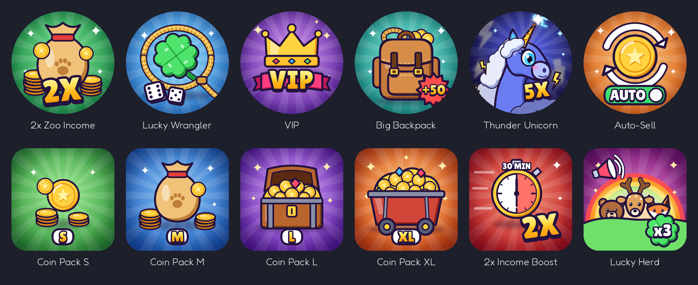

# Winkel-iconen

Iconen voor alle game passes en developer products, getekend in dezelfde cartoonstijl: dikke donkere randen,
glanzende kleuren en een zonnestralen-achtergrond. Elk icoon is **512 × 512**, de maat die Roblox vraagt.



## Game passes

| Bestand | Pass | Prijs | Wat je ziet |
|---|---|---|---|
| `2xZooIncome.png` | 2x Zoo Income | 399 R$ | een geldzak met een pootafdruk, munten en een grote **2X** |
| `LuckyWrangler.png` | Lucky Wrangler | 299 R$ | een klavertjevier in een gouden lasso, met twee dobbelstenen (twee keer gooien) |
| `VIP.png` | VIP | 249 R$ | een gouden kroon met edelstenen en **VIP** op een lint |
| `BigBackpack.png` | Big Backpack | 149 R$ | een leren rugzak vol munten en touw, met **+50** |
| `ThunderUnicorn.png` | Thunder Unicorn | 499 R$ | de Thunder Unicorn met zijn onweerswolk-manen en bliksemhoorn, en **5X** |
| `AutoSell.png` | Auto-Sell | 99 R$ | een munt in twee ronddraaiende pijlen, met een **AUTO**-schakelaar die aan staat |

## Developer products

| Bestand | Product | Prijs | Wat je ziet |
|---|---|---|---|
| `CoinsS.png` | Coin Pack S | 49 R$ | een paar muntjes (groen) |
| `CoinsM.png` | Coin Pack M | 149 R$ | een geldzak met stapels munten (blauw) |
| `CoinsL.png` | Coin Pack L | 399 R$ | een schatkist vol goud (paars) |
| `CoinsXL.png` | Coin Pack XL | 999 R$ | een mijnkarretje vol goud en edelstenen (oranje) |
| `2xIncomeBoost.png` | 2x Income Boost (30 min) | 79 R$ | een stopwatch die half vol is (**30 MIN**) en **2X** |
| `LuckyHerd.png` | Lucky Herd | 99 R$ | een beer, een hert en een vos onder een regenboog, een megafoon en een klavertje met **x3** |

De muntpakketten worden van klein naar groot steeds rijker en hebben elk een eigen kleur (groen, blauw, paars,
oranje), net als zeldzaamheden. Zo zie je in één oogopslag welke de grootste is.

## Uploaden

**Game pass:** ga naar [create.roblox.com](https://create.roblox.com) → je game → **Monetization → Passes →
Create a Pass**. Kies het icoon, geef een naam en een beschrijving, klik **Create Pass**, en zet daarna bij de pass
**Sales → Item for Sale** aan met de prijs.

**Developer product:** je game → **Monetization → Developer Products → Create a Developer Product**. Kies het
icoon, de naam en de prijs.

Let op:

- Roblox toont game pass-iconen als **rondje**. Alles wat belangrijk is staat daarom in het midden; de hoeken zijn
  alleen achtergrond. Zie `preview.png`: bovenaan zie je de passes als rondje, onderaan de producten.
- Een nieuw icoon wordt eerst door Roblox gecontroleerd. Dat kan even duren; tot die tijd zie je een grijs vlak.
- Wil je een icoon ook in je eigen winkelscherm gebruiken? Upload het dan ook als **Decal/Image** en gebruik het ID
  in een ImageLabel.

## Opnieuw maken of aanpassen

De iconen zijn met code getekend (`tools/icons/build_icons.py`, elke functie is één icoon). Een kleur of een tekst
aanpassen en opnieuw maken:

```
python3 tools/icons/build_icons.py
```

Dat schrijft alle PNG's en `preview.png` opnieuw. Het lettertype is **Lilita One** (en **Fredoka** voor de namen in
de preview). Die worden de eerste keer gedownload; ze hebben een vrije licentie (SIL Open Font License).
