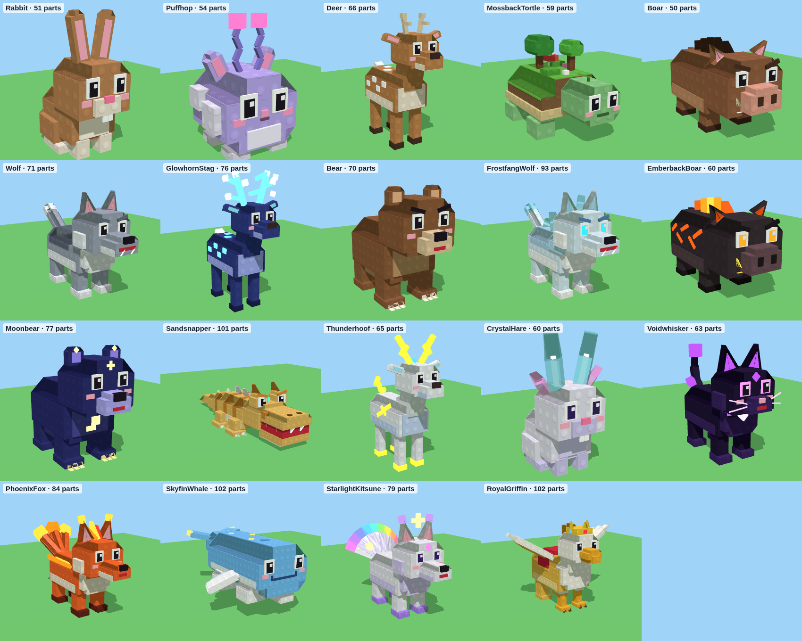

# Hunt an Animal – diermodellen

`HuntAnimalModels.rbxm` bevat een map **HuntAnimalModels** met 19 modellen in blokstijl met noppen (studs):
de 18 dieren uit de Index plus de Royal Griffin.



| Dier | Zeldzaamheid | Onderdelen |
|---|---|---|
| Rabbit | Common | 51 |
| Puffhop | Common | 54 |
| Deer | Uncommon | 66 |
| MossbackTortle | Uncommon | 59 |
| Boar | Rare | 50 |
| Wolf | Rare | 71 |
| GlowhornStag | Epic | 76 |
| Bear | Epic | 70 |
| FrostfangWolf | Epic | 93 |
| EmberbackBoar | Epic | 60 |
| Moonbear | Legendary | 77 |
| Sandsnapper | Legendary | 101 |
| Thunderhoof | Legendary | 65 |
| CrystalHare | Legendary | 60 |
| Voidwhisker | Mythic | 63 |
| PhoenixFox | Mythic | 84 |
| SkyfinWhale | Mythic | 102 |
| StarlightKitsune | Secret | 79 |
| RoyalGriffin | Exclusive | 102 |

## In Roblox Studio zetten

1. Open je place in Roblox Studio.
2. Sleep `HuntAnimalModels.rbxm` het Studio-venster in. Of klik in de Explorer met rechts op
   **ReplicatedStorage** en kies **Insert from File…**.
3. Zet de map **HuntAnimalModels** in **ReplicatedStorage**. Dan kunnen de server en de spelers
   (bijvoorbeeld voor de Photo Card in een ViewportFrame) de modellen allebei gebruiken.

## Hoe een model is opgebouwd

- **RootPart**: een onzichtbaar blok om het hele dier heen. Het is de `PrimaryPart`, staat vast
  (`Anchored`) en is de "hitbox": een raycast van de camera raakt dit blok. Alle andere onderdelen zitten
  eraan vast, dus als je het model verplaatst, beweegt alles mee.
- **Pivot onder de voeten**: met `model:PivotTo(cframe)` komt het dier met zijn voeten precies op die plek.
- **RideAttachment**: het punt op de rug waar de speler moet zitten als hij het dier berijdt.
- **OverheadAttachment**: het punt boven de kop, voor een naambordje (BillboardGui).
- **Attributen op het model**: `AnimalId`, `DisplayName` en `Rarity`, plus de tag `HuntAnimalModel`.
- **Attribuut `Role` op elk onderdeel**: `Primary` (hoofdkleur), `Secondary` (buik en strepen), `Accent`
  (details), `Eye`, `Glow` (neon) of `Hitbox`. Hiermee kun je bij een mutatie alleen de vacht kleuren
  en de ogen laten zoals ze zijn.
- **Gewrichten (Motor6D)**: `Head`, `LegFL`, `LegFR`, `LegBL`, `LegBR` en `Tail`, en bij sommige dieren
  ook `WingL`/`WingR`, `FinL`/`FinR`, `EarL`/`EarR`, `AntennaL`/`AntennaR` of `Tail1`…`Tail9`.
  Die kun je animeren (zie hieronder).
- **Effecten**: zeldzamere dieren hebben deeltjes, zoals vuur, sterren, sneeuw of vonken, en soms een
  lampje (PointLight).

## Voorbeelden (Luau)

Een dier neerzetten en groter maken (voor de maten uit je spel):

```lua
local ReplicatedStorage = game:GetService("ReplicatedStorage")
local models = ReplicatedStorage:WaitForChild("HuntAnimalModels")

local wolf = models.Wolf:Clone()
wolf:PivotTo(CFrame.new(0, 0, 0)) -- voeten op de grond op positie (0, 0, 0)
wolf:ScaleTo(2)                   -- "Big" = 2x zo groot
wolf.Parent = workspace
```

Een Golden-mutatie toepassen (de noppen blijven zichtbaar zolang het materiaal Plastic blijft):

```lua
local function applyGolden(model: Model)
	for _, part in model:GetDescendants() do
		if part:IsA("BasePart") then
			local role = part:GetAttribute("Role")
			if role == "Primary" or role == "Secondary" then
				part.Color = Color3.fromRGB(255, 200, 40)
				part.Reflectance = 0.3
			end
		end
	end
end
```

Een simpele loopanimatie met code (elk frame, op de client):

```lua
local RunService = game:GetService("RunService")

local function animateWalk(model: Model)
	local joints = {}
	for _, joint in model:GetDescendants() do
		if joint:IsA("Motor6D") then
			joints[joint.Name] = joint
		end
	end
	RunService.RenderStepped:Connect(function()
		local swing = math.sin(os.clock() * 10) * math.rad(25)
		if joints.LegFL then joints.LegFL.Transform = CFrame.Angles(swing, 0, 0) end
		if joints.LegBR then joints.LegBR.Transform = CFrame.Angles(swing, 0, 0) end
		if joints.LegFR then joints.LegFR.Transform = CFrame.Angles(-swing, 0, 0) end
		if joints.LegBL then joints.LegBL.Transform = CFrame.Angles(-swing, 0, 0) end
		if joints.Tail then joints.Tail.Transform = CFrame.Angles(0, swing * 0.8, 0) end
	end)
end
```

Wil je liever animeren met de **Animation Editor** van Studio? Zet dan eerst een `AnimationController`
met daarin een `Animator` in het model.

## Waarom ze licht zijn voor je spel

- Alleen **RootPart** doet mee met natuurkunde en raycasts. Alle zichtbare onderdelen hebben
  `CanCollide`, `CanTouch` en `CanQuery` uit en zijn `Massless`.
- Kleine onderdelen (ogen, tanden, details) hebben geen schaduw.
- Per dier zijn er maximaal 2 deeltjeseffecten en 1 lampje.
- Er zijn geen meshes of afbeeldingen van buitenaf nodig: alles is opgebouwd uit gewone Roblox-onderdelen.

## Zelf aanpassen

De modellen worden gemaakt door een programma in `tools/animal-models/`. In `animals.py` staat per
dier welke blokken het heeft, met welke maten, kleuren en posities. Na een aanpassing maak je een
nieuw bestand met:

```
python3 tools/animal-models/build.py --rbxm models/HuntAnimalModels.rbxm
```

Daarvoor heb je Python 3 en Rust (`cargo`) nodig.
