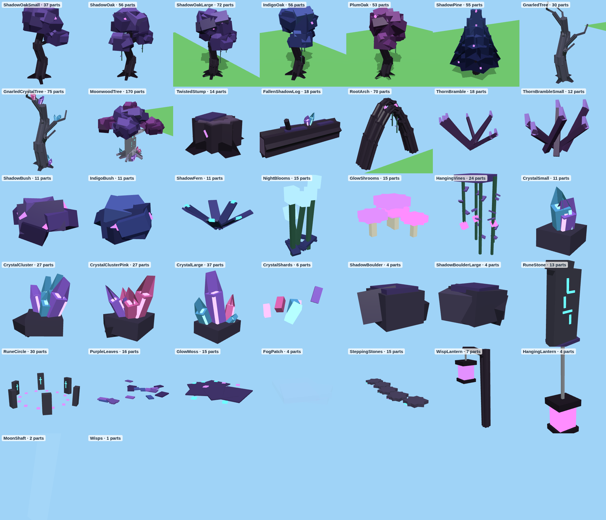
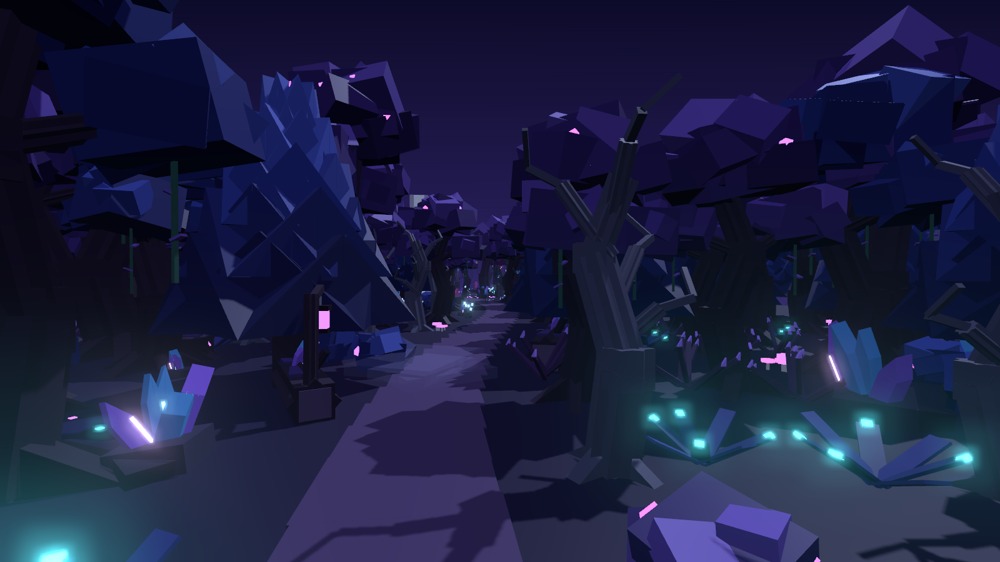
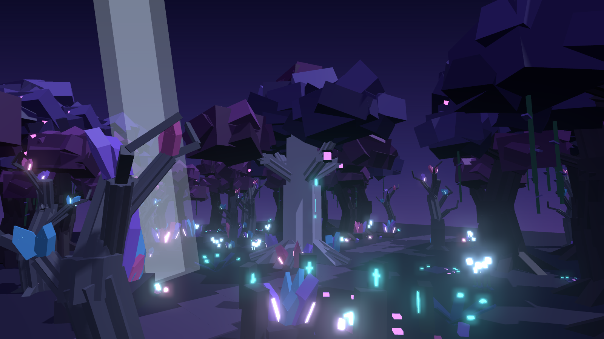
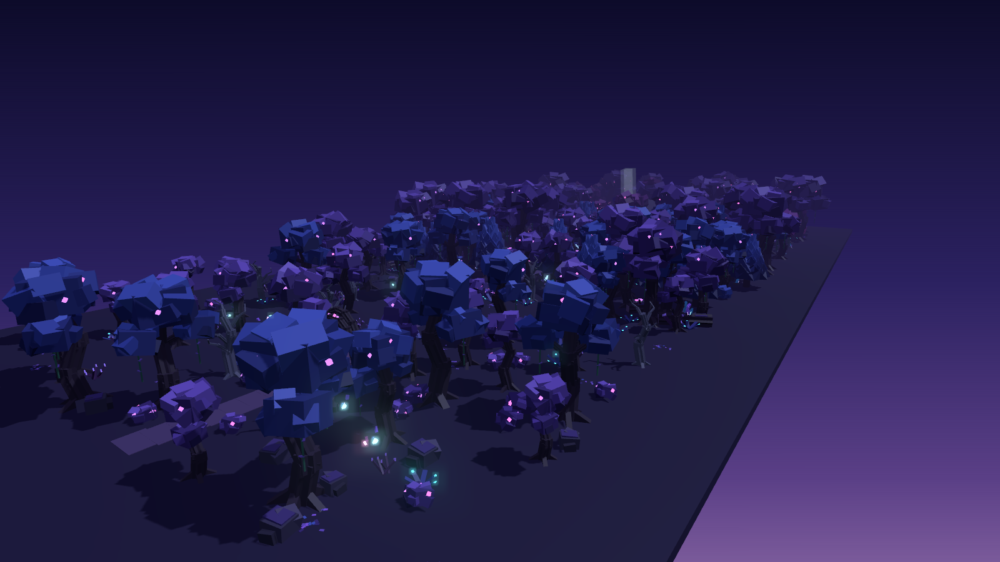
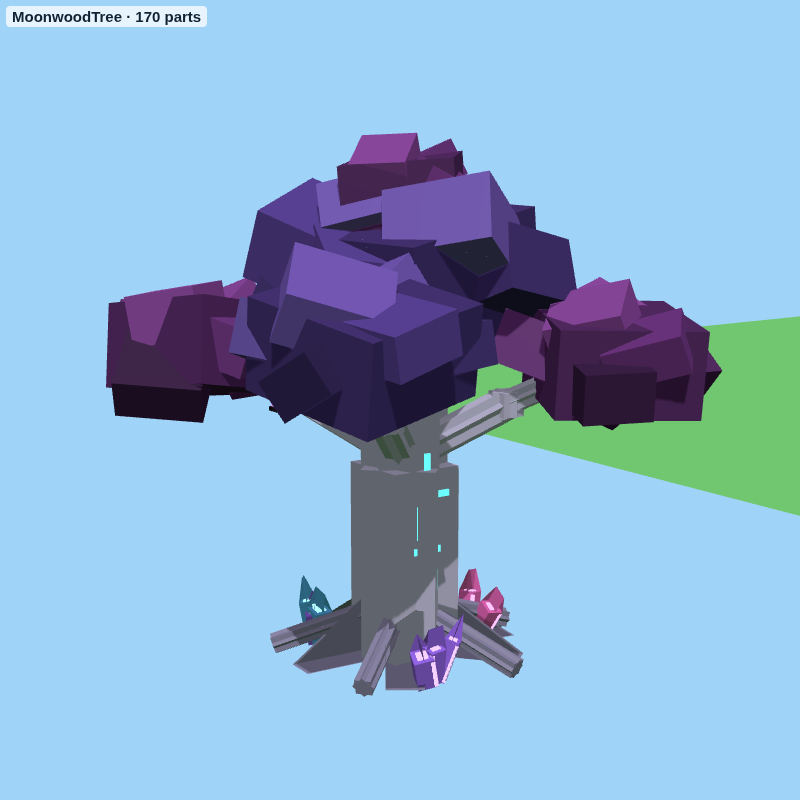

# Dark Woods – bosset voor het donkere bos

`DarkWoodsKit.rbxm` bevat 37 modellen voor de Dark Woods, in de stijl die je koos: **Moonlit Purple met
kristallen**. Gedraaide zwarte bomen met paars en donkerblauw blad en gloeiende besjes, kromme asgrijze bomen,
doornstruiken, en kristallen (blauw, paars en roze) die uit de grond groeien. Het is een heel andere stijl dan de
Critter Woods-set van het eerste bos. Alles is gemaakt van gewone Parts, dus je hoeft niets te uploaden.











## Gemaakt voor telefoons

De set is gemaakt om ook op een gewone iPhone of Android-telefoon soepel te lopen:

- **Weinig onderdelen per model.** Een boom heeft 30 tot 75 Parts, een struik of kristal 5 tot 30. Alleen de
  Moonwood Tree (170) is groter, maar daar zet je er maar één van neer.
- **Geen Glass, geen meshes, geen textures.** De kristallen zijn niet doorzichtig. Ze gloeien door dunne
  Neon-randjes, en dat is veel lichter voor een telefoon.
- **Bijna geen lampjes.** Alleen de WispLantern, de HangingLantern, de CrystalLarge en de Moonwood Tree hebben een
  PointLight, met een kleine Range en zonder schaduw. De rest gloeit met Neon, en dat kost niets extra.
- **Weinig botsingen.** Alleen stammen, boomstammen, stronken en grote rotsen botsen (CanCollide aan). Bladeren,
  planten, kristallen en grondversiering hebben CanCollide, CanTouch en CanQuery uit, dus de physics-engine
  hoeft er niets mee.
- **Kleine dingen geven geen schaduw** (CastShadow uit).
- **Bomen hebben `LevelOfDetail = StreamingMesh`.** Zet je in de Workspace **StreamingEnabled** aan, dan tekent
  Roblox bomen ver weg als simpele versie. Dat scheelt veel op telefoons.
- Doorzichtig zijn alleen de `FogPatch` en de `MoonShaft`. Zet daar een handvol van neer, geen honderden.

**Tips voor je map:** zet in de Workspace **StreamingEnabled** aan, gebruik de lampjes spaarzaam (een stuk of
tien in het hele bos is genoeg) en laat de ScatterScript niet een gigantisch gebied vullen. Een bos van 300 × 150
studs met de standaarddichtheid geeft zo'n 400 bomen en 700 planten.

## In Roblox Studio zetten

1. Klik in de **Explorer** met de rechtermuisknop op **Workspace** (of **ServerStorage**) en kies
   **Insert from File...**. Kies `DarkWoodsKit.rbxm`.
2. Je krijgt een map **DarkWoodsKit** met de mappen `Trees`, `Wood`, `Plants`, `Crystals`, `Rocks`, `Ground` en
   `Lights`. In de Workspace staan alle modellen op rijen, zodat je ze kunt bekijken.
3. Sleep een model naar je map of kopieer het (Ctrl+D) en verplaats het.

Elk model heeft een **pivot op de grond** onder het midden, dus `model:PivotTo(CFrame.new(punt))` zet het precies op
de grond. Uitzondering: bij **HangingVines** en **HangingLantern** zit de pivot **bovenaan**. Daarmee hang je ze
onder een tak. Alle Parts zijn Anchored. Elk model heeft de attributen `Category`, `Zone` (Gloom, Deep of Heart),
`Height` en `Description`, en de tag `DarkWoodsKit`.

## Wat erin zit

Een speler is ongeveer 5 studs hoog.

| Map | Model | Zone | Hoogte | Wat het is |
|---|---|---|---|---|
| Trees | `ShadowOakSmall` | Gloom | 15 | jonge gedraaide eik met paars blad |
| Trees | `ShadowOak` | Deep | 22 | gedraaide zwarte eik met paars blad, gloeiende besjes en slingerplanten |
| Trees | `ShadowOakLarge` | Deep | 29 | grote gedraaide eik met drie bladerbossen en slingerplanten |
| Trees | `IndigoOak` | Deep | 23 | gedraaide eik met donkerblauw blad |
| Trees | `PlumOak` | Heart | 22 | gedraaide eik met pruimpaars blad |
| Trees | `ShadowPine` | Deep | 19 | donkere den met paars gloeiende puntjes |
| Trees | `GnarledTree` | Gloom | 14 | kale, kromme asgrijze boom |
| Trees | `GnarledCrystalTree` | Heart | 14 | kromme boom met kristallen in de takken en aan de voet |
| Trees | `MoonwoodTree` | Heart | 31 | reuzenboom met zilveren stam, gloeiende runen, kristallen tussen de wortels en twee lantaarns |
| Wood | `TwistedStump` | Deep | 2 | donkere stronk met paars mos en besjes |
| Wood | `FallenShadowLog` | Deep | 4 | omgevallen stam met mos en een kristal erop |
| Wood | `RootArch` | Gloom | 13 | twee reuzenwortels die een boog over het pad maken (9 studs breed), mooi als ingang |
| Plants | `ThornBramble`, `ThornBrambleSmall` | Deep | 3–4 | doornstruik met lichtpaarse puntjes |
| Plants | `ShadowBush`, `IndigoBush` | Deep | 3–4 | ronde struik met gloeiende besjes |
| Plants | `ShadowFern` | Deep | 2 | donkerblauwe varen met gloeiende puntjes |
| Plants | `NightBlooms` | Deep | 3 | stengels met maanblauw gloeiende bloemknoppen |
| Plants | `GlowShrooms` | Deep | 1 | kleine paarse en roze gloeiende paddenstoelen |
| Plants | `HangingVines` | Deep | – | slingerplanten om onder een tak te hangen (pivot bovenaan) |
| Crystals | `CrystalSmall` | Deep | 2 | twee kleine kristallen op een steen |
| Crystals | `CrystalCluster` | Deep | 5 | groep blauwe en paarse kristallen op een rots |
| Crystals | `CrystalClusterPink` | Deep | 5 | groep roze en paarse kristallen op een rots |
| Crystals | `CrystalLarge` | Heart | 10 | grote kristalformatie met een lampje |
| Crystals | `CrystalShards` | Deep | 1 | losse kristalsplinters op de grond |
| Rocks | `ShadowBoulder`, `ShadowBoulderLarge` | Gloom | 3–4 | donkere rots met paars mos |
| Rocks | `RuneStone` | Heart | 8 | staande steen met gloeiende runen aan twee kanten |
| Rocks | `RuneCircle` | Heart | 4 | kring van zes runenstenen (14 studs breed) |
| Ground | `PurpleLeaves` | Deep | plat | gevallen paarse en blauwe blaadjes |
| Ground | `GlowMoss` | Deep | plat | donker mos met gloeiende stipjes |
| Ground | `FogPatch` | Deep | 2 | lage mist (doorzichtig, gebruik er een paar) |
| Ground | `SteppingStones` | Deep | plat | rij platte stapstenen met gloeiend mos (10 studs lang) |
| Lights | `WispLantern` | Deep | 8 | kromme paal met een paarse lantaarn (met lampje) |
| Lights | `HangingLantern` | Deep | – | roze lantaarn aan een ketting (pivot bovenaan, met lampje) |
| Lights | `MoonShaft` | Heart | 36 | zachte maanstraal voor een open plek |
| Lights | `Wisps` | Deep | – | onzichtbaar blok waar paarse lichtjes omheen zweven |

**Over "decals":** echte Roblox-Decals zijn plaatjes die je eerst moet uploaden. Daarom zijn de grondversieringen
(blaadjes, mos, stapstenen) gemaakt van dunne, platte Parts. Die werken meteen.

## Snel een bos neerzetten met DarkWoodsScatter

In de map zit een script, **DarkWoodsScatter**, dat een gebied voor je vult. Het werkt net als ForestScatter in
de Critter Woods-set, maar met drie zones:

| Zone | Bomen per 100 × 100 studs | Wat er komt |
|---|---|---|
| Gloom | ongeveer 30 | jonge en gewone Shadow Oaks, kale bomen, doornstruikjes, rotsen, blaadjes |
| Deep | ongeveer 65 | alle eiken, dennen, doornstruiken, varens, paddenstoelen, kristalgroepjes, mos |
| Heart | ongeveer 50 | pruimpaarse eiken en kristalbomen, veel kristallen en gloeiende bloemen |

1. Zet een groot, doorzichtig blok (Part) over de grond waar het bos moet komen, bijvoorbeeld 300 × 10 × 150
   studs. Noem het `DarkWoodsArea`. De Gloom-zone komt aan de voorkant van het blok (de Front-kant), The Heart
   aan de achterkant.
2. Open **View → Command Bar**, plak dit erin en druk op Enter:

```lua
local scatter = require(workspace.DarkWoodsKit.DarkWoodsScatter)
scatter.fillGradient(workspace.DarkWoodsArea)   -- Gloom vooraan, The Heart achteraan
```

Eén zone? Gebruik `scatter.fill(workspace.DarkWoodsArea, "Deep")` (of `"Gloom"`, `"Heart"`). Alles komt in een
nieuwe map in de Workspace, bijvoorbeeld `DarkWoods_Gradient`. Niet mooi? Verwijder de map en probeer het nog eens.

De bijzondere stukken zet je zelf neer, want die wil je op een goede plek hebben: de **MoonwoodTree** met de
**RuneCircle**, de **CrystalLarge** en een **MoonShaft** in The Heart, de **RootArch** als ingang over het pad,
lantaarns langs het pad en **HangingVines** onder takken.

## Let op

Ik heb het bestand gemaakt met dezelfde rbxm-writer als je andere modellen, alle modellen gecontroleerd op losse
of zwevende onderdelen, de previews gerenderd en het script gecontroleerd met de Luau-checker. Roblox Studio zelf
kan ik niet openen. Gaat er iets mis? Kopieer de tekst uit het Output-venster en stuur die op.

## Opnieuw maken

```
python3 tools/dark-woods-kit/build_dark_kit.py --rbxm models/dark-woods-kit/DarkWoodsKit.rbxm
```

Dat schrijft ook `tools/dark-woods-kit/build/world.json` (het preview-bos). Kopieer het naar `tools/viewer/`,
start daar `python3 -m http.server 8123` en render met `node sceneshot.js world.json deep uit.png` (of:
`forest`, `heart`).
