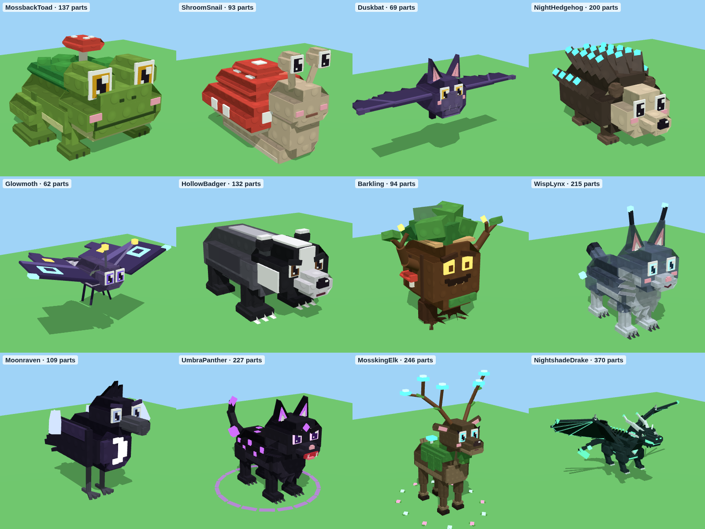
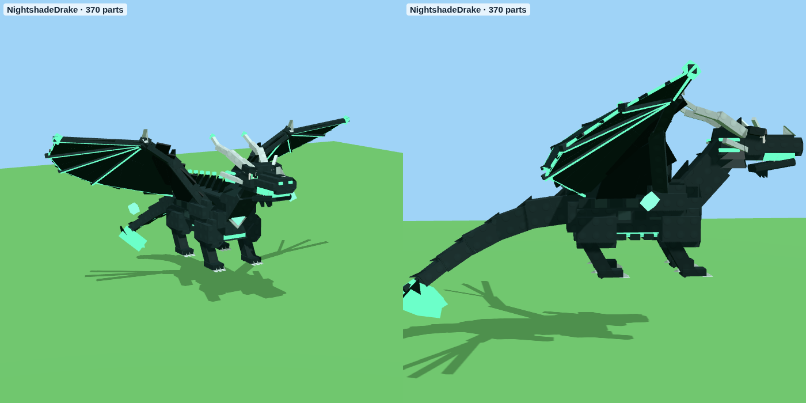
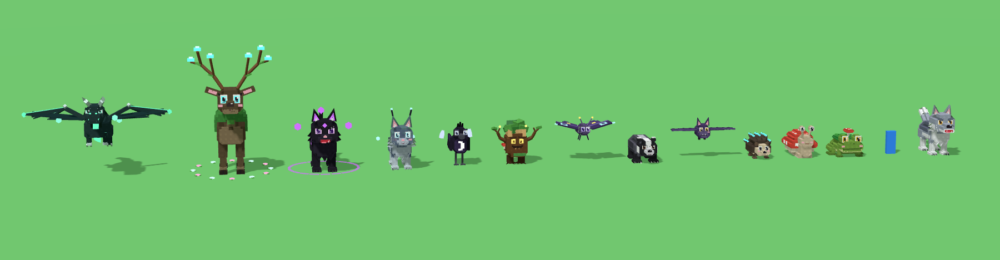

# Dark Woods – 12 dieren voor het donkere bos

`DarkWoodsAnimals.rbxm` bevat de 12 dieren van het conceptbord, gebouwd in dezelfde blokkige stijl met noppen als je
andere dieren. Alles is gemaakt van gewone Parts, dus je hoeft niets te uploaden: het bestand werkt meteen.







## In Roblox Studio zetten

1. Klik in de **Explorer** met de rechtermuisknop op **ReplicatedStorage** (of **ServerStorage**) en kies
   **Insert from File...**. Kies `DarkWoodsAnimals.rbxm`.
2. Je krijgt een map **DarkWoodsAnimals** met 12 modellen.
3. Een dier neerzetten gaat net als bij je andere dieren:

```lua
local ReplicatedStorage = game:GetService("ReplicatedStorage")
local lynx = ReplicatedStorage.DarkWoodsAnimals.WispLynx:Clone()
lynx:PivotTo(CFrame.new(0, 0, 0))  -- de pivot zit op de grond, onder de pootjes
lynx.Parent = workspace
```

Elk dier is opgebouwd zoals je bestaande dieren: een onzichtbare **RootPart** (hitbox en `PrimaryPart`, staat vast),
**Motor6D**-gewrichten (`Head`, poten, `Tail`, bij vliegers `WingL`/`WingR`), een `RideAttachment` en een
`OverheadAttachment`, de attributen `AnimalId`, `DisplayName` en `Rarity`, en de tags `HuntAnimalModel` en
`DarkWoodsAnimal`. Je bestaande code voor dieren werkt dus ook met deze 12.

## De dieren

| Dier | Zeldzaamheid | Hoogte | Effecten |
|---|---|---|---|
| Mossback Toad | Common | 6 studs | geen: een gewone pad met mos en een paddenstoeltje op zijn rug |
| Shroom Snail | Common | 7 studs | een lichtblauw gloeiend **slijmspoor** (Trail) op de grond als hij beweegt |
| Duskbat | Uncommon | zweeft, 9 studs | **klapperende vleugels**, zweeft op en neer, paarse strepen achter de vleugelpunten |
| Night Hedgehog | Uncommon | 6 studs | stekelpunten die blauw **gloeien en pulseren**, zacht blauw licht |
| Glowmoth | Rare | zweeft, 10 studs | klappert en zweeft, gloeiende oogvlekken op de vleugels, **lichtgevend motstof** dat naar beneden dwarrelt, sporen achter de vleugelpunten |
| Hollow Badger | Rare | 8 studs | **stofwolkjes** bij zijn graafklauwen en aardesporen als hij rent |
| Barkling | Epic | 10 studs | gloeiende ogen met warm licht, **vallende blaadjes**, drie **vuurvliegjes die om zijn kruin cirkelen** met lichtsporen |
| Wisp Lynx | Legendary | 13 studs | een beetje **doorzichtig als een geest** met een blauwe gloed (Highlight), rook die van zijn lijf opstijgt, gloeiende oorpluimen met sporen, drie **dwaallichtjes met vlammetjes** die om hem heen cirkelen, zwaaiende staart |
| Moonraven | Legendary | 10 studs | een **maanlichtbundel** die van boven op hem schijnt (Beam), een pulserende maansikkel op zijn borst, **maanscherven** die om hem heen draaien met zilveren sporen, vallende veertjes, zilveren rand (Highlight) |
| Umbra Panther | Mythic | 14 studs | pikzwart met **paars pulserende vlekken**, **schaduwrook** en paarse vonkjes, **paarse strepen achter zijn ogen** als hij rent, een **draaiende schaduwcirkel** op de grond, twee rokende schaduwbollen die om hem heen cirkelen, schaduwwolkjes bij elke stap, paarse rand (Highlight) |
| Mossking Elk | Mythic | 27 studs | mosmantel, een takgewei met **gloeiende paddenstoelen** en lampjes, opstijgende **sporen**, een **boog van levensenergie** tussen zijn geweipunten (Beam met bewegende glinstering), een **ring van bloemetjes** die langzaam om hem heen draait, groene pluisjes bij zijn hoeven |
| Nightshade Drake | **Secret** | zweeft, 20 studs hoog, 35 studs breed | het meest gedetailleerde dier (338 onderdelen): wenkbrauwbogen, open bek met tanden en gloeiende keel, drie paar hoorns, nekvinnen, gloeiend **hartkristal** in de borst, schubben, gloeiende buikplaten, vleugels met 4 vingers, **gloeiende aders** en een **gloeiende achterrand**, een lange stekelstaart met speerpunt. Effecten: zweeft en klappert langzaam, **groen spookvuur** uit zijn bek, een **knetterende energieboog tussen zijn hoorns**, pulserend hart met licht, sporen achter vleugels en staart, drie **zielenvlammen** die om hem heen cirkelen, schaduwrook, groene rand (Highlight) |

Een speler is ongeveer 5 studs hoog. De dieren hebben dezelfde schaal als je bestaande dieren (een wolf is ongeveer
10 studs). Wil je een dier groter of kleiner? Gebruik `model:ScaleTo(1.5)` (of een ander getal).

## Hoe de effecten werken

- **Trails** (sporen) verschijnen alleen als het dier beweegt. Laat een dier dus lopen om ze te zien.
- **Klapperen, zweven, ronddraaien, staart zwaaien en pulseren** doet het script **AnimalFX** in elk dier vanaf
  Uncommon. Het staat op `RunContext = Client`: het draait op de computer van elke speler, dus de server hoeft er
  niets voor te doen. Het beweegt alleen de gewrichten (`Motor6D.Transform`); de RootPart (hitbox) blijft precies
  waar jouw spel hem neerzet. Je ziet de bewegingen pas als je op **Play** drukt.
- Instellingen staan als attributen op het model. Je kunt ze in Studio aanpassen: `FlapSpeed` en `FlapAngle`
  (vleugels), `Hover` en `HoverSpeed` (zweven), `OrbitSpeed` (ronddraaien) en `TailSway` (staart). Onderdelen en
  lampjes met het attribuut `Pulse` (seconden) gloeien feller en zachter.
- **Let op met Highlights:** Roblox laat maximaal 31 Highlights tegelijk zien. Alleen de 5 zeldzaamste dieren
  hebben er een, dus dat gaat meestal goed. Staan er veel tegelijk in beeld? Haal dan de `Aura` weg bij de
  Legendary-dieren.
- Speelt jouw spel eigen animaties af (met een Animator)? Dan kunnen die de vleugels of de staart overschrijven.
  Haal in dat geval het script weg, of haal de flap-attributen weg bij dieren die je zelf animeert.

## Let op

Ik heb het bestand gemaakt met de rbxm-writer uit deze repo, elk dier van drie kanten in 3D gerenderd en het
script gecontroleerd met de officiële Luau-checker (geen fouten). Roblox Studio zelf kan ik niet openen. Gaat er iets
mis? Kopieer de tekst uit het Output-venster en stuur die op, dan los ik het op.

## Opnieuw maken

De vormen, kleuren en effecten staan in `tools/animal-models/dark_woods.py`, het effectscript in
`tools/animal-models/AnimalFX.lua`:

```
python3 tools/animal-models/build_dark_woods.py --rbxm models/dark-woods/DarkWoodsAnimals.rbxm
```
