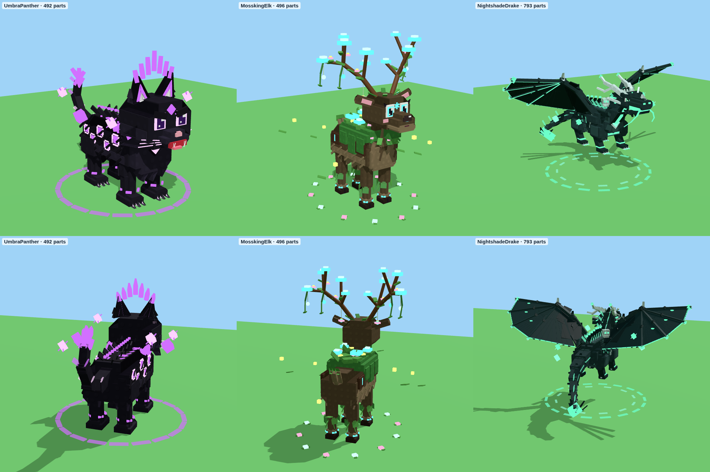
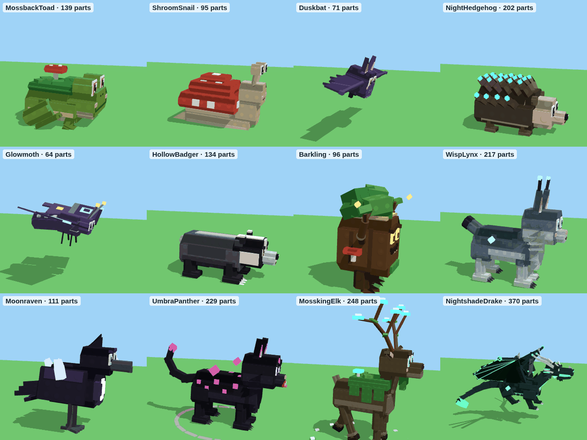
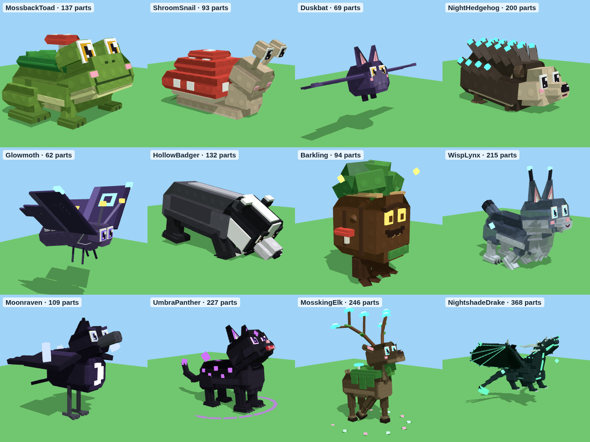

# Dark Woods – 12 dieren voor het donkere bos

`DarkWoodsAnimals.rbxm` bevat de 12 dieren van het conceptbord, gebouwd in dezelfde blokkige stijl met noppen als je
andere dieren. Alles is gemaakt van gewone Parts, dus je hoeft niets te uploaden: het bestand werkt meteen.


## In Roblox Studio zetten

1. Klik in de **Explorer** met de rechtermuisknop op **ReplicatedStorage** (of **ServerStorage**) en kies
   **Insert from File...**. Kies `DarkWoodsAnimals.rbxm`.
2. Je krijgt een map **DarkWoodsAnimals** met 12 modellen.
3. Een dier neerzetten gaat net als bij je andere dieren:

```lua
local ReplicatedStorage = game:GetService("ReplicatedStorage")
local lynx = ReplicatedStorage.DarkWoodsAnimals.WispLynx:Clone()
lynx:PivotTo(CFrame.new(0, 0, 0))  -- de pivot zit op de grond, onder de pootjes
lynx.Parent = workspace
```

Elk dier is opgebouwd zoals je bestaande dieren: een onzichtbare **RootPart** (hitbox en `PrimaryPart`, staat vast),
**Motor6D**-gewrichten (`Head`, poten, `Tail`, bij vliegers `WingL`/`WingR`), een `RideAttachment` en een
`OverheadAttachment`, de attributen `AnimalId`, `DisplayName` en `Rarity`, en de tags `HuntAnimalModel` en
`DarkWoodsAnimal`. Je bestaande code voor dieren werkt dus ook met deze 12.

## De dieren

| Dier | Zeldzaamheid | Hoogte | Effecten |
|---|---|---|---|
| Mossback Toad | Common | 6 studs | geen: een gewone pad met mos en een paddenstoeltje op zijn rug |
| Shroom Snail | Common | 7 studs | een lichtblauw gloeiend **slijmspoor** (Trail) op de grond als hij beweegt |
| Duskbat | Uncommon | zweeft, 9 studs | **klapperende vleugels**, zweeft op en neer, paarse strepen achter de vleugelpunten |
| Night Hedgehog | Uncommon | 6 studs | stekelpunten die blauw **gloeien en pulseren**, zacht blauw licht |
| Glowmoth | Rare | zweeft, 10 studs | klappert en zweeft, gloeiende oogvlekken op de vleugels, **lichtgevend motstof** dat naar beneden dwarrelt, sporen achter de vleugelpunten |
| Hollow Badger | Rare | 8 studs | **stofwolkjes** bij zijn graafklauwen en aardesporen als hij rent |
| Barkling | Epic | 10 studs | gloeiende ogen met warm licht, **vallende blaadjes**, drie **vuurvliegjes die om zijn kruin cirkelen** met lichtsporen |
| Wisp Lynx | Legendary | 13 studs | een beetje **doorzichtig als een geest** met een blauwe gloed (Highlight), rook die van zijn lijf opstijgt, gloeiende oorpluimen met sporen, drie **dwaallichtjes met vlammetjes** die om hem heen cirkelen, zwaaiende staart |
| Moonraven | Legendary | 10 studs | een **maanlichtbundel** die van boven op hem schijnt (Beam), een pulserende maansikkel op zijn borst, **maanscherven** die om hem heen draaien met zilveren sporen, vallende veertjes, zilveren rand (Highlight) |
| Umbra Panther | Mythic | 14 studs | pikzwart met **paars pulserende vlekken**, **schaduwrook** en paarse vonkjes, **paarse strepen achter zijn ogen** als hij rent, een **draaiende schaduwcirkel** op de grond, twee rokende schaduwbollen die om hem heen cirkelen, schaduwwolkjes bij elke stap, paarse rand (Highlight) |
| Mossking Elk | Mythic | 27 studs | mosmantel, een takgewei met **gloeiende paddenstoelen** en lampjes, opstijgende **sporen**, een **boog van levensenergie** tussen zijn geweipunten (Beam met bewegende glinstering), een **ring van bloemetjes** die langzaam om hem heen draait, groene pluisjes bij zijn hoeven |
| Nightshade Drake | **Secret** | zweeft, 20 studs hoog, 35 studs breed | het meest gedetailleerde dier (792 onderdelen): wenkbrauwbogen, open bek met tanden en gloeiende keel, drie paar hoorns, nekvinnen, gloeiend **hartkristal** in de borst, schubben, gloeiende buikplaten, vleugels met 4 vingers, **gloeiende aders** en een **gloeiende achterrand**, een lange stekelstaart met speerpunt. Effecten: zweeft en klappert langzaam, **groen spookvuur** uit zijn bek, een **knetterende energieboog tussen zijn hoorns**, pulserend hart met licht, sporen achter vleugels en staart, drie **zielenvlammen** die om hem heen cirkelen, schaduwrook, groene rand (Highlight) |

Een speler is ongeveer 5 studs hoog. De dieren hebben dezelfde schaal als je bestaande dieren (een wolf is ongeveer
10 studs). Wil je een dier groter of kleiner? Gebruik `model:ScaleTo(1.5)` (of een ander getal).

## De topdieren (Mythic en Secret)

De Mythic-dieren hebben ongeveer **500 parts**, de Secret ongeveer **800**.

| Dier | Parts | Wat er bij kwam |
|---|---|---|
| Umbra Panther | 491 | Een schaduwmanen langs de rug met gloeiende puntjes en vachtstrepen. Gloeiende ringen om de vlekken, leegtekristallen uit de schouders, een kraag van kristallen om de nek, een zwevende kroon van scherven en gloeiende snorharen. Leegteklauwen, enkelringen, leegtevlammen en kristallen op de staart, een edelsteen op de borst, runen op de rug en vier extra schaduwbollen. **Nieuwe effecten:** een halo van duisternis, schaduwvuur dat van zijn rug opstijgt, een **draaiende leegtesigil** op de grond met rimpelringen, vonken uit de kroon en sporen achter de bollen |
| Mossking Elk | 495 | Extra geweitakken met paddenstoelen, mosranken, blaadjes, bloemetjes en **gloeiende zaadjes** die aan het gewei hangen. Een kroon van blaadjes, een rune op het voorhoofd en een **slinger** om de nek. Meer mos, bloemen, paddenstoelen en varens op de rug, schorsplaten met runen, een kraag op de borst, mos en gloeiende ringen om de poten, en vuurvliegjes en dwarrelende blaadjes om hem heen. **Nieuwe effecten:** een zachte gloed van leven, vuurvliegjes, **vallende blaadjes** uit het gewei en een **sigil van bloeiend licht** op de grond |
| Nightshade Drake | 792 | Vollere vleugels met klauwen, gloeiende vingertoppen, stekels en runen. Extra rijen schubben, rugpantser, **spookvlammen** langs de rug en nek, spookribben, kettingen, een borstpantser, tweede hoorns, een kroon, wangkragen, gloeiende **tentakels** en extra tanden. Stekels, platen, gloeiende ringen en vlammen op de staart, pantser en gloeiende klauwen op de poten, vijf extra zielenvlammen, **drie zwevende spookschedels** met spookvuur en een zielenring op de grond. **Nieuwe effecten:** een spookgloed, opstijgende zielenvonken, spookvuur op de vleugelvingers, knetterende hoorns, sporen achter de tentakels en een **draaiende necrosigil** |



## Animaties: lopen, stilstaan en speciale acties

Alle 12 dieren bewegen vanzelf. Je hoeft **niets te uploaden en geen animatie-ID's in te vullen**: het zit in het
script **AnimalFX** in elk dier. Invoegen en klaar, het werkt 1-op-1.





- **Lopen gaat vanzelf.** Het script meet hoe snel de RootPart beweegt (met `PivotTo`, een tween of hoe je spel het
  ook doet) en gaat dan soepel over van stilstaan naar lopen. De pootjes houden gelijke tred met de snelheid, en
  sneller dan normaal ziet eruit als rennen.
- **Stilstaan:** ademen, rondkijken en staartzwaaien. Om de paar seconden doet het dier zijn eigen **speciale
  actie**.
- **Bij elke stap** komt er een effect onder de poot, vaak met een schokgolf op de grond.

| Dier | Zo loopt het | Effect bij het lopen | Speciale actie bij stilstaan |
|---|---|---|---|
| Mossback Toad | springt, alle poten tegelijk | mosstofwolk en groene schokgolf bij elke landing, sporen | **kwaken**: kop omhoog, twee groene geluidsringen en belletjes |
| Shroom Snail | glijdt en rekt zich uit | gloeiende slijmdruppels, sporen uit de hoed | **sporenwolk**: trekt zijn kop in, een fontein van gloeiende sporen |
| Duskbat | vliegt voorover, klappert sneller | paarse strepen en vonkjes | **krijsen**: drie paarse geluidsringen uit zijn neus |
| Night Hedgehog | kleine snelle pasjes | blauwe vonkjes bij elke stap en uit de stekels | **stekels opzetten**: duikt in elkaar, een uitbarsting van blauwe vonken |
| Glowmoth | fladdert, klappert sneller | een wolk dwarrelend motstof | **stofwolk**: stijgt op, een grote wolk gloeiend stof |
| Hollow Badger | waggelt heen en weer | stofwolkjes en kleine schokgolven | **graven**: kop omlaag, pootjes graaf-graaf, aarde vliegt weg |
| Barkling | loopt op twee benen en zwaait met zijn armen | blaadjes en een groene schokgolf bij elke stap | **uitrekken**: armen omhoog, blaadjes en vuurvliegjes, lichtjes draaien sneller |
| Wisp Lynx | sierlijke draf | blauwe spookvlammetjes bij elke stap, spookrook | **kattenrek**: rekt zich uit, een uitbarsting van spookvuur |
| Moonraven | huppelt met knikkende kop, vleugels iets open | zilveren sterretjes en veertjes | **vleugels spreiden**: grote vleugelslagen, een wolk maanschilfers |
| Umbra Panther | sluipende draf | schaduwrook, paarse vonken en schokgolven | **brullen**: kop omhoog en brul, schaduwrook en een grote paarse schokgolf. **Shadow step** (nieuw): duikt in elkaar terwijl de duisternis naar binnen wordt gezogen, en springt dan naar voren in een explosie van leegte, met een schokgolf en een draaiende sigil |
| Mossking Elk | statige stap (één poot tegelijk) | bloemblaadjes en groene ringen bij elke stap | **stampen**: tilt een voorpoot op en stampt, een enorme groene schokgolf. **Bloom** (nieuw): heft zijn kop, zijn gewei licht op en een golf van bloeiend licht rolt over de grond, met dwarrelende blaadjes en vuurvliegjes |
| Nightshade Drake | zware stap (één poot tegelijk), klappert | groen spookvuur bij elke stap | **vuur spuwen**: kop naar achteren en dan anderhalve seconde groen vuur met rook. **Soul storm** (nieuw): steigert met gespreide vleugels en zuigt zielen naar binnen. Dan barst een draaiende storm van spookvuur los, met een schokgolf en een necrosigil |

### Instellingen (attributen op het dier)

| Attribuut | Wat het doet |
|---|---|
| `State` | leeg = automatisch. Of `"Idle"`, `"Walk"` of `"Run"` om een animatie te forceren (handig als je spel het dier niet echt verplaatst) |
| `WalkSpeed` | hoe snel (studs per seconde) een gewone wandeling is. Zet dit op de snelheid waarmee je spel het dier laat lopen |
| `IdleActions` | zet op `false` om de speciale acties uit te zetten |
| `FXDistance` | verder dan dit (standaard 160 studs) van de camera: geen effecten. Nog verder weg: ook geen animatie. Goed voor telefoons |
| `FlapSpeed`, `FlapAngle` | vleugels (de vliegers en de drake) |
| `Hover`, `HoverSpeed` | op en neer zweven |
| `OrbitSpeed` | hoe snel de lichtjes om het dier heen draaien |
| `TailSway` | hoe ver de staart zwaait (graden) |

### Goed om te weten

- Het script staat op `RunContext = Client`: het draait op het apparaat van elke speler en kost de server niets.
  Het beweegt alleen de gewrichten (`Motor6D.Transform`) en maakt deeltjes, dus de RootPart (hitbox) blijft precies
  waar jouw spel hem neerzet.
- De schokgolven zijn tijdelijke Neon-schijven die na een halve seconde verdwijnen. Er zijn er nooit meer dan 6
  tegelijk per dier.
- **Trails** (sporen) verschijnen alleen als het dier beweegt.
- **Let op met Highlights:** Roblox laat maximaal 31 Highlights tegelijk zien. Alleen de 5 zeldzaamste dieren
  hebben er een. Staan er veel tegelijk in beeld? Haal dan de `Aura` weg bij de Legendary-dieren.
- Speelt jouw spel eigen animaties af (met een Animator)? Dan vechten die met dit script. Haal in dat geval het
  script weg.

## Let op

Ik heb het bestand gemaakt met de rbxm-writer uit deze repo, elk dier van drie kanten in 3D gerenderd en het
script gecontroleerd met de officiële Luau-checker (geen fouten). De loop- en actiehoudingen heb ik nagebootst en
gerenderd (de GIF hierboven), maar de deeltjes en schokgolven zie je pas echt in Roblox. Roblox Studio zelf kan ik
niet openen: druk op **Play** en laat een dier lopen om alles te zien. Gaat er iets
mis? Kopieer de tekst uit het Output-venster en stuur die op, dan los ik het op.

## Opnieuw maken

De vormen, kleuren en effecten staan in `tools/animal-models/dark_woods.py`, het animatie- en effectscript in
`tools/animal-models/AnimalFX.lua`:

```
python3 tools/animal-models/build_dark_woods.py --rbxm models/dark-woods/DarkWoodsAnimals.rbxm
```
