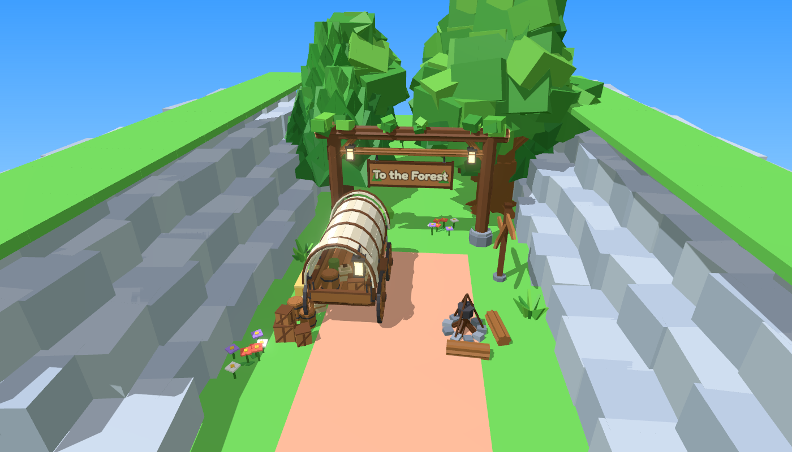
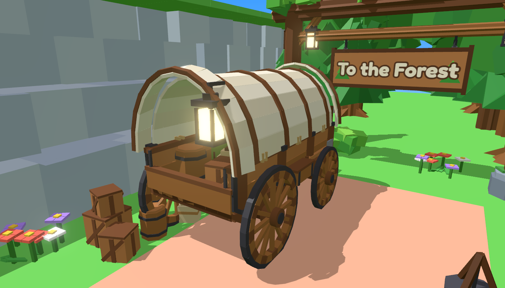
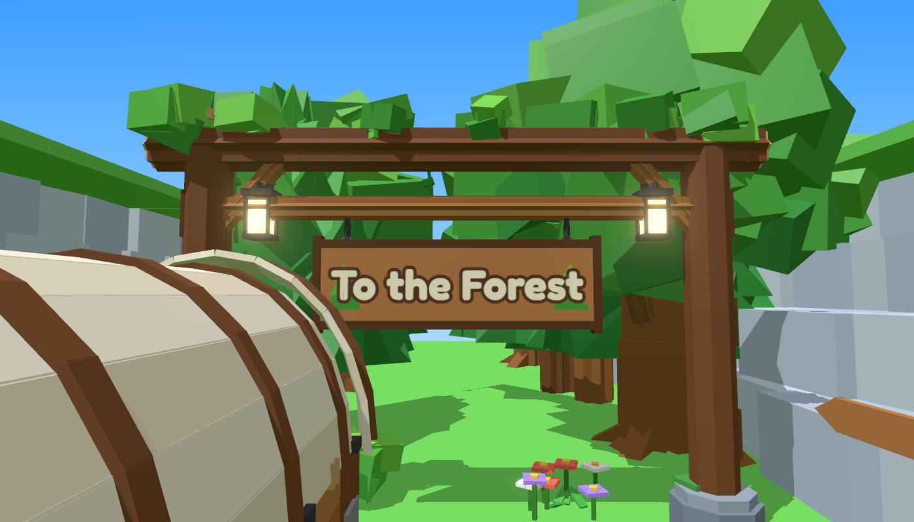
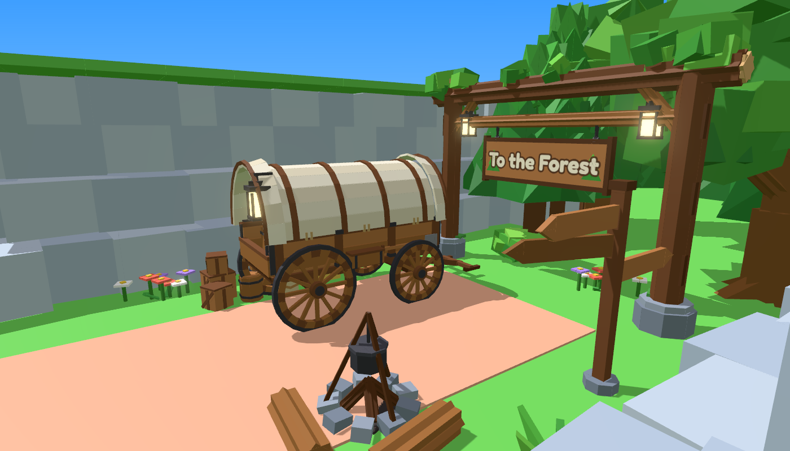

# Forest Entrance – de ingang naar het bos

`ForestEntrance.rbxm` vervangt de oude kar met het bordje "To the Forest". Het is een hele ingang in dezelfde stijl
als je spel, gemaakt van gewone Parts (872 stuks), dus het bestand werkt meteen.









## Wat zit erin

Het model **ForestEntrance** heeft 5 losse modellen. Je kunt elk stuk apart verplaatsen of weghalen.

| Onderdeel | Wat je ziet |
|---|---|
| **Wagon** | een huifkar met spaakwielen (ijzeren banden, 12 spaken, naven), assen, een vloer van losse planken, zijborden met ijzeren beslag, een huif van linnen met houten bogen en uitlopende randen, een bok met een geruite deken, een dissel, een emmer, een gereedschapskist, een schep, een **opgerolde lasso** aan de zijkant, een lantaarn die echt licht geeft, en lading achterin (ton, kist, zakken, slaaprol) |
| **Archway** | een poort van boomstammen op stenen voeten met mos, schuine steunbalken, bladeren en slingerplanten op de bovenste balk, twee lantaarns met licht, en een bord aan kettingen. Aan de kant van het kamp staat **"To the Forest"**, aan de kant van het bos **"To Wrangler Camp"** |
| **Signpost** | een wegwijzer met drie pijlen: **Critter Woods**, **Deep Woods** en **Wrangler Camp** (tekst op beide kanten) |
| **Campfire** | een kring van stenen, houtblokken, een echt **vuur** (Fire) met rook, opvliegende vonkjes en oranje licht, een driepoot met een pan soep, en twee boomstammen om op te zitten |
| **Cargo** | tonnen, gestapelde kisten, zakken, een hooibaal en een hooivork naast de kar |

De teksten staan in een **SurfaceGui** met het lettertype Fredoka One. Wil je andere tekst? Klik in de Explorer op
`Archway > SignBoard > TextBack > Label` (of `TextFront`) en verander `Text`.

## In Roblox Studio zetten

1. Klik met de rechtermuisknop op **Workspace** en kies **Insert from File...**. Kies `ForestEntrance.rbxm`.
2. Het midden van het model is het midden van het pad, precies op de grond. De kant met de kar en het kampvuur
   (+Z) wijst naar het kamp, de boog (-Z) naar het bos.
3. Zet het op zijn plek met de **Move**- en **Rotate**-tools, of met code:

```lua
local entrance = workspace.ForestEntrance
entrance:PivotTo(CFrame.new(0, 0, 0) * CFrame.Angles(0, math.rad(180), 0))
```

Het geheel is ongeveer **19 studs breed** (de bovenste balk van de boog is 18 studs, de palen staan 15 studs uit elkaar) en past dus in je kloof. Is je
kloof smaller of breder? Gebruik `entrance:ScaleTo(0.9)` (of een ander getal).

Alles staat vast (**Anchored**). Kleine versieringen (kettingen, touwtjes, bladeren, vuur) hebben `CanCollide` uit,
zodat spelers er niet achter blijven haken. De kar, de palen, de kisten en de tonnen zijn wel stevig.

## Let op

Ik heb het bestand gemaakt met de rbxm-writer uit deze repo, het in 3D gerenderd en gecontroleerd dat er geen losse,
zwevende onderdelen zijn. Roblox Studio zelf kan ik niet openen. Gaat er iets mis? Kopieer de tekst uit het
Output-venster en stuur die op, dan los ik het op.

## Opnieuw maken

De vormen en kleuren staan in `tools/forest-entrance/build_entrance.py`:

```
python3 tools/forest-entrance/build_entrance.py --rbxm models/forest-entrance/ForestEntrance.rbxm
```
