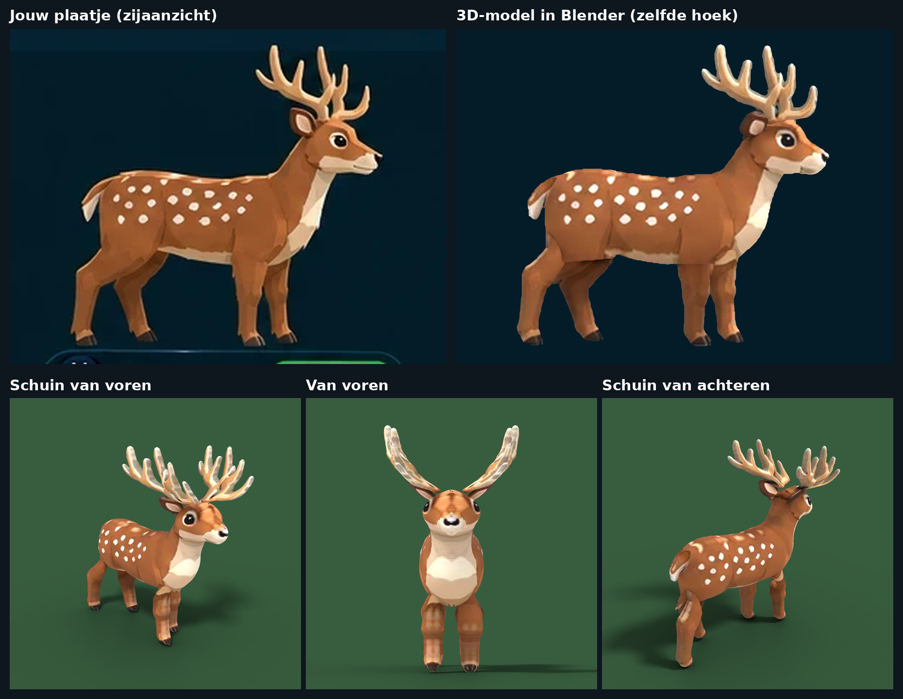

# Create a Zoo – bosdieren, nieuwe hoge kwaliteit (werk in uitvoering)

Deze dieren worden gemaakt vanuit jouw referentieblad (`tools/blender/reference/forest_side_views.webp`):

1. De omtrek van elk dier wordt uit het zijaanzicht geknipt en opgedeeld in lijf, poten, oren en gewei.
2. Elk deel wordt in Blender "opgeblazen" tot 3D. Van opzij heeft het model daardoor precies de vorm van
   de tekening; de breedte (van voren gezien) komt uit het vooraanzicht van het hert op het blad.
3. De tekening zelf wordt de textuur, zodat vlekken, ogen en schaduwen kloppen.

| Dier | Bestand | Driehoekjes | Onderdelen (MeshParts) |
|---|---|---|---|
| Deer | `Deer.glb` | ca. 15.400 | Body (met kop, oren, gewei, staart), LegFL, LegFR, LegBL, LegBR |

Het setup-script (gewrichten, RootPart) is nog niet aangepast aan deze nieuwe dieren. Dat komt zodra alle
dieren goedgekeurd zijn. Je kunt `Deer.glb` al wel importeren via **Import 3D** om hem in Studio te bekijken.

Opnieuw maken: `pip install bpy scikit-image scipy pillow` en dan
`python3 tools/blender/deer.py tools/blender/reference/forest_side_views.webp <map>`.
