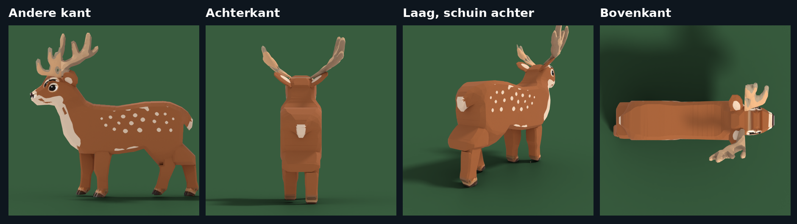

# Create a Zoo – bosdieren, nieuwe hoge kwaliteit (werk in uitvoering)

Deze dieren worden gemaakt vanuit jouw referentieblad (`tools/blender/reference/forest_side_views.webp`):

1. De omtrek van elk dier wordt uit het zijaanzicht geknipt en opgedeeld in lijf, poten, oren en gewei.
2. Elk deel wordt in Blender 3D gemaakt in de hoekige low-poly stijl van je plaatjes: platte zijkanten, een
   platte rug en borst en schuin afgesneden randen. Van opzij heeft het model precies de vorm van de tekening;
   de breedte (van voren gezien) komt uit het voor- en achteraanzicht van het hert op het blad.
3. Low-poly: de omtrek wordt eerst met rechte lijnen nagetekend, het model heeft weinig grote, vlakke
   vlakken (ongeveer 3.000 driehoekjes) en elk vlak wordt vlak belicht.
4. De kleuren komen uit de tekening, maar vlak gemaakt: de getekende lijntjes en schaduwstreepjes zijn weg en
   er blijven een paar egale kleuren over (bruin, crème, wit, de vlekken, het gewei). Het oog, de neus en de
   hoeven blijven zoals getekend. Rug, borst en voorkant van de poten zijn egaal, zonder vlekken.

| Dier | Bestand | Driehoekjes | Onderdelen (MeshParts) |
|---|---|---|---|
| Deer | `Deer.glb` | ca. 3.100 | Body (met kop, oren, gewei, staart), LegFL, LegFR, LegBL, LegBR |

Het setup-script (gewrichten, RootPart) is nog niet aangepast aan deze nieuwe dieren. Dat komt zodra alle
dieren goedgekeurd zijn. Je kunt `Deer.glb` al wel importeren via **Import 3D** om hem in Studio te bekijken.

Opnieuw maken: `pip install bpy scikit-image scipy pillow` en dan
`python3 tools/blender/deer.py tools/blender/reference/forest_side_views.webp <map>`.
