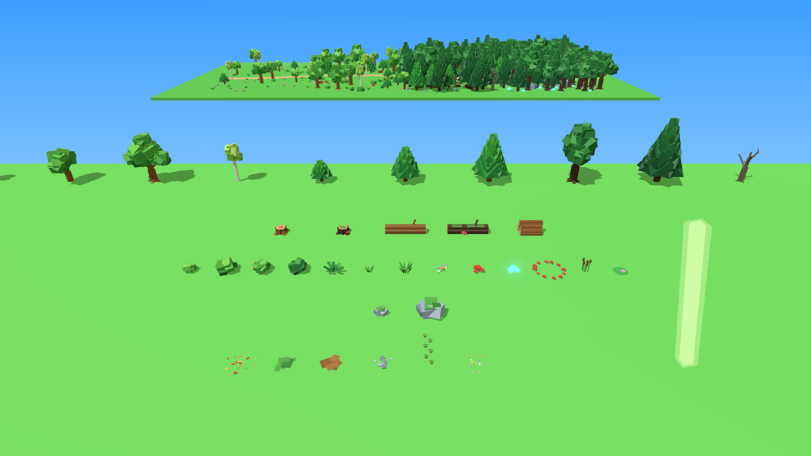
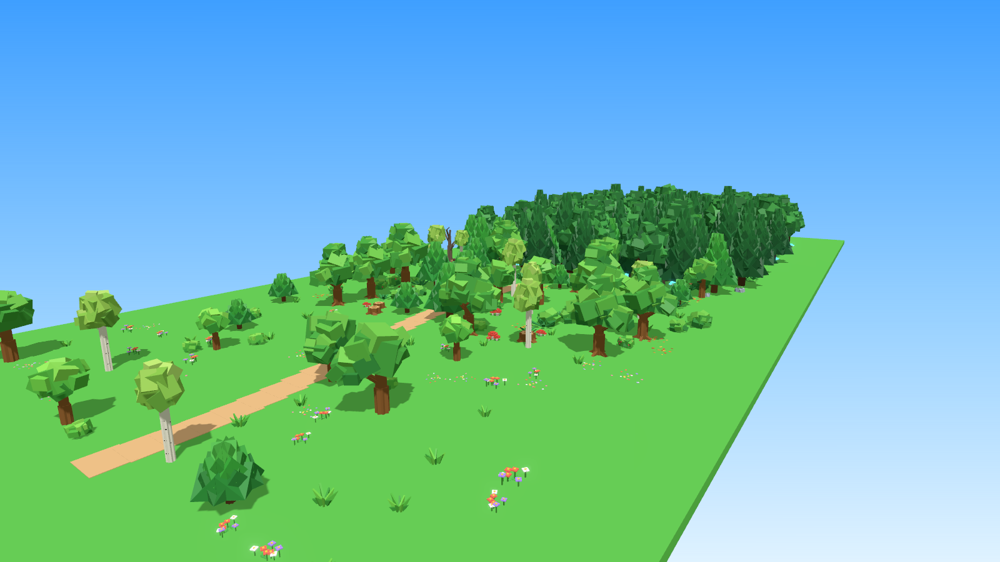
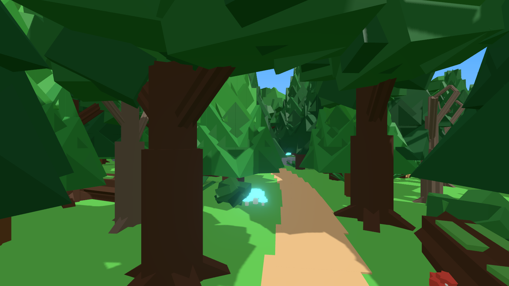
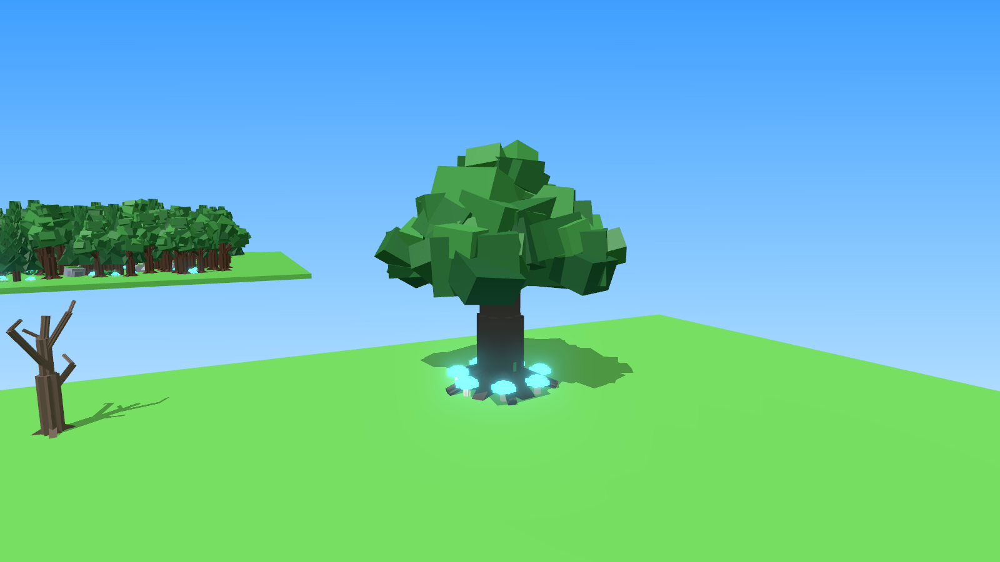

# Critter Woods – bosset (bomen, stammen, struiken en details)

`CritterWoodsKit.rbxm` bevat 39 modellen voor je bosgebied, in de low-poly stijl van je spel: kruinen van
schuin gedraaide blokken in een paar egale groentinten, achthoekige stammen en boomstammen en fel gekleurde
details. Alles is gemaakt van gewone Parts. Je hoeft dus niets te uploaden: het bestand werkt meteen.









## In Roblox Studio zetten

1. Klik in de **Explorer** met de rechtermuisknop op **Workspace** (of **ServerStorage**) en kies
   **Insert from File...**. Kies `CritterWoodsKit.rbxm`.
2. Je krijgt een map **CritterWoodsKit** met de mappen `Trees`, `Wood`, `Plants`, `Rocks` en `Ground`. In de
   Workspace staan alle modellen netjes op rijen, zodat je ze kunt bekijken.
3. Sleep een model naar je map of kopieer het (Ctrl+D) en verplaats het.

Elk model heeft:
- een **pivot op de grond** onder het midden, dus `model:PivotTo(CFrame.new(punt))` zet het precies op de grond;
- alle Parts **Anchored**. Stammen, boomstammen en rotsen botsen (CanCollide aan). Bladeren, struiken, gras en
  grondversiering niet, zodat spelers en dieren er gewoon doorheen lopen;
- de attributen `Category`, `Zone` (Edge, Woodland, Deep, Heart of Water), `Height` (in studs) en
  `Description`, en de tag `CritterWoodsKit`.

## Wat erin zit

Een speler is ongeveer 5 studs hoog.

| Map | Model | Zone | Hoogte | Wat het is |
|---|---|---|---|---|
| Trees | `OakSmall` | Edge | 10 | kleine ronde boom, felgroen |
| Trees | `OakMedium` | Woodland | 15 | ronde boom met een tweede bladerbos |
| Trees | `OakLarge` | Woodland | 20 | grote boom met drie bladerbossen en wortels |
| Trees | `BirchTree` | Edge | 16 | slanke witte berk met zwarte streepjes, geelgroen blad |
| Trees | `PineSmall` | Edge | 9 | jonge den |
| Trees | `PineMedium` | Woodland | 14 | den |
| Trees | `PineTall` | Woodland | 20 | hoge den |
| Trees | `DeepOak` | Deep | 24 | donkere, dikke boom met wortels |
| Trees | `DeepPine` | Deep | 26 | heel hoge, donkere den |
| Trees | `DeadTree` | Deep | 14 | kale, griezelige boom |
| Trees | `AncientTree` | Heart | 32 | reuzenboom met grote wortels, mos, gloeiende paddenstoelen en vuurvliegjes |
| Wood | `Stump` / `StumpMossy` | Woodland / Deep | 2 | boomstronk met jaarringen (de mossige met een paddenstoeltje) |
| Wood | `FallenLog` / `FallenLogMossy` | Woodland / Deep | 4 | omgevallen boom (13 studs lang), dieren kunnen erachter schuilen |
| Wood | `LogPile` | Woodland | 4 | stapel gezaagde stammen |
| Plants | `BushSmall`, `BushLarge`, `BerryBush`, `DarkBush` | Edge → Deep | 2–4 | struiken, de bessenstruik heeft rode besjes |
| Plants | `Fern` | Deep | 2 | varen |
| Plants | `GrassTuft`, `TallGrass` | Edge | 2–3 | pollen gras |
| Plants | `FlowerPatch` | Edge | 1 | groepje bloemen in 3 kleuren |
| Plants | `MushroomCluster` | Woodland | 2 | drie rode paddenstoelen met witte stippen |
| Plants | `GlowMushrooms` | Deep | 2 | blauw gloeiende paddenstoelen (Neon met een lampje) |
| Plants | `MushroomRing` | Heart | 1 | heksenkring van 12 paddenstoeltjes |
| Plants | `Reeds` | Water | 4 | lisdodden voor de oever |
| Plants | `LilyPad` | Water | 1 | waterlelieblad met een roze bloem (zet het op het wateroppervlak) |
| Rocks | `MossyRockSmall`, `MossyRockLarge` | Woodland / Deep | 2–4 | rotsen met mos erop |
| Ground | `LeafLitter` | Woodland | plat | gevallen blaadjes |
| Ground | `MossPatch` | Deep | plat | mosplekken |
| Ground | `DirtPatch` | Woodland | plat | kale plekken zand |
| Ground | `Pebbles` | Water | plat | kiezelsteentjes voor oevers en paden |
| Ground | `PawPrints` | Woodland | plat | een spoor van pootafdrukken: een hint waar dieren lopen |
| Ground | `PetalScatter` | Edge | plat | bloemetjes tussen het gras |
| Ground | `SunShaft` | Deep | 34 | zachte lichtstraal door het bladerdak |
| Ground | `Fireflies` | Deep | – | onzichtbaar blok waar vuurvliegjes omheen zweven |

**Over "decals":** echte Roblox-Decals zijn plaatjes, en die moet je eerst zelf uploaden voordat ze werken.
Daarom zijn de grondversieringen (blaadjes, mos, pootafdrukken, bloemetjes) gemaakt van dunne, platte Parts.
Ze zien er van dichtbij hetzelfde uit en werken meteen.

## Snel een bos neerzetten met ForestScatter

In de map zit ook een script, **ForestScatter**, dat een gebied voor je vult met bomen en planten. Hoe dieper
je het bos in gaat, hoe dichter het wordt:

| Zone | Bomen per 100 × 100 studs | Welke bomen |
|---|---|---|
| Edge | ongeveer 12 | kleine eiken, berken, jonge dennen, veel bloemen en gras |
| Woodland | ongeveer 35 | eiken en dennen, struiken, stronken, paddenstoelen |
| Deep | ongeveer 80 | donkere eiken en dennen, kale bomen, varens, mos, gloeiende paddenstoelen |
| Heart | ongeveer 110 | alleen donkere bomen, varens en mos |

Zo gebruik je het:

1. Zet een groot, doorzichtig blok (Part) over de grond waar het bos moet komen, bijvoorbeeld 400 × 10 × 150
   studs. Noem het `ForestArea`. De bosrand komt aan de voorkant van het blok (de kant waar het naar "kijkt",
   de Front-kant) en het hart aan de achterkant. Komt het bos verkeerd om te staan? Draai het blok 180 graden
   en voer het nog eens uit.
2. Open **View → Command Bar**, plak dit erin en druk op Enter:

```lua
local scatter = require(workspace.CritterWoodsKit.ForestScatter)
scatter.fillGradient(workspace.ForestArea)   -- bosrand vooraan, het hart achteraan
```

Wil je maar één zone? Gebruik dan `scatter.fill(workspace.ForestArea, "Deep")` (of `"Edge"`, `"Woodland"`,
`"Heart"`).

Het script zoekt voor elke boom de grond op (Terrain of Parts), slaat water over, houdt afstand tussen de bomen
en draait en vergroot elke boom een beetje anders. Alles komt in een nieuwe map in de Workspace, bijvoorbeeld
`Forest_Gradient`. Vind je het niet mooi? Verwijder die map en voer het nog eens uit: elke keer komt er een
ander bos uit. Met hetzelfde getal erachter (`scatter.fillGradient(workspace.ForestArea, 42)`) krijg je steeds
hetzelfde bos. Haal daarna het blok `ForestArea` weg, of zet het op onzichtbaar.

Tip: zet een open plek in het hart met de `AncientTree` en de `MushroomRing` erbij. Dat is een mooie plek voor
een legendarisch dier.

## Let op

Ik heb het bestand gemaakt met dezelfde rbxm-writer als je dieren, de previews gerenderd en het script
gecontroleerd met de officiële Luau-checker (geen fouten). Roblox Studio zelf kan ik niet openen. Gaat er iets
mis bij het invoegen of bij het script? Kopieer dan de tekst uit het Output-venster en stuur die op.

## Opnieuw maken

De modellen worden gemaakt door `tools/forest-kit/build_kit.py`, en het script staat in
`tools/forest-kit/ForestScatter.lua`:

```
python3 tools/forest-kit/build_kit.py --rbxm models/forest-kit/CritterWoodsKit.rbxm
```

Dat schrijft ook `tools/forest-kit/build/world.json`, het preview-bos voor de viewer: kopieer het naar
`tools/viewer/`, start daar `python3 -m http.server 8123` en render met
`node sceneshot.js world.json forest uit.png` (of: `kit`, `deep`, `ancient`). Daarvoor is Playwright nodig.
