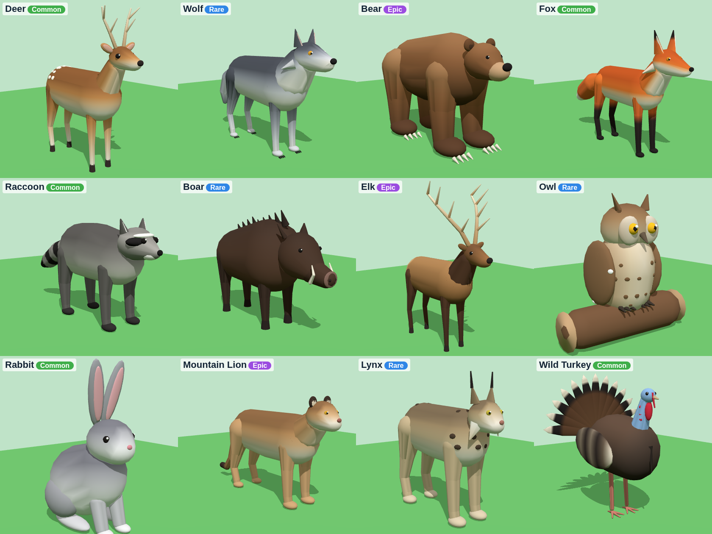

# Create a Zoo – bosdieren (Forest biome)

12 low-poly 3D-dieren in de stijl van het Forest Biome-plaatje:



| Dier | Zeldzaamheid | Bestand |
|---|---|---|
| Deer | Common | `Deer.glb` |
| Fox | Common | `Fox.glb` |
| Raccoon | Common | `Raccoon.glb` |
| Rabbit | Common | `Rabbit.glb` |
| Wild Turkey | Common | `WildTurkey.glb` |
| Wolf | Rare | `Wolf.glb` |
| Boar | Rare | `Boar.glb` |
| Owl | Rare | `Owl.glb` |
| Lynx | Rare | `Lynx.glb` |
| Bear | Epic | `Bear.glb` |
| Elk | Epic | `Elk.glb` |
| Mountain Lion | Epic | `MountainLion.glb` |

Elk dier bestaat uit 4 tot 7 MeshParts (lijf, kop, poten, staart en bij sommige dieren vleugels) met samen
3.000 tot 7.000 driehoekjes, en één kleine textuur voor de vachtkleuren. Dat is licht genoeg voor veel dieren
tegelijk in je spel.

## In Roblox Studio zetten (2 stappen)

1. **Importeren**: ga naar het tabblad **Avatar** → **Import 3D** (of **File** → **Import 3D**) en kies alle
   `.glb`-bestanden tegelijk. Laat de instellingen zoals ze zijn en klik op **Import**. De dieren verschijnen
   in de Workspace. Mocht het importvenster een optie hebben om meshes samen te voegen, zet die dan uit:
   de losse delen (Body, Head, LegFR, …) zijn nodig voor de gewrichten.
2. **Afmaken met het script**: open **View** → **Command Bar**, plak de hele inhoud van `SetupZooAnimals.lua`
   erin en druk op Enter. In het Output-venster zie je per dier "Set up Deer" enzovoort.

Daarna staan alle dieren in **ReplicatedStorage → ZooAnimals**.

## Wat het script aan elk dier toevoegt

- **RootPart**: een onzichtbaar blok om het dier heen. Het is de `PrimaryPart` en de hitbox, en staat vast
  (`Anchored`). De pivot zit onder de voeten, dus `model:PivotTo(cframe)` zet het dier precies op de grond.
- **Gewrichten (Motor6D)**: `Head`, `LegFR`, `LegFL`, `LegBR`, `LegBL`, `Tail` (en `WingR`/`WingL` bij de uil
  en de kalkoen), zodat je de dieren kunt animeren.
- **OverheadAttachment**: het punt boven de kop voor een naambordje.
- **Attributen** `AnimalId`, `DisplayName` en `Rarity`, en de tag `ZooAnimal`.

## Voorbeeld (Luau)

```lua
local ReplicatedStorage = game:GetService("ReplicatedStorage")
local animals = ReplicatedStorage:WaitForChild("ZooAnimals")

local deer = animals.Deer:Clone()
deer:PivotTo(CFrame.new(0, 0, 0))  -- voeten op de grond op (0, 0, 0)
deer.Parent = workspace
print(deer:GetAttribute("Rarity"))  -- "Common"
```

## Let op

Ik heb de bestanden gecontroleerd met de officiële glTF-validator (0 fouten) en de rekenkunde van het script
getest, maar ik kan Roblox Studio zelf niet openen. Gaat er bij het importeren of bij het script iets mis?
Kopieer dan de tekst uit het Output-venster en stuur die op, dan los ik het op.

## Opnieuw maken

De dieren worden gemaakt door `tools/animal-models/forest.py` (vormen en kleuren per dier) en
`tools/animal-models/build_forest.py`:

```
pip install numpy scipy
python3 tools/animal-models/build_forest.py
```

Dat schrijft de `.glb`-bestanden en `SetupZooAnimals.lua` naar `tools/animal-models/build/forest/`.
