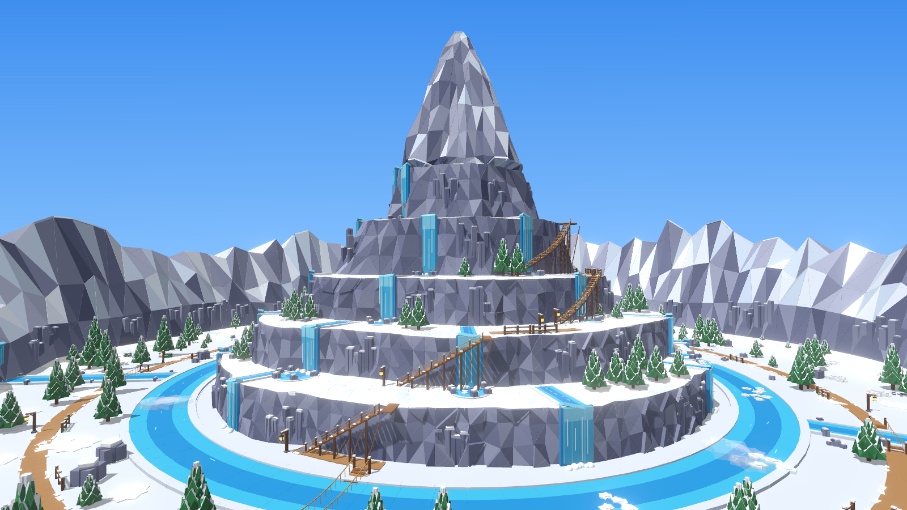
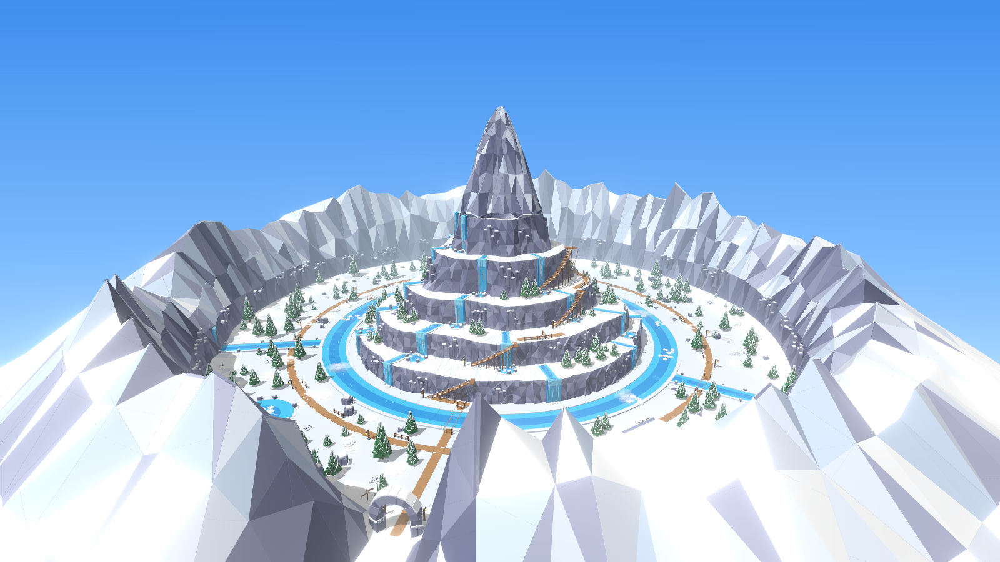
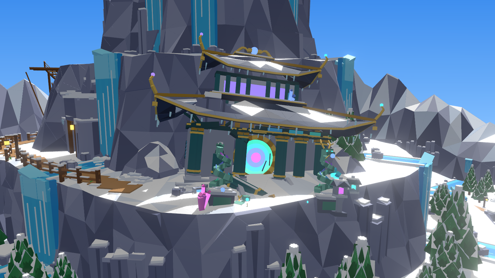
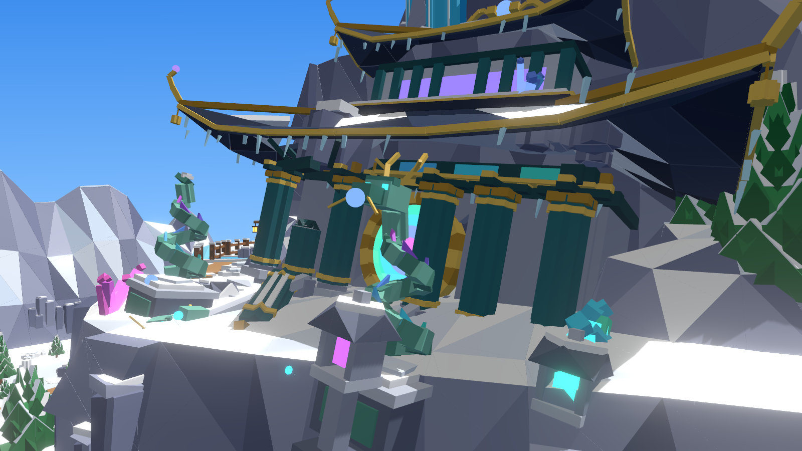
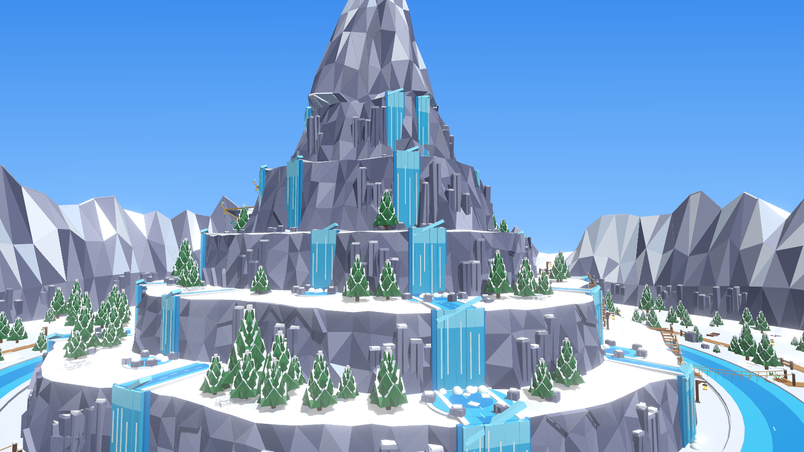
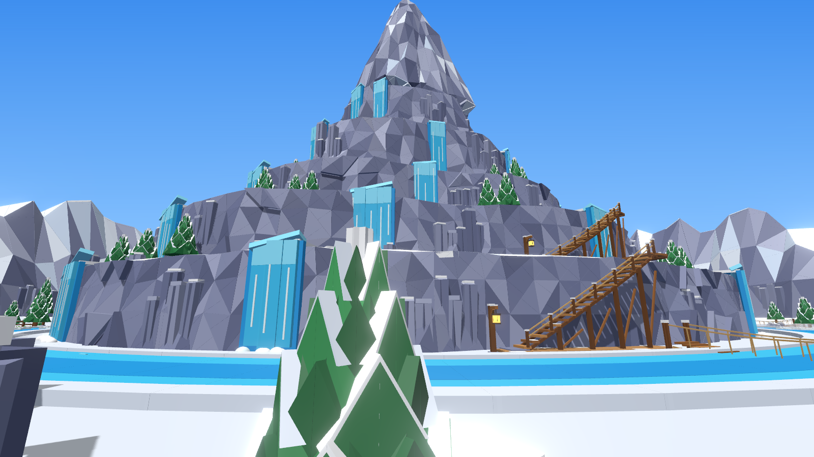
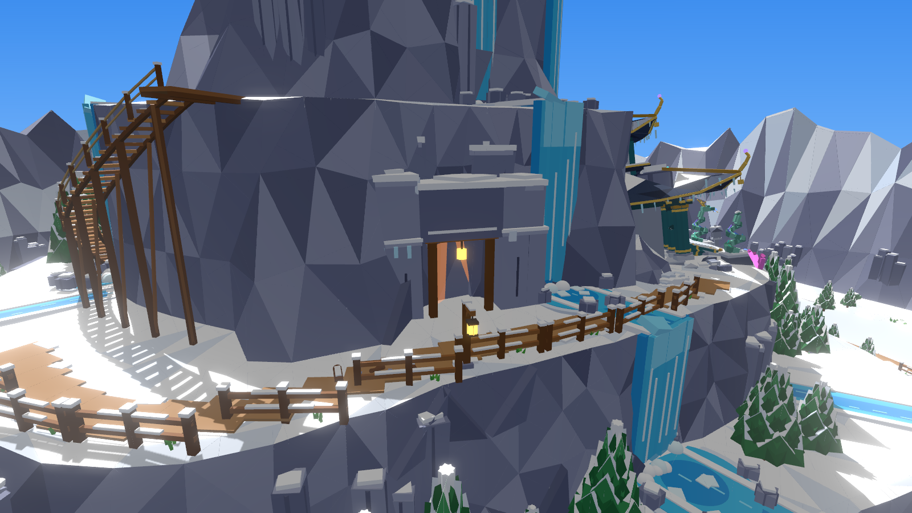
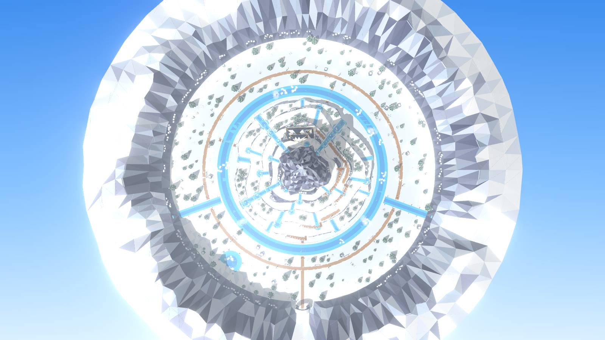
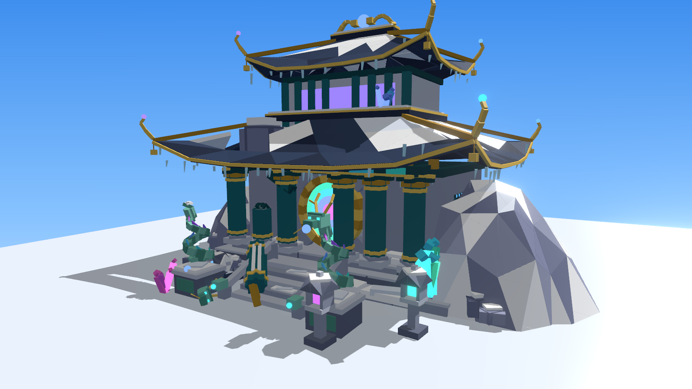
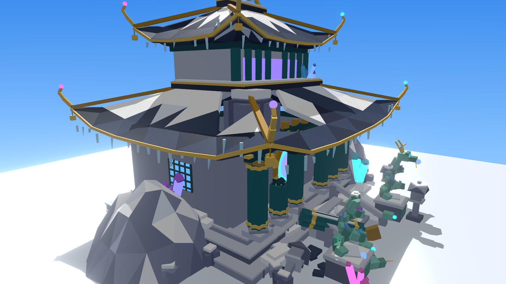

# Frost Peak – het ronde bergengebied

`FrostPeakArea.rbxm` is het complete nieuwe gebied: één groot rond dal (bijna 700 studs breed) met in het midden de
berg van je referentieplaatje en rondom een ring van bergen.

De berg is nu één echte berg met facetten, gemaakt van driehoeken (twee WedgeParts per driehoek), in plaats van
losse blokken. Het blijft dezelfde gladde low-poly stijl als Critter Woods en Dark Woods, zonder noppen.

- **De kliffen:** ze hellen schuin, met richels en verticale facetten.
- **De sneeuw:** ligt op de vlakke stukken en loopt in strepen over de top.
- **De top:** een scherpe piek met vier graten.










## Hoe het in elkaar zit

Van buiten naar binnen:

- **De rand:** een ring van besneeuwde bergen met facetten rondom het hele dal, met basaltzuilen aan de voet.
  - De ingang is een pas met een stenen boog (bij de `EntranceSpawn`), met een wegwijzer en lantaarns.
  - Waar de twee beekjes de rand raken, vallen watervallen naar beneden.
- **Het dal:** een ringpad met hekjes en lantaarns, een dennenbos, rotsen, een bevroren meer en een kampvuur.
  Naar de rand toe loopt de grond een beetje omhoog.
- **De rivier:** een turquoise ring om de berg, met ijsschotsen, mist en drie touwbruggen.
- **De berg:** vijf ringen met kliffen en besneeuwde terrassen, en bovenop de piek.
  - Op elke ring staan dennen en basaltzuilen.
  - Ruim 30 brede watervallen vallen in stralen van ring naar ring, met een beekje erboven en een plas eronder.
- **De klim:** houten trappen gaan van de grond ring voor ring omhoog.
  - De trappen hebben open treden op balken, palen naar beneden, een touwleuning en een bordes bovenaan.
  - Tussen de trappen lopen paden met hekjes en lantaarns.
  - Het pad op de derde ring gaat langs de grot naar de tempel.

## De tempel van de Aurora Dragon

Aan de achterkant van de berg (op de derde ring) staat de tempel van de Aurora Dragon. Het is een oude tempel in
oosterse stijl, net als de draak zelf. Hij is scheef in de berg weggezakt en de berg is er deels overheen geschoven.

Wat erin zit:

- **Het gebouw:**
  - Stenen terrassen en blauwgroene gelakte zuilen met gouden banden.
  - Twee gebogen daken met opkrullende hoeken en gouden drakenkrullen.
  - Een parel in de kleuren van de draak op de nok.
- **De poort en het altaar:**
  - Een ronde maanpoort die gloeit in de aurora-kleuren van de draak, met licht en vonkjes.
  - Binnen staat een altaar met een runenring. Het onzichtbare Part `DragonSpawn` geeft aan waar de draak kan rusten.
- **Eromheen:** twee opgerolde stenen drakenbeelden met gouden geweien, stenen lantaarns en aurora-kristallen.
- **Wat er kapot is:**
  - Een zuil is gebroken en over de trap gevallen.
  - Een rotsblok is door het onderste dak gevallen.
  - Eén drakenbeeld is zijn kop kwijt.
  - Een lantaarn is omgevallen.
  - Er liggen sneeuw en rotsen tegen de zijkant.

Ongeveer 1.500 parts.

`DragonTemple.rbxm` is dezelfde tempel apart en recht (niet weggezakt). Die kun je ook ergens anders neerzetten.




## In Studio zetten

1. Sleep `FrostPeakArea.rbxm` in Studio. Er komt één Model `FrostPeakArea` in Workspace.
2. Verplaats het met `PivotTo` naar een lege plek. Het draaipunt ligt bij de ingang.
3. Spelers komen binnen bij het Part `EntranceSpawn`. Zet je teleport daarheen.
4. Zet de Aurora Dragon op `DragonSpawn` in de tempel (in de map `Temple`).

De mappen in het model zijn `Ground`, `Mountain`, `Temple`, `Rim`, `Water`, `Paths`, `Trees` en `Decor`.

## Telefoons

- Het gebied telt ongeveer 39.700 parts. Dat is veel, dus **zet `Workspace.StreamingEnabled` aan**. Dan laadt een
  telefoon alleen wat in de buurt is.
- Bomen en kliffen hebben `LevelOfDetail = StreamingMesh`, zodat ze ver weg als simpele vorm getekend worden.
- Kleine details zoals sneeuw, scheuren en ijspegels hebben geen botsing en geen schaduw.
- Water is half doorzichtig plastic, geen Glass.

Wil je het lichter maken? Haal dan wat dennen uit `Trees` weg. Daar zitten de meeste parts.

## Opnieuw bouwen

```
python3 tools/frost-peak-kit/build_frost_area.py --rbxm models/frost-peak-area/FrostPeakArea.rbxm --temple models/frost-peak-area/DragonTemple.rbxm
```

Alles staat bovenaan `tools/frost-peak-kit/build_frost_area.py`, dus het is makkelijk aan te passen:

- `TIERS`: grootte en hoogte van de ringen.
- `EXTRA_FALLS`: de watervallen.
- `STAIRS`: de trappen.
- `TEMPLE_ANGLE`: waar de tempel staat.
- `RIM_ROWS`: de bergen rondom.

De tempel zelf staat in `tools/frost-peak-kit/dragon_temple.py`.
