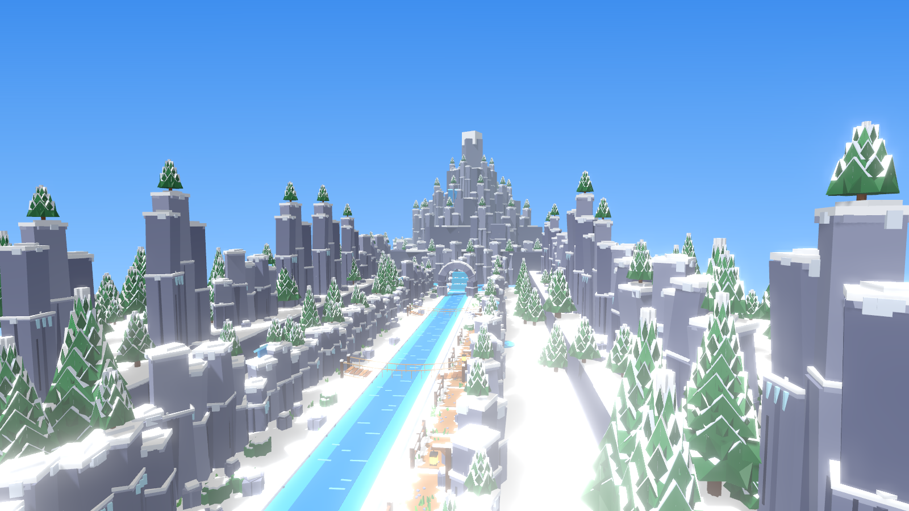
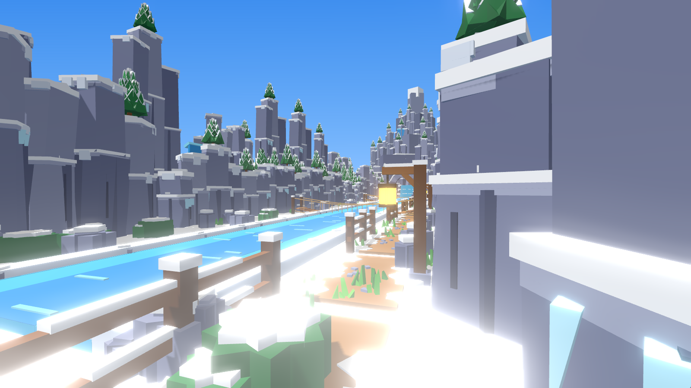
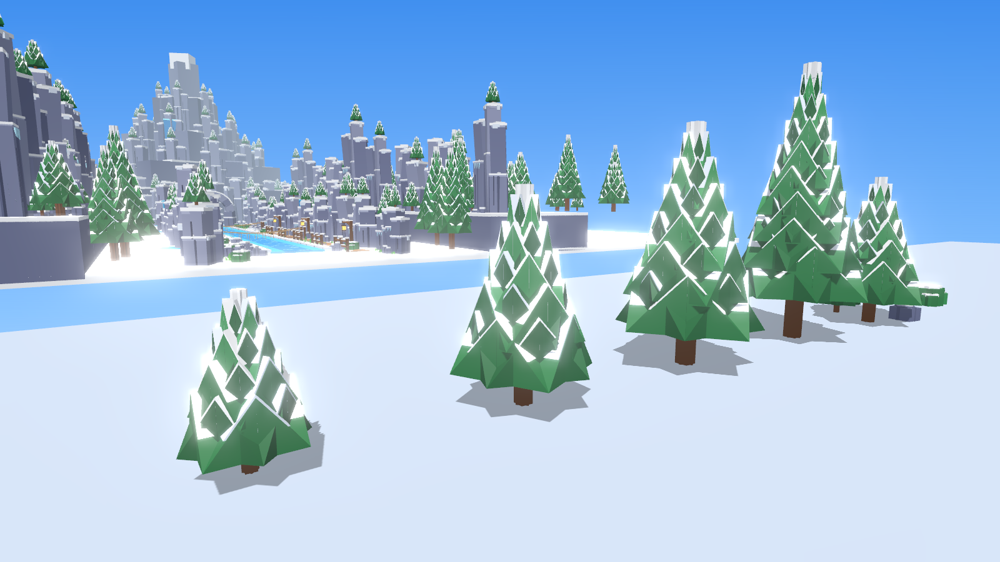
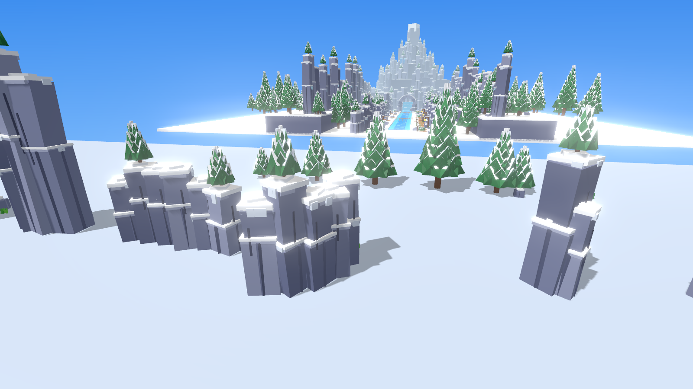
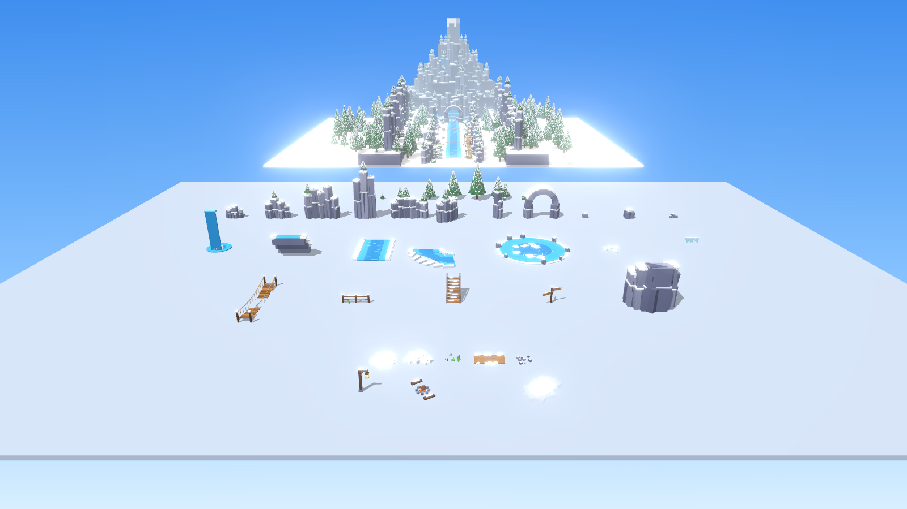

# Frost Peak – decorset voor het bergengebied

`FrostPeakKit.rbxm` bevat 39 decorstukken voor het nieuwe grote, ronde bergengebied. De stijl komt van je
referentieplaatje: blauwgrijze kliffen van rotszuilen met dikke sneeuwkappen, dennen vol sneeuw, turquoise rivieren
en bevroren meren, watervallen, touwbruggen, houten hekjes, lantaarnpalen en een grot in de berg.

Het is gemaakt in dezelfde gladde low-poly stijl als de Critter Woods- en Dark Woods-sets (geen noppen), maar met veel
meer detail: dennen met facetten en een laag sneeuw op elke laag, kliffen met richels, scheuren, ijspegels en
sneeuw die over de randen druipt, en water dat beweegt. Alles is van gewone Parts gemaakt, je hoeft niets te
uploaden.







(De plaatjes van het dal zijn een voorbeeld dat ik met de set heb gebouwd. Het echte ronde gebied maken we hierna.)

## Wat erin zit

| Map | Modellen |
|---|---|
| Trees | `PineSapling`, `SnowPineSmall`, `SnowPine`, `SnowPineLarge`, `SnowPineTall` (5 tot 31 studs), `PineCluster` (drie dennen en een rots), `SnowyBush` |
| Cliffs | `CliffSmall`, `CliffMedium`, `CliffLarge`, `CliffTall` (tot 37 studs), `CliffWall` (rechte wand van 24 studs), `CliffCorner` (kwart cirkel), `CliffPillar`, `StoneArch` (natuurlijke boog, 18 studs breed), `Boulder`, `BoulderLarge`, `RockPile` |
| Water | `WaterfallTall` (24 studs, met plas, mist en opspattend water), `WaterfallCascade` (over drie treden), `RiverStraight` (16 × 32), `RiverBend` (kwart cirkel), `FrozenLake` (40 studs, met scheuren en ijsschotsen), `IceFloes`, `Icicles` |
| Wood | `RopeBridge` (36 studs, doorhangend), `WoodFence` (12 studs), `WoodStairs`, `SignPost`, `CaveEntrance` (grot met houten stutten en warm licht) |
| Ground | `SnowPatch`, `SnowDrift`, `GrassTufts` (gras dat door de sneeuw steekt), `DirtPath` (12 × 6), `Pebbles` |
| Lights | `LanternPost` (met lampje), `Campfire` (met vuur, rook en lampje), `SnowfallZone` (laat sneeuw vallen), `MistPatch` |

**Bewegend water:** de watervallen hebben een Beam met een ingebouwde Roblox-textuur die naar beneden stroomt, plus
mist en opspattend water onderaan. Daar hoef je niets voor te uploaden.

## Gemaakt voor telefoons

- Alleen kliffen, rotsen, stammen en hout waar je op loopt botsen; sneeuw, planten, water en effecten niet.
- Kleine onderdelen geven geen schaduw. Alleen de lantaarnpaal, het kampvuur en de grot hebben een lampje.
- Bomen en kliffen hebben `LevelOfDetail = StreamingMesh`: met **StreamingEnabled** aan tekent Roblox ze ver weg als
  simpele versie.
- De dennen zijn gedetailleerder dan in je bos (40 tot 100 Parts). Zet er dus niet honderden dicht op elkaar; de
  scatter hieronder houdt daar rekening mee.

## In Roblox Studio zetten

1. Klik in de Explorer met de rechtermuisknop op **Workspace** (of **ServerStorage**) → **Insert from File...** →
   `FrostPeakKit.rbxm`. Je krijgt een map **FrostPeakKit** met de mappen `Trees`, `Cliffs`, `Water`, `Wood`, `Ground`
   en `Lights`.
2. Elk model heeft een **pivot op de grond** (bij `Icicles` bovenaan, om onder een richel te hangen), dus
   `model:PivotTo(CFrame.new(punt))` zet het precies neer. Elk model heeft de attributen `Category`, `Zone`, `Height`
   en `Description`.

## Snel vullen met FrostPeakScatter

Het gebied wordt een grote cirkel: **The Peak** in het midden, **The Slopes** daaromheen en **The Valley** aan de
buitenkant. Zet een groot (doorzichtig) blok over de grond, noem het `FrostPeakArea`, en typ in de Command Bar:

```lua
local scatter = require(workspace.FrostPeakKit.FrostPeakScatter)
scatter.fillRings(workspace.FrostPeakArea)   -- Peak in het midden, Slopes, Valley aan de buitenkant
```

Het script zet dennen, rotsen, sneeuwduinen en gras neer, en slaat steile klifwanden en water over. Eén zone over een
heel blok kan ook: `scatter.fill(workspace.SomeArea, "Slopes")` (of `"Valley"`, `"Peak"`). De grote stukken (kliffen,
watervallen, rivier, meer, bruggen, grot, lantaarns) zet je zelf neer, want die bepalen de vorm van het gebied.

## Opnieuw maken

```
python3 tools/frost-peak-kit/build_frost_kit.py --rbxm models/frost-peak-kit/FrostPeakKit.rbxm
```
