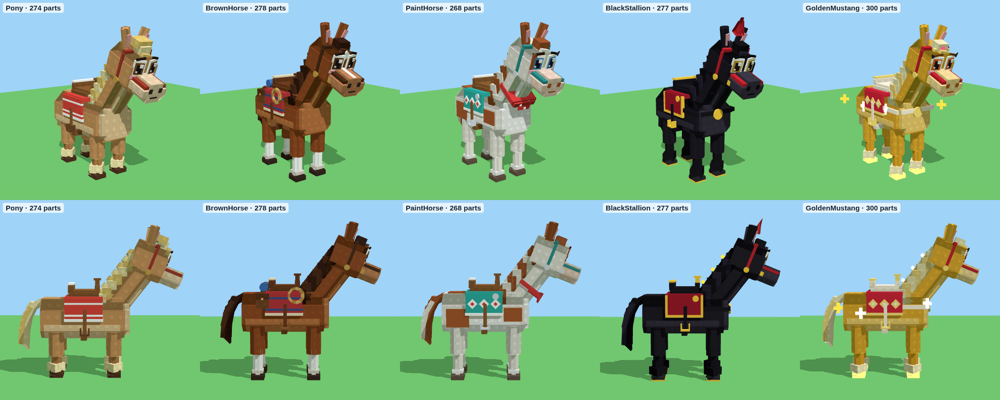

# Paarden – Pony, Brown Horse, Paint Horse, Black Stallion en Golden Mustang

`Horses.rbxm` bevat nieuwe modellen voor de vijf paarden, in dezelfde blokjesstijl en kwaliteit als je andere
dieren en de Thunder Unicorn. Ze hebben allemaal hetzelfde lijf (net als de unicorn), dus ze bewegen hetzelfde,
maar elk paard heeft een eigen vacht, aftekening, manen, tuig en effecten. Hoe zeldzamer, hoe meer effecten.



(De deeltjes, lichtsporen en de gloed zie je niet in deze plaatjes, alleen in Roblox.)

| Model | Zeldzaamheid | Hoe hij eruitziet | Effecten | Idle-actie |
|---|---|---|---|---|
| `Pony` | Common | kleiner, karamelkleurig, met korte beentjes, pluizige blonde manen en pluizige hoefjes, een rood-wit dekje en een madeliefje achter zijn oor | stofwolkjes bij elke stap | graast: hoofd omlaag, knabbelen, staart zwiepen |
| `BrownHorse` | Rare | kastanjebruin met witte sokken, een witte bles, donkere manen, een westernzadel met een opgerolde lasso, zadeltassen en een slaaprol | stofwolkjes | krabt met zijn voorhoef in het zand |
| `PaintHorse` | Epic | wit met kastanjebruine vlekken, een bruine vlek over één oog, wimpers, een turquoise dekje met ruitjes, zilveren knopen en een rode bandana | stof en paarse vonkjes bij elke stap, kleine schokgolf, lichtspoor achter de hoeven | schudt zijn hoofd en manen, met een wolk vonkjes |
| `BlackStallion` | Legendary | groter, gitzwart met lange golvende manen, lange staart en behaarde hoeven met gouden hoefijzers, rood-goud tuig, een borsttuig met een gouden medaille, een gouden ster en een rode pluim | gouden lichtsporen achter alle hoeven, vonken en een gouden schokgolf bij elke stap, stoom uit zijn neus, glinsters in zijn manen, een gouden randje | steigert, hinnikt met een regen van vonken en landt met een schokgolf |
| `GoldenMustang` | Mythic | goud met glanzende crème manen, gloeiende gouden hoeven, sterren op zijn flanken, een tiara, wimpers, rood-goud tuig, en vier sterretjes die om hem heen draaien | **een spoor van sparkles waar hij ook rent** (achter alle hoeven en zijn staart), sparkles bij elke stap, een gouden gloed, een lampje en een gouden aura | steigert in een explosie van sparkles en landt met een gouden schokgolf |

## Animaties

Het script **AnimalFX** (hetzelfde als bij de Dark Woods-dieren en de unicorn) laat ze bewegen. Het kijkt hoe snel
het model beweegt, dus je hoeft niets aan te zetten:

- **Lopen:** een rustige stap. **Rennen:** ze gaan over in een galop. Ook op hoge snelheid (tot Speed 80)
  blijven de benen netjes galopperen, niet wazig snel.
- **Stilstaan:** ademen, rondkijken, en elke paar seconden hun eigen idle-actie (zie de tabel).

## In je game zetten

1. Klik in de **Explorer** met de rechtermuisknop op **ServerStorage** (of **ReplicatedStorage**, of waar je
   paarden nu staan) en kies **Insert from File...** → `Horses.rbxm`. Je krijgt een map **Horses** met de vijf
   modellen.
2. Elk model werkt zoals je andere dieren:
   - **RootPart** is de hitbox en de PrimaryPart. De pivot zit op de grond.
   - **RideAttachment** (in RootPart) is de plek op het zadel waar de speler zit.
   - **OverheadAttachment** is de plek boven het hoofd, voor een naamkaartje.
   - Attributen: `AnimalId`, `DisplayName`, `Rarity`, `Mount = true`, en de tags `Mount` en `Horse`.
3. **Vervang je oude paarden.** Zoeken je scripts de paarden op hun naam (bijvoorbeeld "Brown Horse" met een
   spatie)? Geef het nieuwe model dan precies dezelfde naam als het oude. De animaties blijven werken, want die
   kijken naar het attribuut `AnimalId`. Zat er in je oude paarden iets dat je rij-script nodig heeft (een Seat,
   een Attachment met een andere naam, een script)? Verplaats dat naar het nieuwe model, of stuur me een
   screenshot van een oud paard in de Explorer, dan pas ik ze aan.
4. De plaatjes in je ride-menu komen van de oude modellen. Maak ze opnieuw met de nieuwe modellen (bijvoorbeeld
   met een ViewportFrame of een screenshot).

De Pony is expres kleiner (ongeveer 17 studs hoog) en de Black Stallion groter (ongeveer 23 studs). De rest is
ongeveer 20 studs, net als de Thunder Unicorn.

## Gemaakt voor telefoons

Ongeveer 270 tot 300 Parts per paard en 7 bewegende delen (8 bij de Golden Mustang). Kleine onderdelen geven geen
schaduw en botsen niet. Hoe gewoner het paard, hoe minder effecten: de Pony en de Brown Horse hebben alleen
stofwolkjes. Ver weg stoppen de effecten, en nog verder weg ook de animaties.

## Let op

Ik heb het bestand gemaakt met dezelfde rbxm-writer als je andere modellen, alle paarden gerenderd en het script
gecontroleerd met de Luau-checker. Roblox Studio zelf kan ik niet openen. Gaat er iets mis, kopieer dan de tekst
uit het Output-venster en stuur die op.

## Opnieuw maken

```
cd tools/animal-models
python3 build_horses.py --rbxm ../../models/horses/Horses.rbxm
```

De paarden staan in `tools/animal-models/horses.py`, de animaties in `AnimalFX.lua` (de profielen `Pony`,
`BrownHorse`, `PaintHorse`, `BlackStallion` en `GoldenMustang`, en de acties `graze`, `paw`, `toss` en `rear`).
