# Hub-gebouwen: Lasso Shop, Animal Market, Worlds, Wrangler Camp, Upgrade Camp en Dark Woods Cart

`HubBuildings.rbxm` bevat nieuwe, veel gedetailleerdere versies van zes dingen uit je hub, in dezelfde warme
blokstijl als je spel. Alles is gemaakt van gewone Parts, dus je hoeft niets te uploaden.

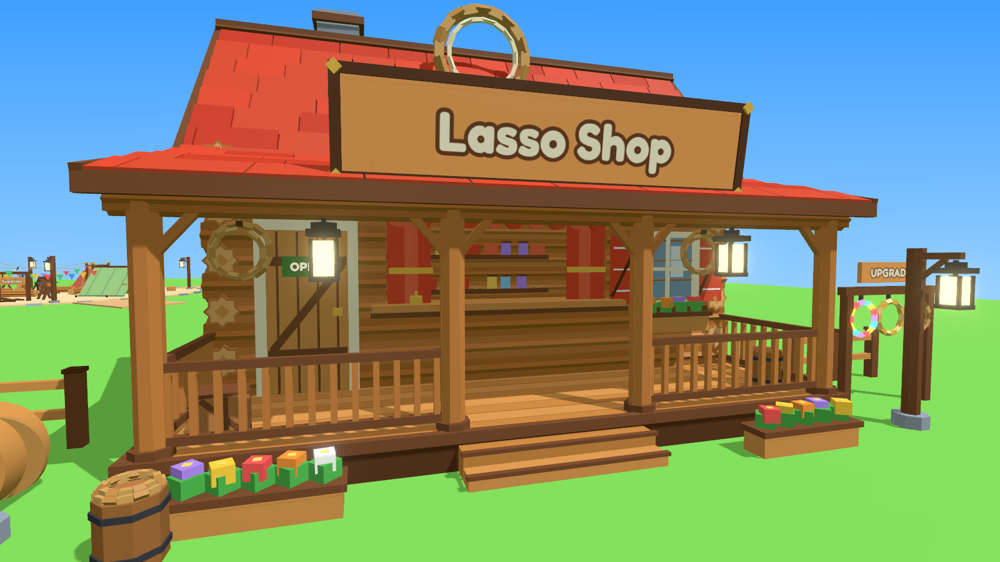

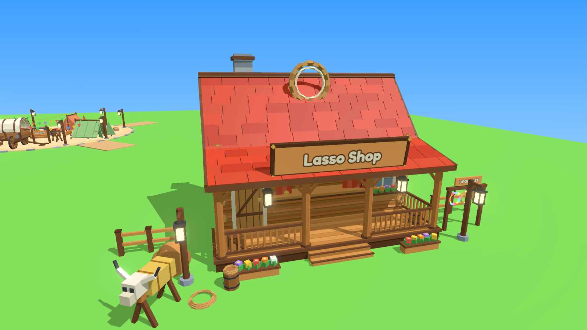

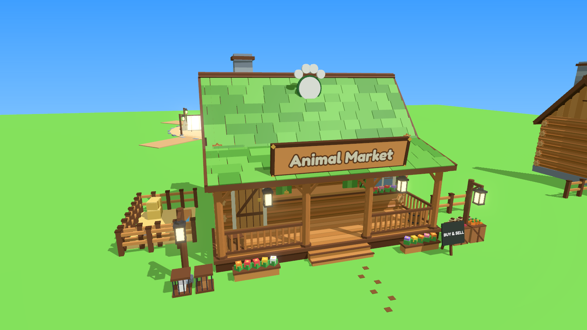

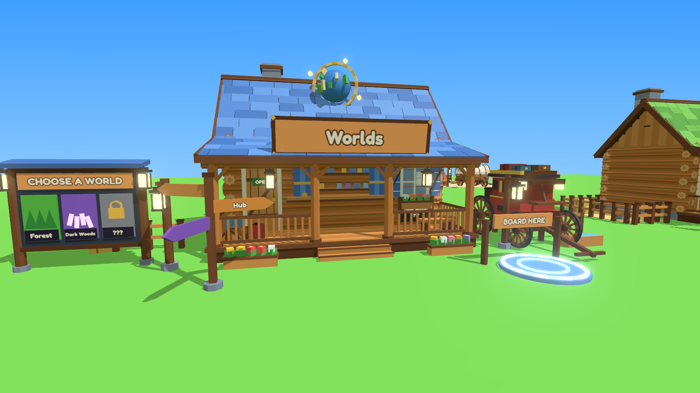

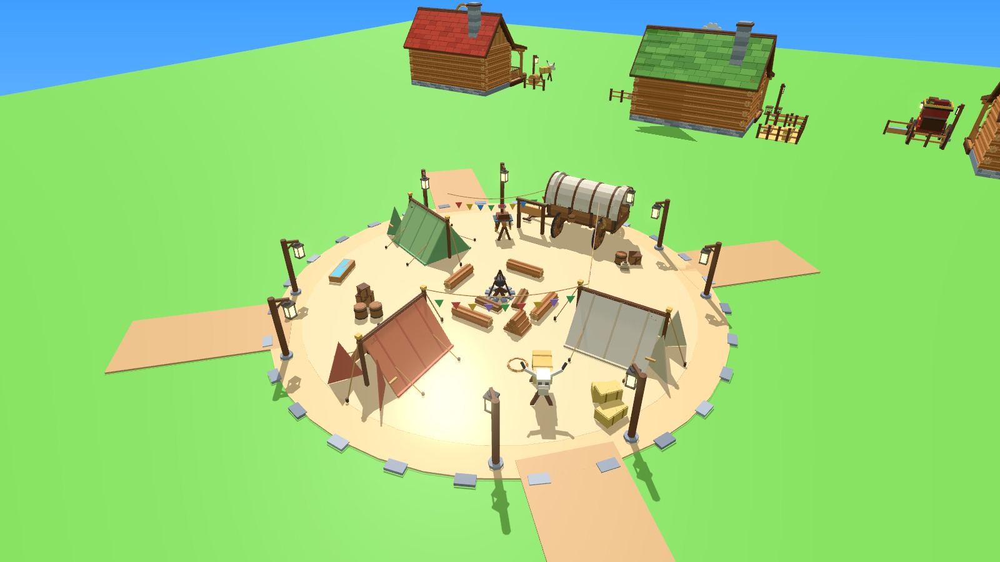

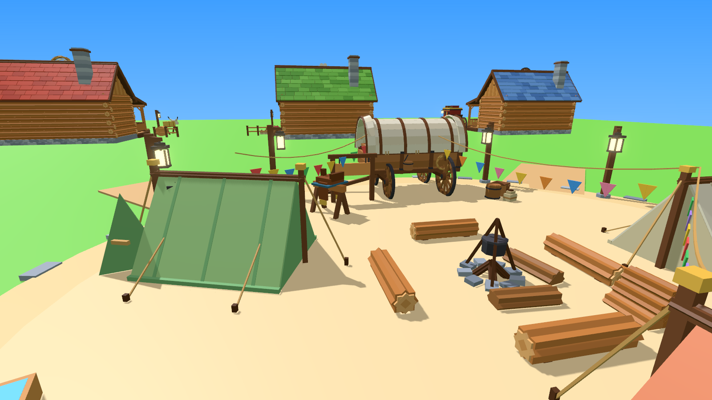

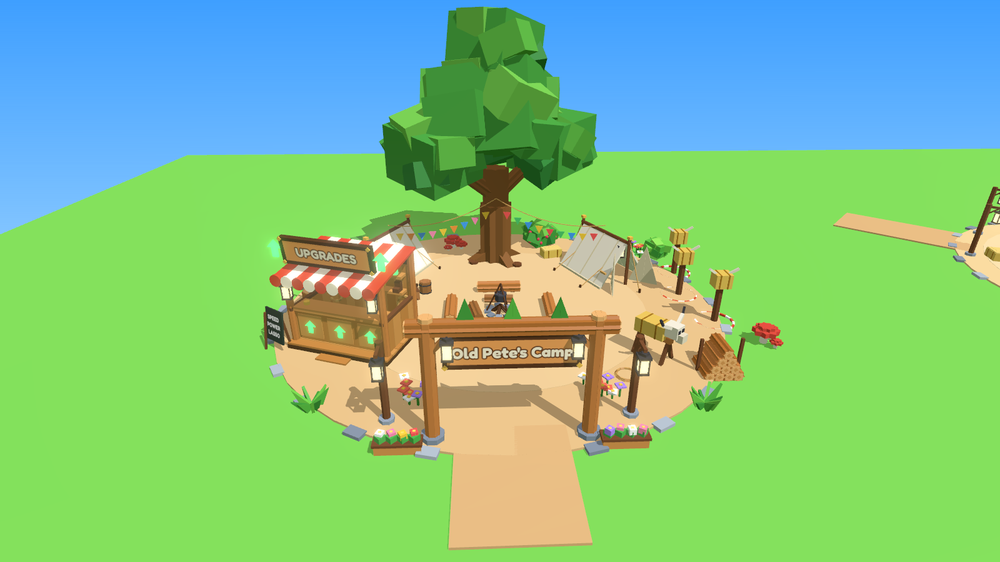

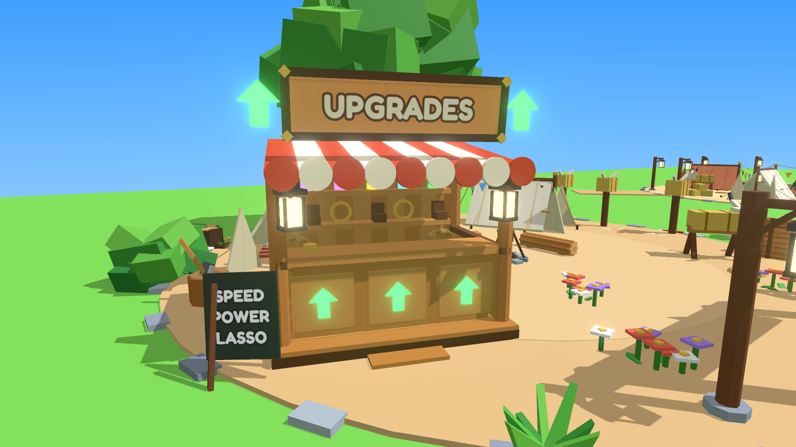

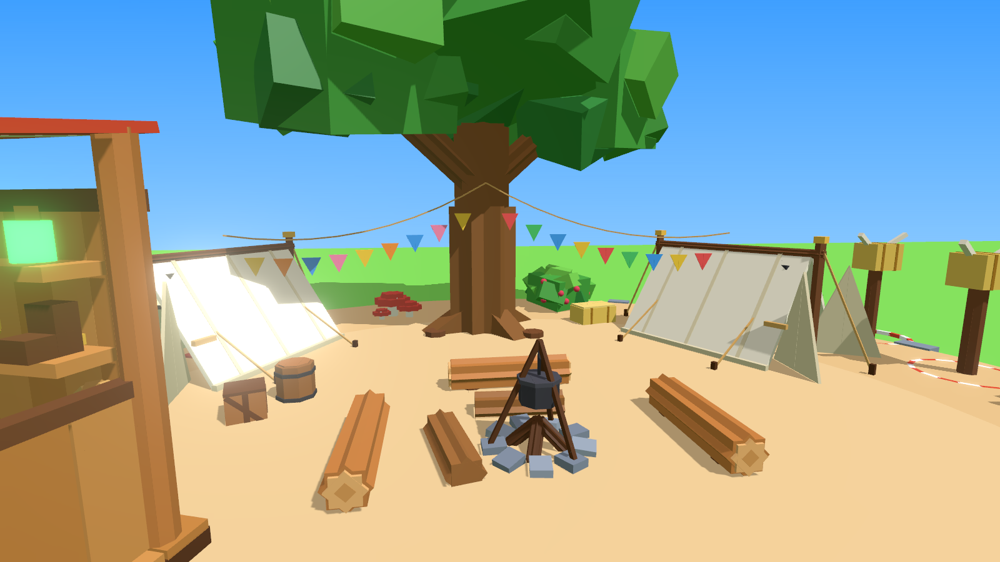

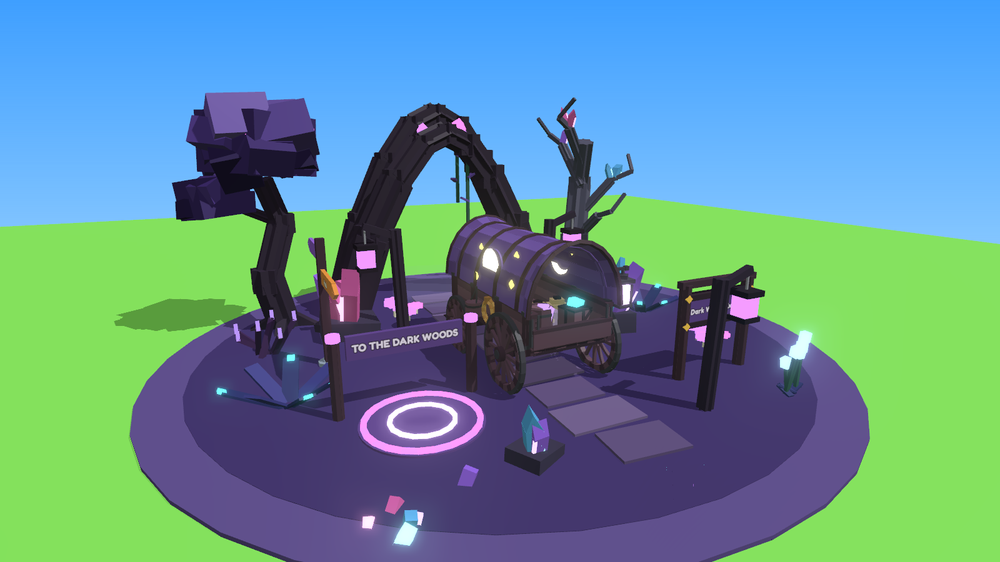

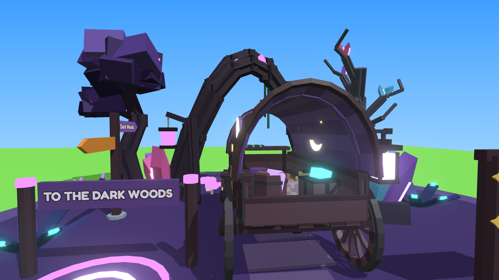

## Wat er nieuw is

**De drie winkels** hebben allemaal:

- **muren** van echte ronde boomstammen met uitstekende, afgezaagde uiteinden op de hoeken;
- een **fundering** van steen;
- een **dak** van dakpannen in drie tinten, met een nok, windveren, een lager afdak boven de veranda en een
  **schoorsteen die rookt**;
- een **veranda** van losse planken met een trapje, leuningen met spijlen, palen met schoren en twee lantaarns die
  echt licht geven;
- een **toonbankraam** met gordijnen, een geschulpte rand en een belletje, en daarachter **planken met spullen**
  (potten, dozen en touw) en een warm lampje binnen. Er is plek achter de toonbank voor je winkel-NPC;
- een **deur** met planken, een schoor, een gouden knop en een bordje **OPEN**;
- een **raam** met luiken, een kruis, een vensterbank en een bloembak;
- een groot **bord** met de naam, een **embleem** op het dak, bloembakken, lantaarnpalen, hekjes, een ton en een kist.

Daarbovenop heeft elke winkel eigen spullen:

| Winkel | Kleur | Extra's |
|---|---|---|
| **Lasso Shop** | rood | gouden lasso op het dak, lasso's aan haken op de muur, een rek met drie lasso-upgrades (touw, goud, regenboog) en het bord UPGRADES, een grote touwspoel, een oefenstier (zaagbok met hooi en een koeienschedel), een ton met touw |
| **Animal Market** | groen | pootafdruk op het dak, een wei met hek, stro, hooibalen, een waterbak en een voeremmer, kisten met wortels en appels, voerzakken, een krijtbord **BUY & SELL**, twee kooitjes met konijntjes en pootafdrukken naar de deur |
| **Worlds** | blauw | het station om naar **andere werelden** te reizen. Een **wereldbol** met een gouden ring op het dak, een groot bord **CHOOSE A WORLD** met een tegel voor elke wereld (Forest, Dark Woods en een op slot met een hangslot: ???), een gloeiend **BoardingPad** met het bord **BOARD HERE** naast een echte **postkoets** (rood met goud, deuren met WORLDS erop, bagage op het dak), een vertrekbord, een bankje, koffers, een wegwijzer, een waterbak en een paal om paarden vast te binden |

**Wrangler Camp** (het ronde kamp):

- een zandplein met een rand van stenen en vier paden (in een apart model **Ground**, dat je kunt weghalen als je
  je eigen grond wilt houden);
- een **kampvuur** met echt vuur, rook, vonkjes en licht, een driepoot met een pan, vier bankjes van boomstammen en
  een houtstapel;
- **drie tenten** (groen, crème en oranje) met een nokbalk, palen, open flappen, scheerlijnen met haringen, en
  binnen een slaaprol, een deken, een kussen en een lantaarn;
- de **huifkar** met het bord **Supplies**;
- **acht lantaarnpalen** bij de vier paden;
- een **zadelrek** met zadel, een **oefenstier** met een opgerolde lasso, hooibalen, tonnen, kisten, een waterbak
  en **vlaggetjes** tussen de tenten en de kar.

**Upgrade Camp** (de plek van Old Pete, de trainer):

- een **toegangsboog** van boomstammen met het bord **Old Pete's Camp** (aan twee kanten), lantaarns, dennetjes
  bovenop en twee lantaarnpalen;
- de **upgrade-stand** van Old Pete: een plankenkraam op een vlonder met een trapje, een rood-wit **luifel**
  met een geschulpte rand, een toonbank met **gloeiende groene pijlen omhoog**, een belletje, planken vol
  upgrades (laarzen met sporen, gouden hoefijzers, gloeiende drankjes), lasso's aan de muur, een groot bord
  **UPGRADES** met pijlen, lantaarns en een krijtbord met **SPEED / POWER / LASSO**;
- een **kampvuur** met echt vuur, een driepoot met een pan en drie bankjes van boomstammen;
- een **grote eik** in het midden, twee **tenten** met scheerlijnen, slaaprollen en lantaarns, en **vlaggetjes**
  van de tenten naar de boom;
- een **trainingshoek**: drie lasso-doelen (palen met een hooi-kop met hoorns en een ring op de grond), een
  oefenstier met een opgerolde lasso en een grote **houtstapel**;
- een **hakblok met een bijl** en houtsnippers, bloemen, struiken, een mossige stronk, paddenstoelen, een ton,
  een kist en een hooibaal;
- een zanderige open plek met een rand van stenen en een pad naar de boog (in een apart model **Ground**).

Old Pete (je NPC) staat het mooist achter de toonbank: daar ligt een onzichtbaar onderdeel `TrainerSpot`.
Zet je NPC op die plek, of verplaats de stand als je hem liever ergens anders hebt.

**Dark Woods Cart** (de kar naar de Dark Woods, voor in je hub):

- de huifkar in **Dark Woods-kleuren**: een paarse huif met een gloeiende **maansikkel en sterren** aan twee
  kanten, donker hout, **paarse lantaarns** die paars licht geven, en als lading gloeiende kristallen en een pot
  met dwaallichtjes. De dissel wijst naar het bos: de kar staat klaar om te vertrekken;
- de **wortelboog** uit de Dark Woods-set boven het pad, met mist erachter;
- een paars gloeiend **BoardingPad** met een bord **TO THE DARK WOODS** (zet daar je teleport-script op);
- een hangend bord **Dark Woods Express** en een wegwijzer met **Dark Woods** en **Hub**;
- paarse lantaarnpalen, kristallen, gloeiende paddenstoelen, varens, doornstruikjes, bloemen die gloeien, een
  kromme kristalboom, een Shadow Oak en zwevende paarse lichtjes;
- een stuk donkere, mossige grond met een pad van stapstenen (in een apart model **Ground**), zodat je hub
  daar mooi overgaat in het donkere bos.

| Model | Parts |
|---|---|
| LassoShop | ~1350 |
| AnimalMarket | ~1240 |
| Worlds | ~1600 |
| WranglerCamp | ~1400 |
| UpgradeCamp | ~1410 |
| DarkWoodsCart | ~1120 |

Alleen muren, veranda's, meubels en grote spullen botsen. Kleine versieringen hebben CanCollide, CanTouch en
CanQuery uit. Er zijn weinig lampjes, en die hebben geen schaduw.

## 1-op-1 vervangen

1. Klik met de rechtermuisknop op **Workspace** en kies **Insert from File...**. Kies `HubBuildings.rbxm`. Je krijgt
   een map **HubBuildings** met de vier gebouwen naast elkaar, en een script **SwapIn**.
2. Open **View → Command Bar** en zet een nieuw gebouw op de plek van het oude. Vervang de namen door de namen van
   jouw oude gebouwen:

```lua
local swap = require(workspace.HubBuildings.SwapIn)
swap(workspace.LassoShop, workspace.HubBuildings.LassoShop)
swap(workspace.AnimalMarket, workspace.HubBuildings.AnimalMarket)
swap(workspace.Stagecoach, workspace.HubBuildings.Worlds)
swap(workspace.WranglerCamp, workspace.HubBuildings.WranglerCamp)
swap(workspace.UpgradeShop, workspace.HubBuildings.UpgradeCamp)
```

De **DarkWoodsCart** is nieuw, dus die zet je gewoon zelf neer: sleep hem naar de plek in je hub waar het pad
naar de Dark Woods begint. De voorkant (-Z, met het bord en de pad) wijst naar je hub, de boog naar het bos.

SwapIn zet het nieuwe gebouw op precies dezelfde plek, met dezelfde draaiing, en maakt het net zo groot als het
oude (de grondvlakken passen op elkaar). Het oude gebouw wordt **niet** verwijderd: het gaat naar
**ServerStorage** met `_Old` achter de naam, zodat je het terug kunt halen.

- Staat het nieuwe gebouw met zijn voorkant de verkeerde kant op? Geef een draai mee in graden:
  `swap(workspace.LassoShop, workspace.HubBuildings.LassoShop, 180)`
- Wil je het niet schalen, maar de maat houden zoals ik hem maakte (een speler is 5 studs)? Zet `false` als laatste:
  `swap(workspace.LassoShop, workspace.HubBuildings.LassoShop, 0, false)`

Liever met de hand? Elk gebouw heeft zijn draaipunt op de grond in het midden, en de voorkant wijst naar **-Z**
(de Front-kant). Een winkel is ongeveer 45 × 25 studs met alles eromheen, het kamp is 48 studs breed (68 met de
paden).

**Reizen naar een wereld:** het gloeiende rondje naast de koets heet `BoardingPad` (in `Worlds`). Zet daar je
teleport-script of ProximityPrompt op, of laat je bestaande reis-script naar dat onderdeel kijken. De tegels op het
bord heten `WorldTile` en `WorldName`: verander de tekst in `WorldName > TextFront > Label` als je andere werelden
hebt.

**Let op:** hangen er scripts aan je oude gebouwen (bijvoorbeeld een ProximityPrompt voor de winkel)? Verplaats die
dan naar het nieuwe gebouw, bijvoorbeeld naar de `CounterTop` of de `SignBoard`.

## Let op

Ik heb het bestand gemaakt met dezelfde rbxm-writer als je andere modellen, alles in 3D gerenderd (de plaatjes
hierboven) en het SwapIn-script gecontroleerd met de Luau-checker. Roblox Studio zelf kan ik niet openen. Gaat er
iets mis? Kopieer de tekst uit het Output-venster en stuur die op.

## Opnieuw maken

```
python3 tools/buildings/build_buildings.py --rbxm models/hub-buildings/HubBuildings.rbxm
```
