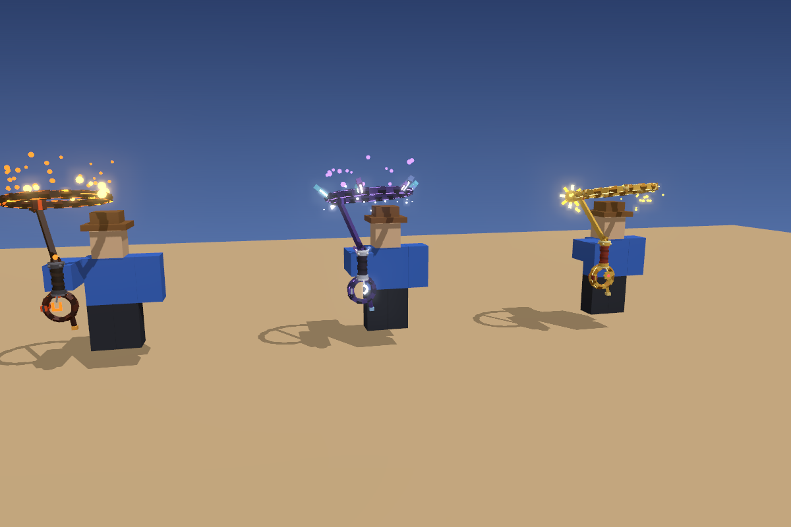
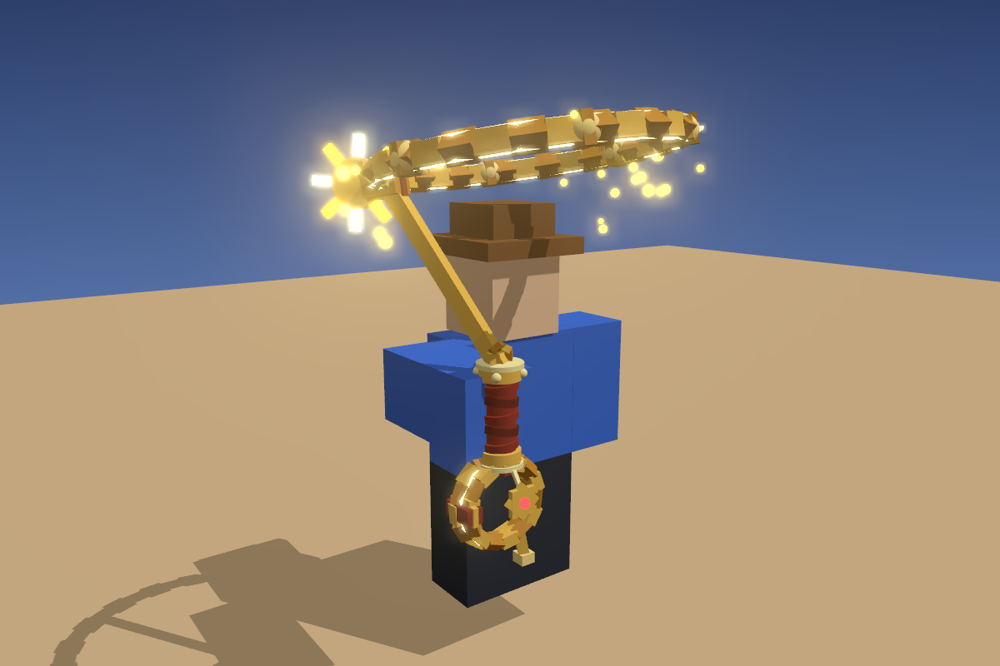
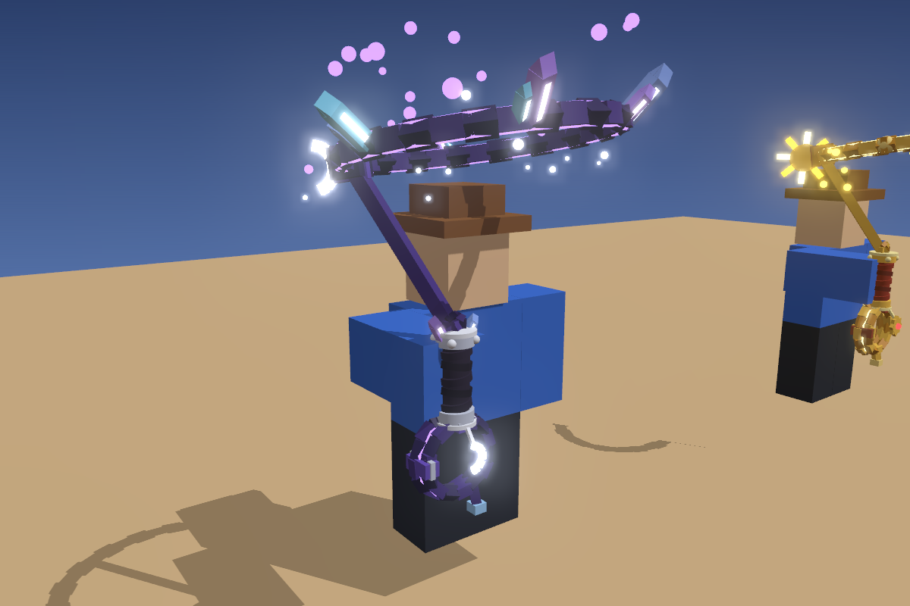
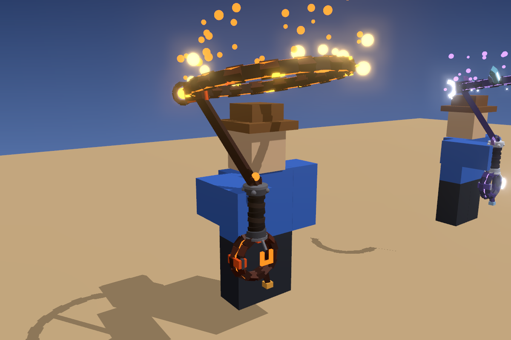
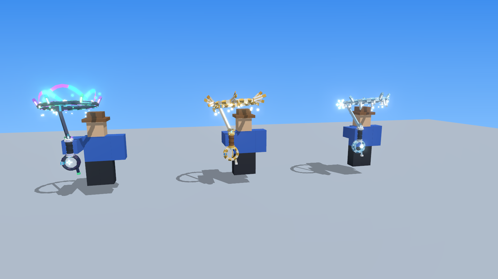
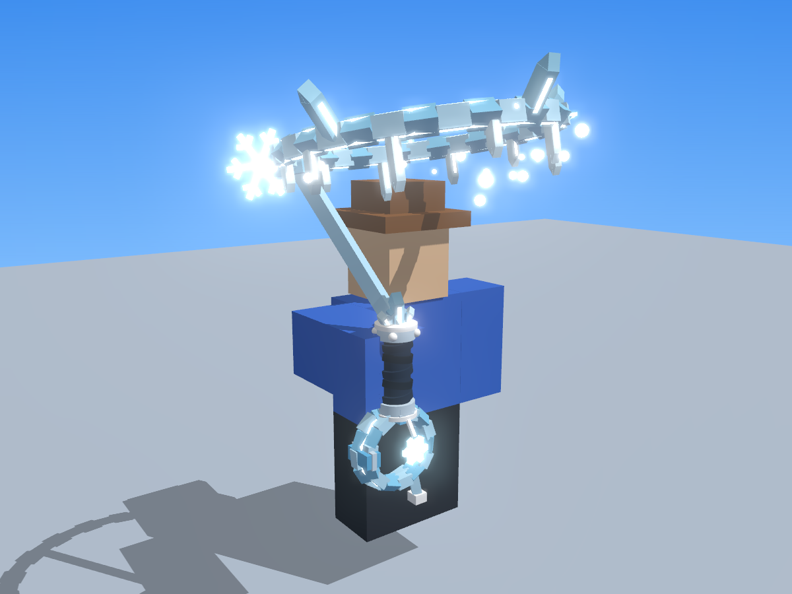
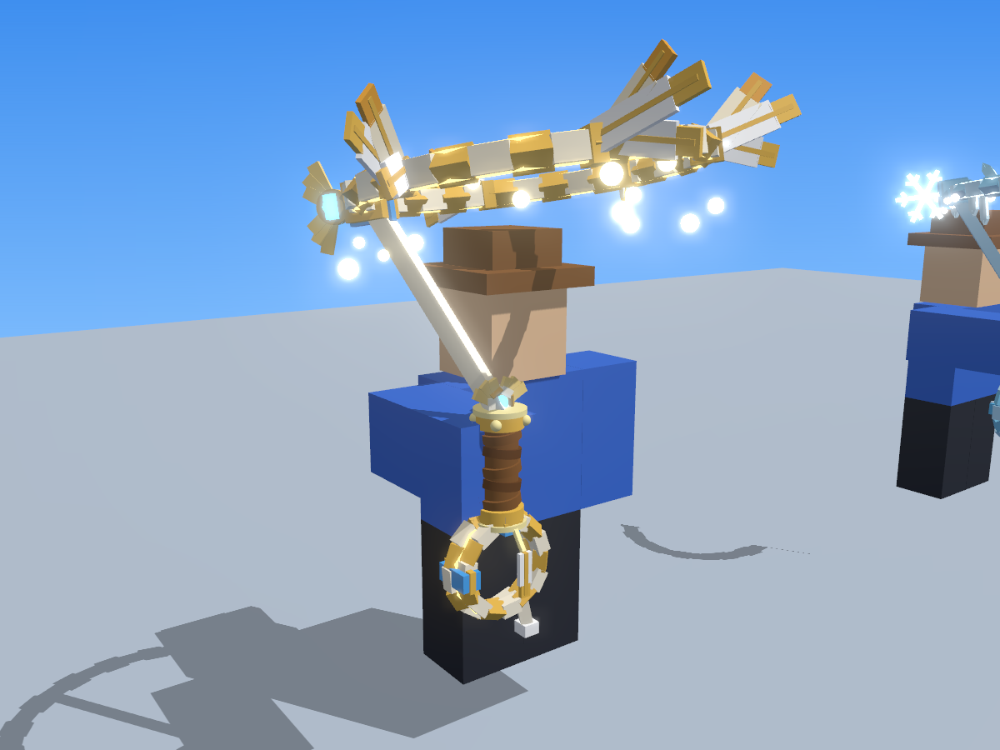
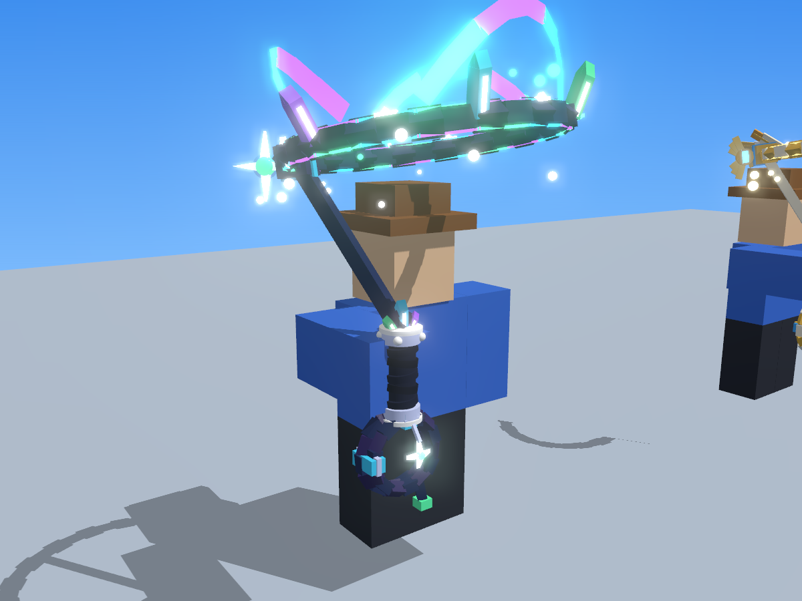

# Lasso's – Sunburst, Moonshard en Wildfire

`Lassos.rbxm` bevat drie nieuwe lasso's als **Tools**. Je houdt een handvat vast, er hangt een rol touw onder je
hand en boven je hoofd draait een open lus. Die is met een touw verbonden met je hand. Alles is gemaakt van
gewone Parts en ingebouwde Roblox-effecten, dus je hoeft niets te uploaden.



| Lasso | Zeldzaamheid | Hoe hij eruitziet | Effecten |
|---|---|---|---|
| **Sunburst Lasso** | Legendary | goudkleurig touw met een gloeiende draad, gouden kralen, een zon-medaillon met stralen, rood leren handvat met gouden kappen, een sheriffster aan een kettinkje | vallende goudvonkjes, schitteringen op het touw, een gouden lichtspoor, warm licht |
| **Moonshard Lasso** | Mythic | donkerpaars touw met paarse gloed, maankristallen die uit het touw groeien, een gloeiende halve maan, kristallen op het handvat, een maan-bedeltje | paarse dwaallichtjes die opstijgen, vallend maanstof, een paars-blauw lichtspoor, paars licht |
| **Wildfire Lasso** | Epic | verkoold touw met gloeiende scheuren, een ijzeren ring met een gesmolten kern, ijzeren kappen, een gloeiend hoefijzer-bedeltje | vlammen langs het touw, opvliegende vonken, rook, een oranje lichtspoor, flikkerend vuurlicht |





(In de plaatjes zijn de deeltjes nagemaakt met bolletjes. In Roblox zijn het echte ParticleEmitters.)

## Wat er gebeurt

- **De lus draait altijd rustig rond** boven je hoofd. De vonken, vlammen of lichtjes zitten op de lus, dus ze
  maken vanzelf mooie sporen als hij draait. Alle spelers zien dat.
- **Klik je** (Activate), dan draait de lus even heel snel en spat er een explosie van sterren, kristalscherven
  of vlammen uit, met een lichtflits. Ook dat zien alle spelers.

Dat doen twee kleine scripts in elke lasso:

- **LassoFX** (Script, RunContext = Client) laat de lus draaien en speelt de explosie af. Het draait op de
  computer van elke speler, dus de server hoeft er niets voor te doen.
- **LassoBurst** (Script, RunContext = Server) telt bij elke klik het attribuut `Bursts` op, zodat elke speler de
  explosie ziet.

## In Roblox Studio zetten

1. Klik in de **Explorer** met de rechtermuisknop op **ServerStorage** en kies **Insert from File...** →
   `Lassos.rbxm`. Je krijgt een map **Lassos** met de drie Tools.
2. Uitproberen? Sleep een lasso naar **StarterPack** en druk op Play.
3. Verkoop je ze in de Lasso Shop? Laat de map in ServerStorage staan en laat je winkelscript een kopie in de
   Backpack van de speler zetten: `ServerStorage.Lassos["Wildfire Lasso"]:Clone().Parent = player.Backpack`.

**Heb je al een lasso met een gooi-script?** Zet dat script (en eventueel zijn RemoteEvents) in de nieuwe lasso,
in plaats van in je oude. Het handvat heet net als altijd `Handle`. LassoBurst doet alleen het effect, dus je
eigen klik-actie blijft gewoon werken. Het touw dat je gooit, kan de kleur van de lasso gebruiken: lees de
attributen `RopeColor` en `GlowColor` van de Tool.

## Instellen

Elke Tool heeft attributen die je in de Properties kunt veranderen:

| Attribuut | Wat het doet |
|---|---|
| `SpinSpeed` | rondjes per seconde als je niets doet (1.1). Zet op 0 en de lus staat stil |
| `BurstSpinSpeed` | rondjes per seconde vlak na een klik (4.5) |
| `Flicker` | (alleen Wildfire) het licht flikkert als vuur |
| `DisplayName`, `Rarity`, `Description` | voor je winkel of je inventory |
| `RopeColor`, `GlowColor` | de kleuren van de lasso, handig voor je gooi-touw |

Wil je meer of minder effect? In `LoopHub` zitten Attachments met de ParticleEmitters. Verander daar `Rate`
(hoeveel deeltjes) of zet een emitter uit met `Enabled`.

## Gemaakt voor telefoons

- 160 tot 200 Parts per lasso. Alle Parts botsen niet en wegen niets (`Massless`), dus je speler loopt er niet
  anders door.
- Per lasso 10 tot 17 kleine ParticleEmitters, één PointLight zonder schaduwen, en één Trail.
- Kleine onderdelen geven geen schaduw.

## Let op

Ik heb het bestand gemaakt met dezelfde rbxm-writer als je andere modellen, de previews gerenderd en de scripts
gecontroleerd met de Luau-checker. Roblox Studio zelf kan ik niet openen. Houdt je speler de lasso raar vast?
Verander dan `Grip` van de Tool. Gaat er iets anders mis, kopieer dan de tekst uit het Output-venster en stuur die
op.

## Opnieuw maken

```
python3 tools/lassos/build_lassos.py --rbxm models/lassos/Lassos.rbxm
```

Dat schrijft ook `tools/lassos/build/world.json`. Kopieer het naar `tools/viewer/lassos_world.json`, start daar
`python3 -m http.server 8123` en render met `node sceneshot.js lassos_world.json all uit.png` (of `sunburst`,
`moonshard`, `wildfire`, en `_back` voor achteraanzicht).

# Bergen-lasso's – Frostbite, Skyfeather en Aurora

`MountainLassos.rbxm` bevat drie lasso's voor het **Mountain Range**-gebied. Ze zijn gebouwd op dezelfde manier
als de lasso's hierboven: een handvat, een rol touw, een draaiende lus met effecten en dezelfde twee scripts.
Alles hierboven over Studio, de scripts en de attributen geldt dus ook voor deze drie. Je krijgt een map
**MountainLassos** met de drie Tools, die ook de tag `MountainLasso` hebben.



| Lasso | Zeldzaamheid | Parts | Hoe hij eruitziet | Effecten |
|---|---|---|---|---|
| **Frostbite Lasso** | Epic | 244 | ijsblauw touw met ijspegels eronder en ijskristallen erop, een gloeiende sneeuwvlok, een sneeuwvlok-bedeltje en ijskristallen op het handvat | vallende sneeuw, koude mist, twinkelend ijs, een wit-blauw lichtspoor, ijsblauw licht |
| **Skyfeather Lasso** | Legendary | 207 | wit-gouden touw met waaiers van gouden griffioenveren, een hemelsblauwe edelsteen met gouden vleugels, een veer-bedeltje en een gevleugelde knop op het handvat | dwarrelende veren, windstrepen, gouden schitteringen, een wit-blauw lichtspoor, warm licht |
| **Aurora Lasso** | Mythic | 181 | nachtblauw touw met gloeiende draden in noorderlichtkleuren (groen, blauw, paars), sterrenkristallen, sterrenkralen, een vierpuntige ster van licht, een sterren-bedeltje en kristallen op het handvat | drie linten van noorderlicht die over de lus golven, vallende sterren, een zachte gloed, een groen-paars lichtspoor |





(In de plaatjes zijn de deeltjes en de noorderlichtlinten nagemaakt. In Roblox zijn het echte
ParticleEmitters en Beams.)

**Klik je**, dan draait de lus snel en komt er een explosie uit:

- **Frostbite:** sneeuw en een wolk van vorst.
- **Skyfeather:** veren en een windvlaag.
- **Aurora:** sterren en een gloed van noorderlicht.

Opnieuw maken:

```
python3 tools/lassos/mountain_lassos.py --rbxm models/lassos/MountainLassos.rbxm
```
