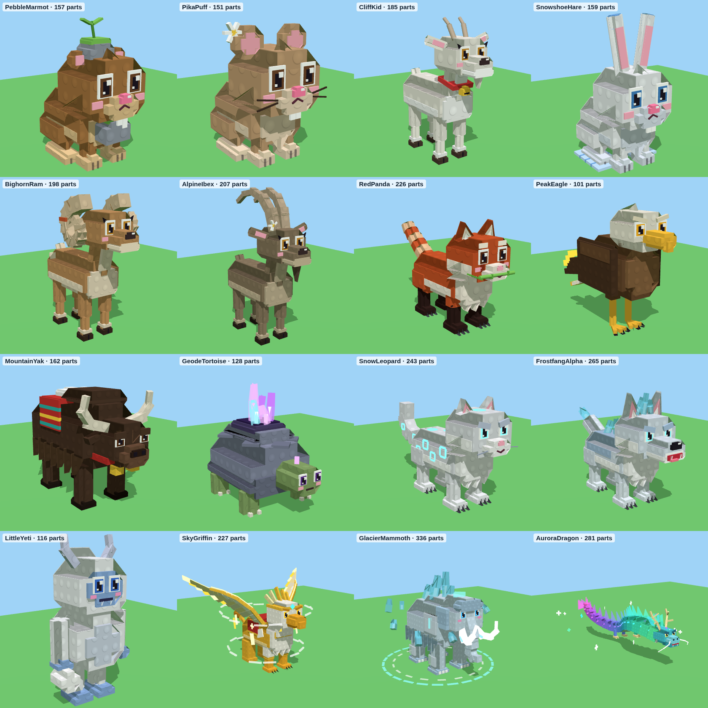
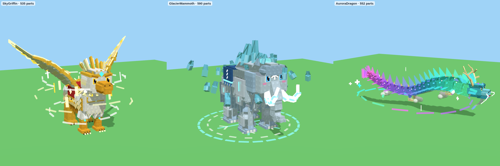
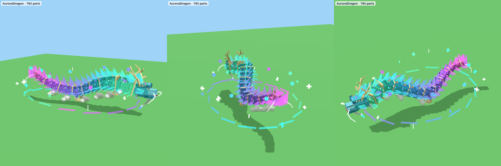

# Mountain Range – de 16 dieren

`MountainAnimals.rbxm` bevat de 16 dieren van de Mountain Range, gebouwd naar de goedgekeurde concept art
(`concept-art/mountain-range/`). Ze zijn gemaakt in dezelfde blokjesstijl met noppen als je andere dieren, met
dezelfde opbouw (RootPart als hitbox, RideAttachment, OverheadAttachment, attributen `AnimalId`, `DisplayName`,
`Rarity`), dus ze werken in je game zoals de Dark Woods-dieren. Alles is van gewone Parts gemaakt, je hoeft niets te
uploaden.





(De deeltjes, lichtsporen, beams en het licht zie je niet in deze plaatjes, alleen in Roblox.)

| Dier | Zeldzaamheid | Wat er bijzonder aan is | Idle-actie |
|---|---|---|---|
| Pebble Marmot | Common | houdt zijn lievelingssteentje vast, met een mossteentje en een plantje op zijn hoofd | graast |
| Pika Puff | Common | rond bolletje met grote ronde oren, snorharen en een edelweiss | schudt zijn kop |
| Cliff Kid | Common | baby-berggeit met hoorntjes, een sikje en een rood halsbandje met een gouden belletje | schudt zijn kop |
| Snowshoe Hare | Common | wit met blauwe oorpuntjes en grote sneeuwschoenen met veters | graast |
| Bighorn Ram | Rare | grote gekrulde hoorns met ribbels en een streep rode rots | geeft een kopstoot met een schokgolf |
| Alpine Ibex | Rare | lange geribbelde hoorns naar achteren, een sik en een edelweiss | graast |
| Red Panda | Rare | gestreepte staart, wit masker, traanvlekken en een bamboetakje in zijn bek | graast |
| Peak Eagle | Epic | witte kop, gouden snavel, gouden veerpunten | windwervels, gouden veren, lichtsporen aan de vleugels, spreidt zijn vleugels |
| Mountain Yak | Epic | lange vacht, een geweven deken met sneeuw erop, horens en gouden belletjes | sneeuw valt van zijn rug, gouden ring bij elke stap, krabt in de grond |
| Geode Tortoise | Epic | stenen schild dat openbreekt in gloeiende kristallen | kristalstof, paars licht, kristallen pulseren |
| Snow Leopard | Legendary | gloeiende ijsblauwe rozetten, lange dikke staart, gloeiende ogen | vorstsporen achter de poten, sneeuwvlokken, huilt met een ijswolk |
| Frostfang Alpha | Legendary | ijskristallen op zijn rug en nek, een ijskroon, staart met een ijspunt | ijsadem, vorstsporen, ijsglitters, schokgolf bij elke stap, huilt |
| Little Yeti | Legendary | pluizige kleine yeti met blauw gezicht, hoorntjes en een sneeuwbal | gooit zijn sneeuwbal (die uit elkaar spat) |
| **Sky Griffin** | **Mythic** | gouden leeuwenlijf, adelaarskop met gouden kroon en kuif, enorme gelaagde vleugels met gloeiende gouden punten, koninklijk zadel | **zie hieronder** |
| **Glacier Mammoth** | **Mythic** | ijsblauwe vacht, een gletsjer van ijskristallen op zijn rug, gloeiende ijsslagtanden, ijspantser | **zie hieronder** |
| **Aurora Dragon** | **Secret** | een zwevende drakenslang van noorderlicht: groen, blauw, paars en roze, met lichtvinnen, gouden gewei en gloeiende snorharen | **zie hieronder** |

## De topdieren: zware effecten

De drie topdieren zijn extra gedetailleerd: de Mythic-dieren hebben ongeveer **500 parts** en de Aurora Dragon (Secret) ongeveer **800**.

| Dier | Parts | Wat er bij kwam |
|---|---|---|
| Sky Griffin | 534 | gelaagde veerschubben op de borst, een kraag van veren om de nek, rijen veren op de flanken, een franje onder de buik, wangveren, oorpluimen en een kroon met punten. Voller vleugels, met een extra laag veren, gouden banden en een gewricht in de vleugelpunt, zodat die bij elke slag naslaat. Verder stijgbeugels, een zadelknop, studs, kwastjes, een gouden ketting over de borst en een zonnemedaillon. Op de poten tenen, klauwen en gloeiende klauwpunten, op de staart een pluim van gouden veren, en een derde windring |
| Glacier Mammoth | 589 | een dubbele laag ruige vacht, een baard op de borst en een franje over het achterwerk. Bontmanchetten om de poten en voeten, ijspegels onder de buik, extra ijspantser met runen en ijskristallen langs de rug. Een geweven deken met kwastjes en gloeiend vorststiksel. Een sneeuwvlokrune op het voorhoofd, een plukje haar, rafelige oren, een ijskroon, gloeiende banden en runen op de slagtanden, zes extra zwevende ijskristallen en een sneeuwvlok van licht op de grond |
| Aurora Dragon | 792 | op elk van de 17 delen twee extra rijen schubben, lichtvinnen aan beide kanten, een buikribbel, een gouden stekel en sterretjes. Op de kop een baard, extra tanden, geweitakken, wangvinnen, wenkbrauwen, oren, runen en een langere manen. Schouders, polsbanden, vlammetjes bij de ellebogen en extra klauwen aan de poten, een drakenparel in zijn klauw, een grotere staartwaaier met vlammen, wolkjes onder zijn lijf en een ring van noorderlicht. Verder vlammenplukjes van noorderlicht langs de rug, een tweede rij vinnen, buikplaten, gouden banden en kraaltjes, een kroon van hoorntjes, wapperende manenlinten, ringen om de parel, snorharen aan de staart en acht zwevende geestbollen |


**Sky Griffin (Mythic)**
- **Altijd:** een gouden aura, vallende veren, twee ringen van wind en acht gouden veren die om hem heen draaien (met lichtsporen), windzuilen die uit zijn vleugels omhoog wervelen, lampjes en een gouden randje.
- **Lopen:** de vleugels slaan langzaam. Bij galop gaan ze wijd open, met gouden lichtsporen aan de vleugelpunten en de staart, en een gouden schokgolf bij elke stap.
- **Sky Roar:** hij steigert met gespreide vleugels en schreeuwt. Er volgen een gouden flits, een explosie van 80 veren en drie windringen, en hij landt met een gouden schokgolf.

**Glacier Mammoth (Mythic)**
- **Altijd:** een sneeuwstorm om hem heen, een koude gloed, en ijswolken onder zijn poten. Er hangen tien zwevende ijskristallen om hem heen, verbonden door ijsbogen, met een bevroren runencirkel op de grond. Vorstzuilen schieten uit zijn gletsjer omhoog, en zijn slagtanden laten lichtsporen achter.
- **Lopen:** bij een stap schieten soms ijspieken uit de grond.
- **Glacier Stomp:** hij steigert, trompettert en stampt. Twee kringen ijspieken (28 stuks) schieten uit de grond en smelten weer weg, met grote schokgolven en een flits.

**Aurora Dragon (Secret)**



- **Nieuwe effecten:**
  - Langs zijn hele lijf hangt een zachte gloed van geestlicht in de kleuren van het noorderlicht.
  - De parel in zijn klauw is een draaiend sterrenstelsel met gloed, lichtpuntjes en een lampje.
  - Uit zijn bek flakkert geestvuur, van zijn gewei springen vonken en zijn ogen trekken lichtsporen.
  - Om hem heen vallen vallende sterren (lange strepen licht).
  - Op de grond draait een sigil van noorderlicht die lichtringen uitzendt.
  - Acht geestbollen gloeien en zijn met sterrenbeeldlijnen aan elkaar verbonden.
  - Zijn staart is een komeet: een draaiende werveling met een sproeiregen van sterren.
- **Star Breath (nieuw):**
  1. Hij gooit zijn kop naar achter en licht verzamelt zich in zijn bek.
  2. Dan blaast hij een lange straal noorderlicht-vuur vol sterren.
  3. Ringen van licht rollen langs de straal mee.
- **Constellation (nieuw):**
  1. Hij rolt zich op en stijgt.
  2. De sterren verzamelen zich om hem heen.
  3. Dan ontrolt hij zich in een explosie van sterrenlicht: een flits, sterren uit zijn hele lijf, een draaiende sigil, ringen en een schokgolf over de grond.
- **Altijd:** hij zweeft, en zijn hele lijf (16 delen) golft als een lint. Gordijnen van noorderlicht wapperen boven zijn rug. Lange noorderlicht-slingers en lichtsporen achter zijn snorharen volgen hem, sterrenstof en gloeiende mist komen uit zijn lijf, en een lichtzuil schiet uit zijn kop de lucht in. Twaalf sterren draaien om hem heen.
- **Aurora:** hij stijgt op en krult zich. Er volgen een felle flits, 90 sterren en ringen in alle kleuren van het noorderlicht, in de lucht en op de grond.

Ver weg (buiten `FXDistance`) stoppen de effecten, en nog verder weg ook de animaties, net als bij je andere dieren.

## In je game zetten

1. Klik in de **Explorer** met de rechtermuisknop op **ServerStorage** (of waar je dieren staan) en kies **Insert from
   File...** → `MountainAnimals.rbxm`. Je krijgt een map **MountainAnimals** met de 16 modellen.
2. Gebruik ze zoals je Dark Woods-dieren. Elk model heeft het script **AnimalFX**, dat lopen, rennen, de idle-acties
   en de effecten doet. Het kijkt hoe snel het model beweegt, dus je hoeft niets aan te zetten.
3. Alle dieren hebben de tag `MountainAnimal`.

**Let op de naam van de wolf:** er bestaat al een `FrostfangWolf` in je bosdieren, daarom heet deze **Frostfang Alpha**
(`FrostfangAlpha`), zodat ze elkaar niet in de weg zitten.

## Gemaakt voor telefoons

De gewone dieren hebben 100 tot 230 Parts en alleen stofwolkjes bij de stappen. De topdieren zijn zwaarder
(ongeveer 230 tot 340 Parts, met veel effecten), maar die zijn zeldzaam, dus er lopen er nooit veel tegelijk rond.
Kleine onderdelen geven geen schaduw, effecten stoppen op afstand, en de ijspieken en flitsen worden na een seconde
opgeruimd.

## Let op

Ik heb het bestand gemaakt met dezelfde rbxm-writer als je andere modellen, alle dieren gerenderd en het script
gecontroleerd met de Luau-checker. Roblox Studio zelf kan ik niet openen. Gaat er iets mis, kopieer dan de tekst uit
het Output-venster en stuur die op.

## Opnieuw maken

```
cd tools/animal-models
python3 build_mountain.py --rbxm ../../models/mountain-range/MountainAnimals.rbxm
```

De dieren staan in `tools/animal-models/mountain.py`, de animaties in `AnimalFX.lua`.
