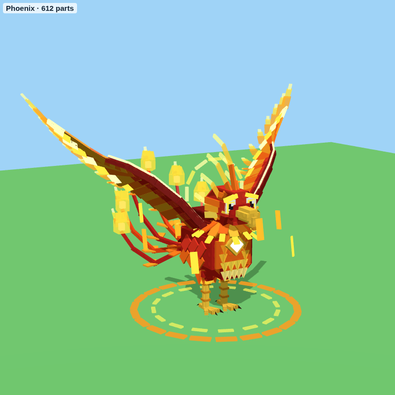
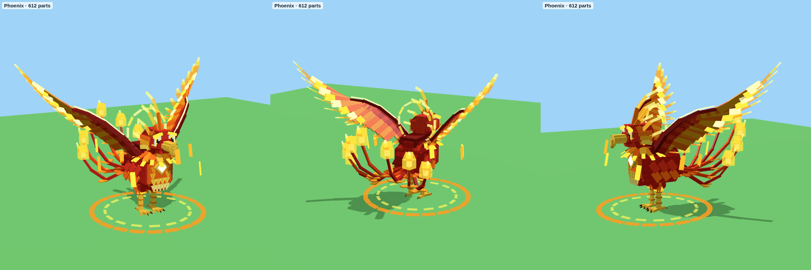
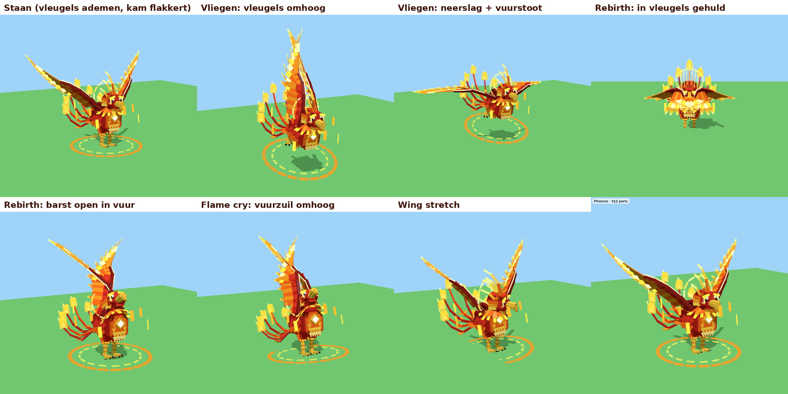

# Phoenix – vernieuwd

`Phoenix.rbxm` is de nieuwe Phoenix (Mythic), opnieuw gebouwd van gewone Parts in dezelfde stijl als de andere
dieren: 612 parts met 13 gewrichten (ook in de vleugelpunten, de staart, de kam en de krans), ongeveer 23 studs hoog met zijn vleugels omhoog. Het `AnimalId` is `Phoenix`, dus hij kan de
oude Phoenix vervangen.




(De plaatjes laten geen deeltjes zien. In het spel komen daar het vuur, de vonken en de sporen bij.)

## Wat erin zit

- **Lijf:** karmijnrood, met rijen borstschubben die van oranje naar witheet lopen. Er zitten lagen veren op de
  rug en flanken, en een rok van vlammen over de poten.
- **Kop:**
  - Een gouden haaksnavel, gloeiende ogen onder boze gloeiende wenkbrauwen en wangveren die naar achter wijzen.
  - Een kam van zeven vlammenpluimen.
  - Een zonnekrans achter de kop en een kraag van vlammenveren om de nek.
- **Vleugels:** twee grote vleugels met lagen veren. Uit elke slagpen likt een vlammentong.
- **Staart:** zeven lange pluimen met veren aan beide kanten. Ze zwaaien naar achter en omhoog en eindigen elk in
  een gloeiend vlammenoog.
- **Poten:** goud met schubben, vlammende enkelbanden en zwarte klauwen.
- **Om hem heen:** acht gloeiende veren die rondjes vliegen en een ring van vuur op de grond.

## Effecten

De effecten gebruiken de ingebouwde textures van Roblox: vuur, vlammenvonken, explosie, schokgolf, vortex en
gloed. Je hoeft dus niets te uploaden. Het vuur loopt van witheet via geel en oranje naar diep rood.

- **Vleugels die branden:** elke vlammentong op de vleugels brandt echt. Linten van vuur waaieren van de
  vleugelpunten naar achter en golven mee met elke vleugelslag. Gloeiende veren van vuur laten los en dwarrelen
  draaiend naar beneden.
- **Zonnekrans:** achter de kop draait een schijf van zonnevuur (vortex) die vonken van zijn rand gooit. De
  krans zelf draait ook langzaam rond.
- **Kam:** de kam brandt als een fakkel en flakkert heen en weer.
- **Hart van vuur:** een gloeiende zonnesteen op de borst pulseert. Om de hele vogel hangt een zachte gloed, en
  vlammenvonken stijgen op.
- **Staart:** elke staartpluim eindigt in een brandend vlammenoog. Drie pluimen slepen een lint van vuur achter
  zich aan, en de buitenste helft van de staart golft als een vlam.
- **Vuursigil:** op de grond draait langzaam een sigil van vuur, met vlammen langs de ring.
- **Sporen:** vuursporen met een vlammentextuur achter de vleugels, de staart en de rondvliegende veren.

## Animaties

- **Staan:**
  - De vleugels ademen zacht en de vleugelpunten bewegen iets later mee, zodat het soepel oogt.
  - De staart golft, de kam flakkert, de krans draait en de kop kijkt rond.
- **Lopen:** stoer als een vogel. De kop beweegt mee, de vleugels staan iets open en bij elke stap komen er
  vlammen, vonken en een ring van vuur.
- **Vliegen:**
  - Als hij snel bewogen wordt (of als je het attribuut `State` op `"Fly"` zet), stijgt hij op.
  - De vleugels slaan krachtig en de punten zwiepen erachteraan. De poten gaan omhoog en de staart waaiert uit.
  - Bij elke neerslag spatten vonken van de vleugelpunten en gaat er een schokgolf van hitte omlaag.
- **Idle-acties** (om de 6 tot 10 seconden een willekeurige):
  - **Rebirth:**
    1. Hij hult zich in zijn vleugels en het vuur wordt naar binnen gezogen.
    2. Hij gloeit witheet en trilt.
    3. Dan barst hij open met een vuurbal, een zuil van vuur, een schokgolf over de grond en een oplichtende
       sigil.
    4. Daarna komen er as en gloeiende veren die neerdwarrelen.
  - **Flame cry:** gooit zijn kop naar achter, heft zijn vleugels en schreeuwt een zuil van vuur de lucht in,
    met ringen van vuur.
  - **Wing stretch:** strekt eerst de ene en dan de andere vleugel laag en wijd uit, en schudt de vonken eraf.
  - **Ascend:** duikt in elkaar en springt omhoog met een vuurstoot. Hij blijft fladderend hangen, draait
    één keer rond in een spiraal van vuur en landt met een schokgolf.



## Instellingen (attributen op het Model)

| Attribuut | Standaard | Wat het doet |
|---|---|---|
| `WalkSpeed` | 7 | hoe snel hij loopt |
| `FlapSpeed` | 1,6 | hoe snel de vleugels zacht klapperen |
| `FlapAngle` | 7 | hoe ver ze klapperen (graden) |
| `OrbitSpeed` | 0,7 | hoe snel de vuurveren rond draaien |
| `TailSway` | 9 | hoe ver de staart zwaait |

## Opnieuw bouwen

```
cd tools/animal-models
python3 build_phoenix.py --rbxm ../../models/phoenix/Phoenix.rbxm
```

Het model staat in `tools/animal-models/phoenix.py`, de animatie in `AnimalFX.lua` (profiel `Phoenix` en de acties
`rebirth`, `flamecry`, `wingstretch` en `ascend`). Omdat `AnimalFX.lua` in alle dieren zit, zijn de andere `.rbxm`-bestanden (Dark Woods, paarden,
Thunder Unicorn, bergdieren) ook opnieuw gebouwd.
