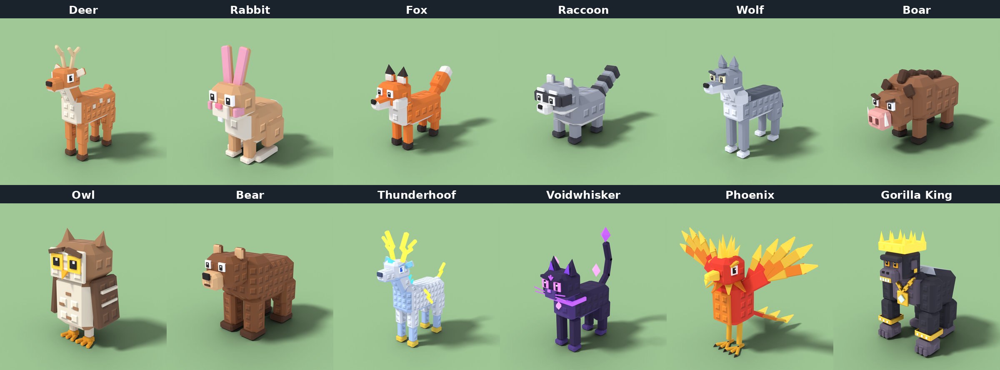
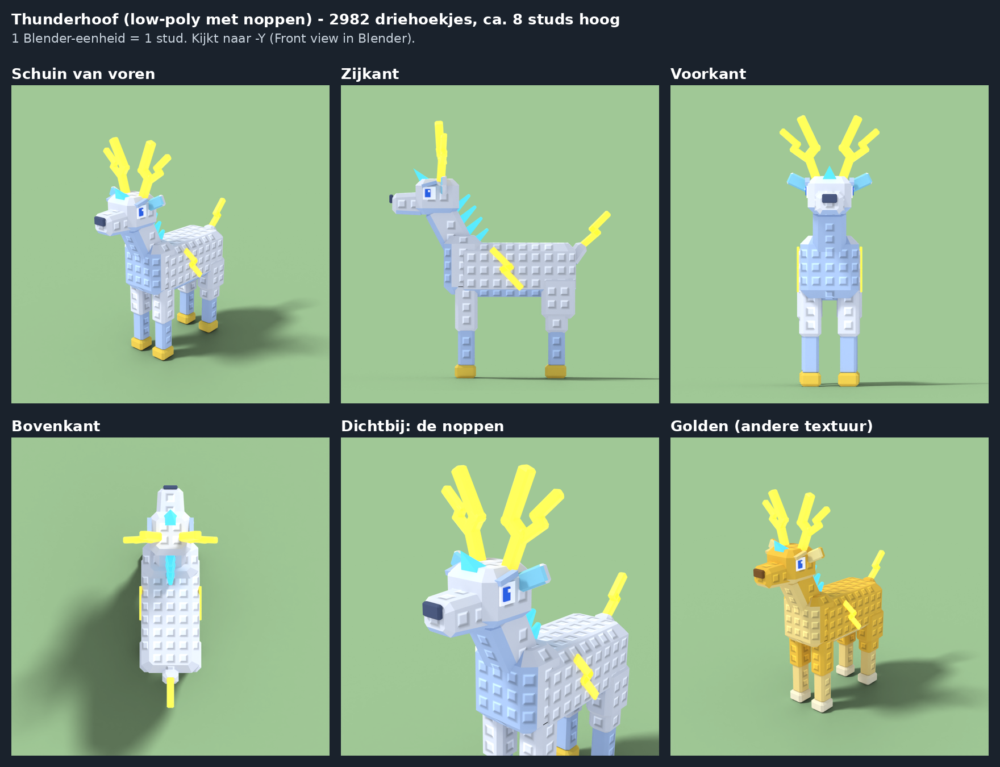
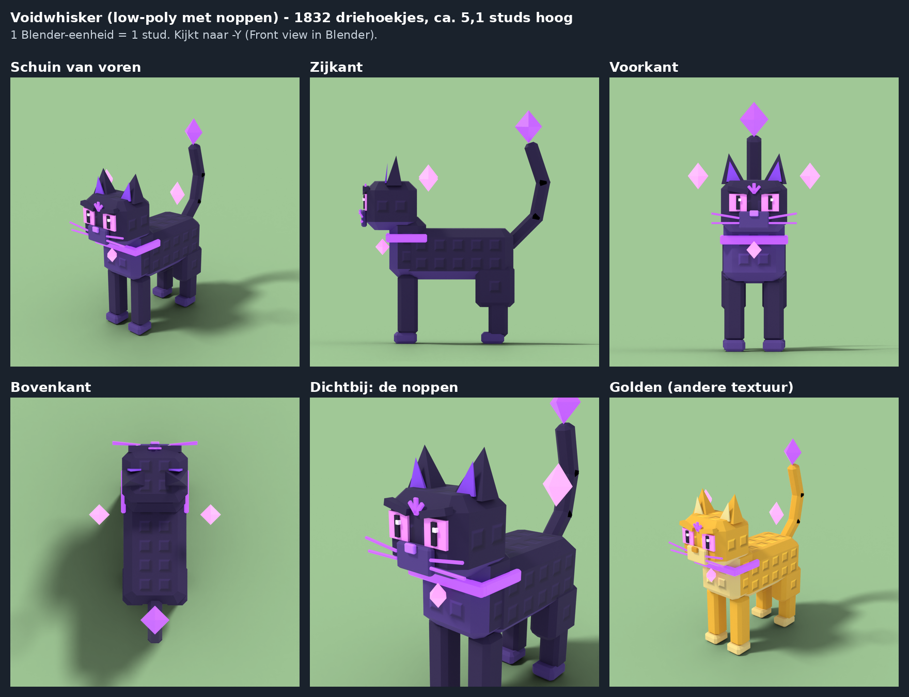
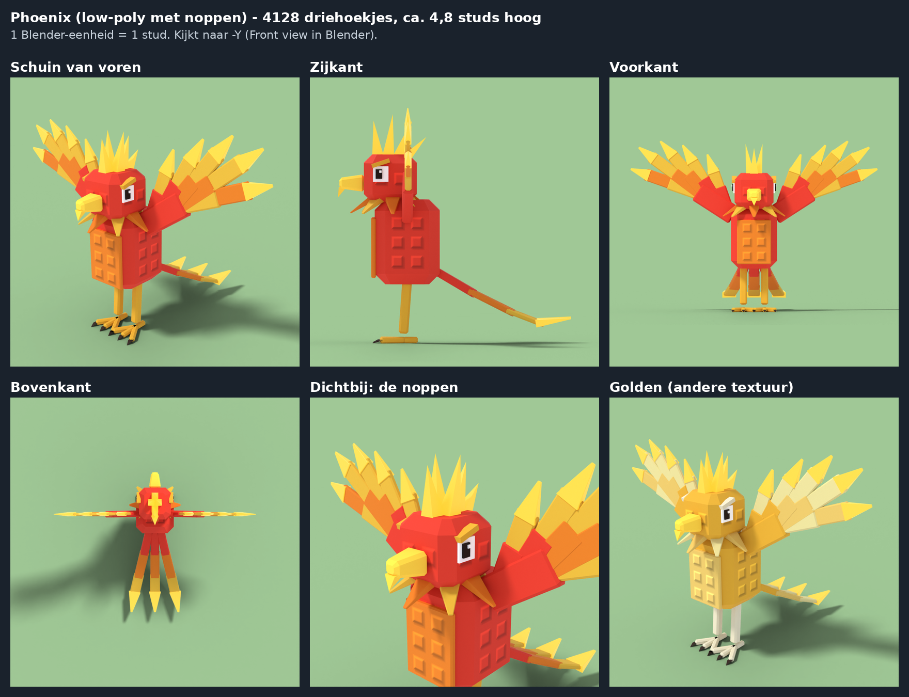
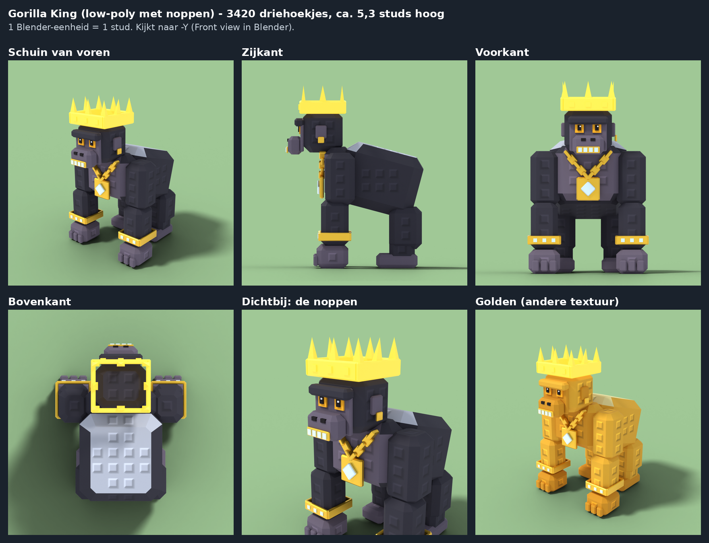

# Create a Zoo – blokkige dieren met noppen

Twaalf dieren, helemaal in Blender gemaakt, in een blokkige cartoonstijl: elk dier is opgebouwd uit dikke blokken
met afgeschuinde randen, net als modellen die in Studio uit parts zijn gebouwd. Ze hebben felle kleuren, grote
cartoonogen met pupillen (sommige met wenkbrauwen) en de klassieke Roblox-noppen in de textuur: vierkante noppen
met een schuin randje (licht aan de boven- en linkerkant, donker aan de onder- en rechterkant). De noppen zijn
bij alle dieren even groot, zodat ze bij elkaar en bij je map passen. De vier zeldzaamste dieren (Legendary,
Mythic en Secret) hebben ook delen die gloeien, vonken, vlammen en een lichtje, en alle dieren vanaf Rare krijgen
glinsters in de kleur van hun zeldzaamheid.

| Dier | Zeldzaamheid | Hoogte | Driehoekjes | Hoe hij eruitziet |
|---|---|---|---|---|
| Deer | Common | 5,6 studs (met gewei) | 1.884 | bruin met crème vlekjes op de rug, crème borst en buik, gewei van blokjes, donkere hoeven |
| Rabbit | Common | 3,3 studs (tot de oorpunten) | 1.212 | lichtbruin, crème snuit en buik, lange oren die van binnen roze zijn, roze wangetjes, tandjes, wit staartje, grote achtervoeten |
| Fox | Common | 3,2 studs (tot de oorpunten) | 1.404 | oranje, witte borst, buik en pluizige wangen, zwarte oorpuntjes en sokken, grote pluimstaart met witte punt |
| Raccoon | Common | 2,2 studs (tot de oren) | 1.572 | grijs, zwart masker met witte wenkbrauwen, witte snuit, staart met zwarte ringen, zwarte pootjes |
| Wolf | Rare | 4,3 studs (tot de oorpunten) | 1.428 | grijs met een donkere rug, lichte borst, kraag, buik en poten, gele ogen met stoere wenkbrauwen, puntoren, hangende staart met donkere punt |
| Boar | Rare | 2,3 studs (met manen) | 1.332 | bruin, stekelige donkere manen, roze snuit met neusgaten, witte slagtanden, boze wenkbrauwen, donkere hoeven |
| Owl | Rare | 3,2 studs (met oorpluimen) | 1.194 | bruin, licht gezicht en lichte borst met veertjes, grote gele ogen met wenkbrauwen, oranje snavel en tenen, donkere vleugels met strepen |
| Bear | Epic | 3,8 studs (tot de oren) | 1.212 | dik en bruin, lichte snuit en binnenkant oren, donkere poten |
| Thunderhoof | Legendary | 8 studs (met gewei) | 2.982 | groot, wit en lichtblauw, blauwe ogen met wenkbrauwen, gouden hoeven; gloeit: gele bliksemschichten als gewei, op de flanken en uit de staart, en blauwe stekels als manen |
| Voidwhisker | Mythic | 5,1 studs (met staart) | 1.832 | schaduwkat, bijna zwart paars, roze ogen met spleetpupillen, paars in de oren; gloeit: een rune op het voorhoofd, een halsband, snorharen, drie roze edelstenen (op de halsband en twee zwevend) en een kristal op de staart |
| Phoenix | Mythic | 4,8 studs (met kuif), 7 studs breed met gespreide vleugels | 4.128 | vuurvogel: rood met een oranje borst, een kraag van oranje en gele veren, haaksnavel, stoere gouden wenkbrauwen, grote vleugels met waaiers van rode, oranje en gele veren, drie lange staartveren, gouden poten met zwarte klauwen; gloeit: een vlammenkuif en vlammen aan de vleugels en de staart |
| Gorilla King | Secret | 5,3 studs (met kroon) | 3.420 | helemaal dripped out: zwarte vacht, zilveren rug, grijze borst, gezicht en vuisten, zware wenkbrauw, oranje ogen; gloeit: een gouden kroon met punten en robijnen; glimt: gouden grills met diamanten tanden, een dikke gouden ketting met een medaillon met diamant, een gouden oorring en gouden armbanden met diamanten |









Een Roblox-speler is ongeveer 5 studs hoog. De gewone dieren hebben 1.200 tot 1.900 driehoekjes, de vier
zeldzaamste meer, omdat ze meer onderdelen hebben (bliksem, vlammen, veren, bling). Een Roblox-MeshPart mag er
tot 20.000 hebben, dus alle dieren zijn licht. Bij alle dieren geldt:

- **Onderdelen:** `Body` (met kop, oren, staart en de rest) en de poten `LegFL`, `LegFR`, `LegBL`, `LegBR`
  (F = voor, B = achter, L = links, R = rechts). Bij de Gorilla King zijn `LegFL` en `LegFR` de armen. De uil en
  de Phoenix staan rechtop en hebben daarom `Body`, de vleugels `WingL` en `WingR` en de poten `LegL` en `LegR`.
  De oorsprong van elke poot en vleugel zit waar hij draait (bovenaan).
  De oorsprong van `Body` ligt op de grond tussen de poten. De vier zeldzaamste dieren hebben ook gloeiende
  delen (zie hieronder).
- **Richting:** het dier kijkt naar -Y in Blender (je ziet zijn gezicht in de Front view). 1 Blender-eenheid
  = 1 stud.
- **Textuur:** één materiaal met één plaatje van 1024 × 1024.

## De bestanden

Voor elk dier (`Deer`, `Rabbit`, `Fox`, `Raccoon`, `Wolf`, `Boar`, `Owl`, `Bear`, `Thunderhoof`, `Voidwhisker`,
`Phoenix`, `GorillaKing`):

| Bestand | Wat het is |
|---|---|
| `<Dier>.blend` | Het Blender-bestand. De textuur zit erin verpakt. |
| `<Dier>.glb` | Het dier voor Roblox Studio (File → Import 3D). |
| `<Dier>Studs.png` | De textuur: vlakke kleuren met noppen. |
| `<Dier>Studs_Golden.png` | Dezelfde textuur in goudkleuren, voor de mutatie "Golden". |
| `<Dier>.rig.json` | De gegevens voor de gewrichten; daarmee wordt `SetupZooAnimals.lua` gemaakt. |

En voor alle dieren samen:

| Bestand | Wat het is |
|---|---|
| `SetupZooAnimals.lua` | Script voor de Command Bar in Studio. Het zet alle dieren klaar. |
| `texture_bands.json` | In welke rijen pixels van elke textuur elke kleur staat. |

De Python-scripts staan in `tools/blender/`: `stud_<dier>.py` (bijvoorbeeld `stud_fox.py`) beschrijft de vorm
en kleuren van één dier, en `stud_animal.py` doet de rest (noppen, textuur, export, plaatjes).

## Hoe het gemaakt is

- **Blokken:** elk dier is gebouwd uit blokken met afgeschuinde randen: een blok voor het lijf, een voor de borst,
  de kop, de snuit, de oren, de poten en de staart. Sommige blokken lopen schuin of worden smaller naar het eind
  (snuiten, staarten, stekels). Elk vlak is precies plat en krijgt één kleur, zonder verloop. De dieren zijn vlak
  belicht: je ziet de randjes.
- **Cartoonogen:** een wit (of gekleurd) blokje met een donkere pupil en een klein wit lichtpuntje, soms met een
  wenkbrauw erboven. Door de wenkbrauw schuin te zetten kijkt een dier stoer (wolf, zwijn, Phoenix) of lief.
- **De noppen zitten in de textuur, niet in de 3D-vorm.** Echte 3D-noppen zouden duizenden driehoekjes extra
  kosten. De ingebouwde noppen van Roblox werken ook niet: die bestaan alleen op gewone Parts, niet op MeshParts.
- **Alle noppen zijn even groot en nergens uitgerekt.** Elk vlak krijgt een eigen plekje in de textuur, en alle
  vlakken van een dier staan daar op dezelfde schaal. Het script controleert dat: de verhouding tussen een rand
  in 3D en in de textuur is overal precies 1.
- **Alleen hele noppen.** De noppen staan in een raster in het midden van elk vlak en de rijen lopen waterpas.
  Een nop die over de rand van een vlak zou vallen, wordt weggelaten. Daardoor blijven de schuine randjes en
  dunne vlakken glad, en zie je nergens halve noppen of streepjes. De ogen, neuzen, snavels, klauwen, slagtanden,
  het goud en de edelstenen en de gloeiende delen hebben geen noppen.
- **Hoe een nop eruitziet:** een vierkantje met een schuin randje eromheen. Het licht komt van linksboven: de
  boven- en linkerrand zijn lichter, de onder- en rechterrand donkerder, en rechtsonder ligt een zacht schaduwtje.
  Zo lijken ze uit het vlak te steken, terwijl het gewoon een plaatje is.
- **Noppengrootte:** er staat om de 0,4 stud een nop, en elke nop is 0,24 stud breed. Kleurvlakken zijn nooit
  helemaal wit: de lichte randjes van de noppen moeten nog lichter kunnen zijn.
- **Elke kleur heeft een eigen band in de textuur** (een aantal rijen pixels over de hele breedte). Van boven
  naar beneden:

  | Dier | Banden van boven naar beneden |
  |---|---|
  | Deer | bruin, crème, gewei, hoeven, neus, oogwit, pupil, lichtpuntje |
  | Rabbit | bruin, crème, wit, roze, neus, oogwit, pupil, lichtpuntje |
  | Fox | oranje, wit, donker, neus, oogwit, pupil, lichtpuntje |
  | Raccoon | grijs, licht, donker, neus, oogwit, pupil, lichtpuntje |
  | Wolf | grijs, licht, donker, neus, oogwit (geel), pupil, lichtpuntje |
  | Boar | bruin, donker (manen, oren, staart), snuit, slagtanden, hoeven, neusgaten, oogwit, pupil, lichtpuntje |
  | Owl | bruin, licht, donker (vleugels, staart), tenen, snavel, oogwit (geel), pupil, lichtpuntje |
  | Bear | bruin, licht (snuit, oren), donker (poten), neus, oogwit, pupil, lichtpuntje |
  | Thunderhoof | wit, lichtblauw, cyaan (oren), hoeven, neus, oogwit, pupil (blauw), lichtpuntje, bliksem, manen |
  | Voidwhisker | vacht, zacht paars, paars (oren), neus, oogwit (roze), pupil, lichtpuntje, void (paars), edelsteen (roze) |
  | Phoenix | rood, oranje, geel, goud (poten, wenkbrauwen), snavel, klauwen, oogwit, pupil, lichtpuntje, vlam |
  | GorillaKing | vacht, zilver, huid, goud, robijn, diamant, zwart (neusgaten), oogwit (oranje), pupil, lichtpuntje, kroon |

  In `texture_bands.json` staat per dier precies in welke rijen elke kleur staat.

## Gloeiende delen en effecten

Thunderhoof, Voidwhisker, Phoenix en Gorilla King hebben extra MeshParts die gloeien. Die draaien niet zelf, maar
zitten vast aan `Body`, of aan het deel waar ze bij horen: de vlammen `WingFlameL`/`WingFlameR` van de Phoenix
bewegen mee met de vleugels. Het setup-script maakt ze **Neon** in één kleur, en zet er deeltjes (ParticleEmitters,
met Roblox' eigen plaatjes voor vonken, vuur en rook) en een lichtje (PointLight) bij:

| Dier | Gloeiende MeshParts | Effecten |
|---|---|---|
| Thunderhoof | `Lightning` (geel), `Mane` (blauw) | vonken rond de bliksem, kleine vonkjes onder elke hoef (zodat hij knettert als hij loopt), blauw licht |
| Voidwhisker | `Void` (paars: rune, halsband, snorharen), `Gems` (roze), `TailWisp` (paars) | paarse vonken bij de staart, donkere rookslierten, paars licht |
| Phoenix | `Crest`, `TailFlames`, `WingFlameL`, `WingFlameR` (geel) | vuur op de staart, de vleugels en de kuif op zijn kop, gloeiende vonkjes die opstijgen, oranje licht |
| Gorilla King | `Crown` (goud) | gouden vonken bij de kroon, de ketting en de armbanden, witte glinsters bij de grills, goudkleurig licht |

Effecten die uit één punt komen (zoals de vonkjes onder de hoeven en het vuur op de kuif) zitten aan een
**Attachment** op dat punt, die meebeweegt met de poot of de kop.

**Glinsters per zeldzaamheid:** elk dier vanaf Rare krijgt ook een ParticleEmitter `RarityAura` op de RootPart:
een paar zachte glinsters rondom het dier, in de kleur van zijn zeldzaamheid. Zo zien spelers meteen hoe
zeldzaam een dier is. Common-dieren krijgen niets, zodat ze gewoon blijven.

| Zeldzaamheid | Kleur van de glinsters |
|---|---|
| Rare | blauw |
| Epic | paars |
| Legendary | goud |
| Mythic | rood |
| Secret | roze |

Wil je andere kleuren, verander dan `RARITY_AURA` bovenin `SetupZooAnimals.lua`.

Het goud van de Gorilla King glimt: het setup-script geeft `Chains` (de ketting met het medaillon), `Grills` (de
gouden tanden) en de armbanden `BraceletL` en `BraceletR` een **Reflectance** (0,35 tot 0,4). De armbanden zitten
vast aan de armen en bewegen dus mee.

In Blender en op de plaatjes gloeien en glimmen die delen ook. In de `.glb` hebben ze gewoon hun kleur in de
textuur (zonder noppen), zodat het dier ook zonder het script goed uitziet.

## In Roblox Studio zetten (3 stappen)

1. **Importeren:** kies **File** → **Import 3D** en kies de `.glb`-bestanden van de dieren die je wilt (samen of
   één voor één). Klik op **Import**. Studio uploadt de meshes en de texturen naar jouw account, en de dieren
   verschijnen in de Workspace.
2. **Afmaken met het script:** open **View** → **Command Bar**, plak de hele inhoud van `SetupZooAnimals.lua`
   erin en druk op Enter. In het Output-venster staat dan per dier "Set up Deer" enzovoort. Het script:
   - voegt een onzichtbare **RootPart** toe (hitbox en `PrimaryPart`, met de pivot onder de poten);
   - maakt **Motor6D**-gewrichten voor de poten (en de vleugels van de uil), zodat je ze kunt animeren;
   - zet elk dier terug op zijn eigen grootte, als Studio het bij het importeren anders heeft gemaakt;
   - maakt de gloeiende delen Neon, laat het goud glimmen en zet de effecten erbij (bij de vier zeldzaamste
     dieren);
   - geeft elk dier vanaf Rare glinsters in de kleur van zijn zeldzaamheid;
   - zet de dieren in **ReplicatedStorage → ZooAnimals** en selecteert die map.
3. **Opslaan als één .rbxm:** klik met de rechtermuisknop op de map **ZooAnimals** (die is al geselecteerd) en
   kies **Save to File...**. Je krijgt één bestand `ZooAnimals.rbxm` met alle dieren, met hun gewrichten en
   effecten. Wil je één los dier, klik dan met de rechtermuisknop op dat dier en kies **Save to File...**.

**In een ander spel gebruiken:** open dat spel in Studio, klik met de rechtermuisknop op **ReplicatedStorage** en
kies **Insert from File...**, en kies `ZooAnimals.rbxm`. In je scripts pak je een dier met bijvoorbeeld
`ReplicatedStorage.ZooAnimals.Deer:Clone()`.

**Waarom maak je de .rbxm zelf in Studio?** Een MeshPart in een .rbxm verwijst naar een mesh en een plaatje die
op de Roblox-website staan (een `MeshId` en `TextureID`). Die krijg je pas als Studio ze bij **Import 3D** naar
jouw account uploadt. Een .rbxm die buiten Studio is gemaakt, zou dus lege, onzichtbare MeshParts hebben. Omdat de
meshes op jouw account staan, werkt de .rbxm in al jouw eigen spellen (en in groepsspellen, als de groep ze mag
gebruiken).

Let op: de dieren hebben dezelfde namen als de oudere versies in `models/forest` en `models/forest-hq`. Het
script vervangt dus een dier met dezelfde naam dat al in ReplicatedStorage → ZooAnimals staat.

## Golden maken

- **Klaar plaatje:** upload `<Dier>Studs_Golden.png` in Studio, bijvoorbeeld via de Asset Manager. Zet daarna
  de **TextureID** van alle MeshParts van dat dier (`Body` en de poten, bij de uil ook de vleugels) op dat
  plaatje. De gloeiende Neon-delen houden hun eigen kleur; het goud van de Gorilla King blijft ook goud.
- **Zelf een kleur maken:** kleur in een tekenprogramma een band uit de textuur anders. Gebruik
  "kleurtoon/verzadiging" (hue/saturation), dan blijven de lichtjes en schaduwen van de noppen goed. Of pas
  `GOLDEN` of `PALETTE` bovenin het script van het dier aan en maak het opnieuw.

## Opnieuw maken of aanpassen

```
pip install bpy numpy pillow scipy
python3 tools/blender/stud_fox.py
```

Zo maak je één dier opnieuw (hier de vos). Elk script maakt de bestanden van zijn dier in deze map opnieuw, en
ook `SetupZooAnimals.lua` en `previews/stud_<dier>_views.png`. Dat duurt ongeveer 2,5 minuut per dier. Wat je
makkelijk kunt veranderen:

- bovenin elk dierscript: `PALETTE` en `GOLDEN` (de kleuren); in `build_body()` en de functies voor de poten
  staan de blokken: `block(deel, midden, (breedte, diepte, hoogte), kleur, ...)` met eventueel `rot` (draaien),
  `taper` (smaller naar boven) en `bevel` (hoe schuin de randen zijn), en `bar(deel, van, naar, dikte, kleur)`
  voor een blok van het ene punt naar het andere;
- bovenin `stud_animal.py`: `STUD`, de afstand tussen de noppen (0,4 stud), en `STUD_SIZE`, hoe breed een nop is
  vergeleken met die afstand (0,6). Dat geldt voor alle dieren tegelijk, zodat ze bij elkaar passen.
