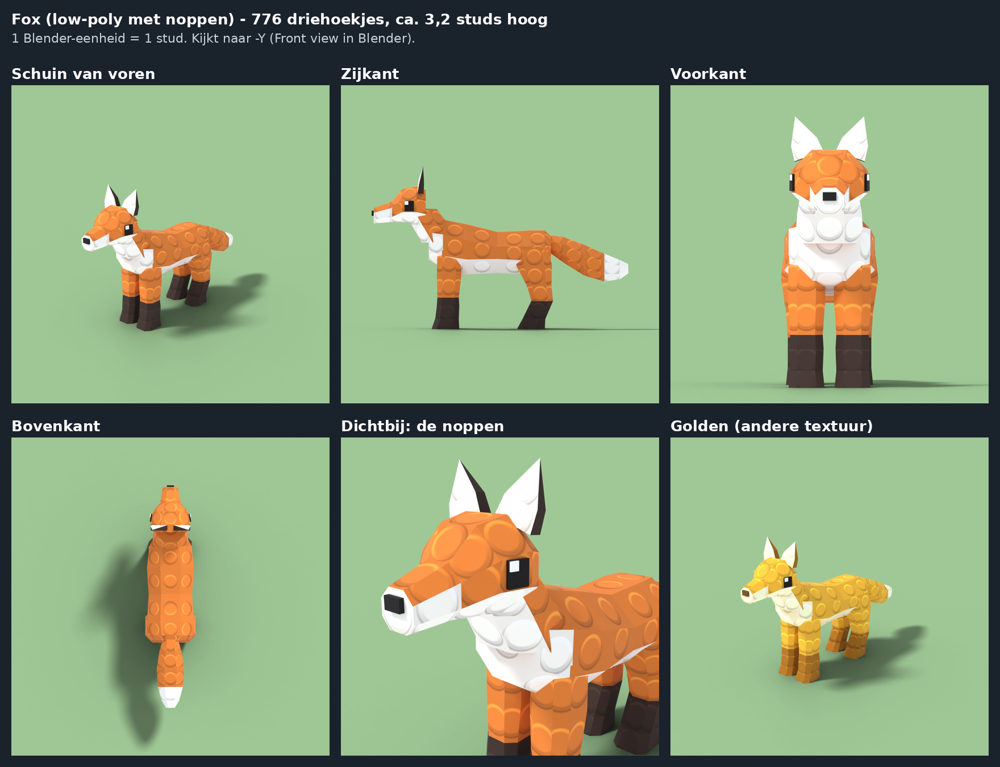
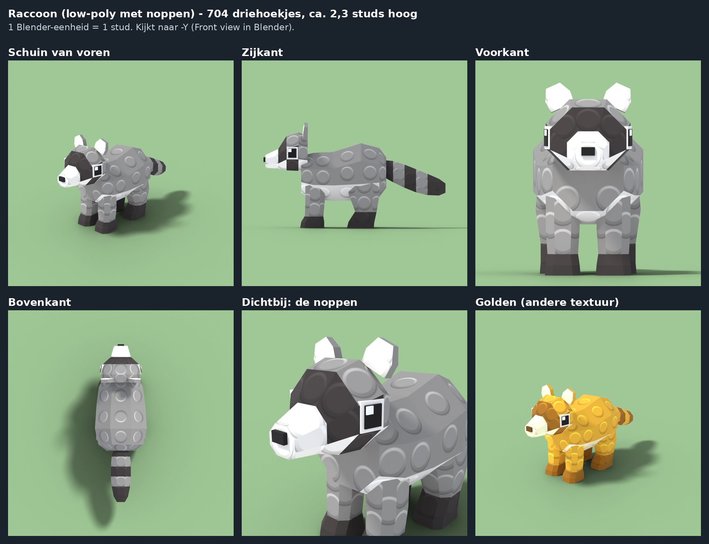
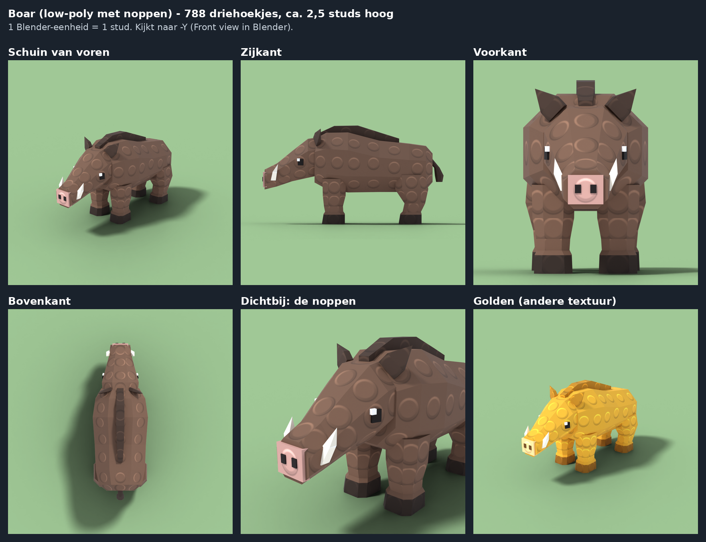
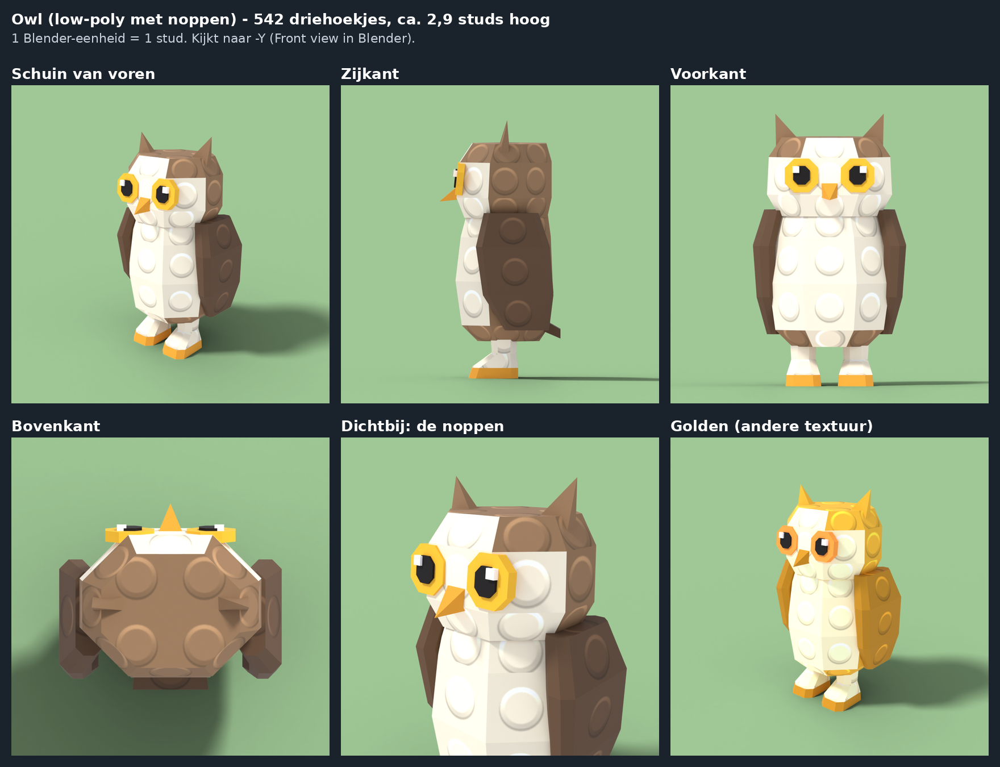
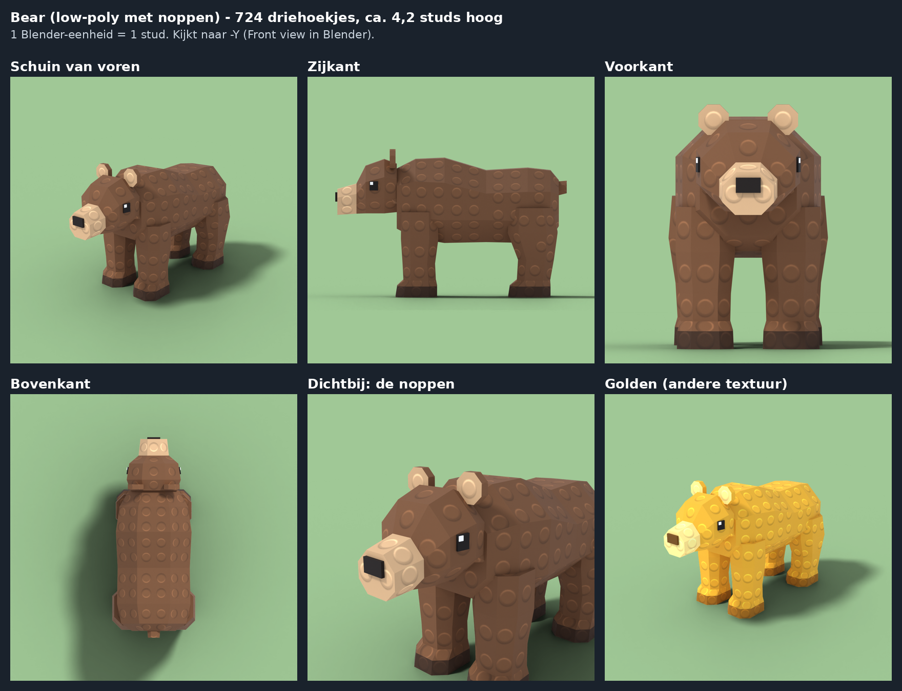

# Create a Zoo – dieren met noppen (low-poly)

Acht dieren, helemaal in Blender gemaakt, in dezelfde low-poly stijl en met de klassieke Roblox-noppen in de
textuur. De noppen zijn bij alle dieren even groot, zodat ze bij elkaar en bij je map passen.

| Dier | Zeldzaamheid | Hoogte | Driehoekjes | Kleuren |
|---|---|---|---|---|
| Deer | Common | 6 studs (met gewei) | 1.040 | bruin, crème buik/borst, wit onder de staart, lichtbruin gewei, donkerbruine hoeven en neus |
| Rabbit | Common | 3,3 studs (tot de oorpunten) | 584 | bruin, crème buik/borst/snuit, roze binnenkant oren en neus, wit staartje |
| Fox | Common | 3,2 studs (tot de oorpunten) | 776 | oranje, witte borst/buik/wangen/staartpunt, zwarte sokken en oren |
| Raccoon | Common | 2,3 studs (tot de oren) | 704 | grijs, zwart masker met witte randjes om de ogen, witte snuit, staart met zwarte ringen, zwarte pootjes |
| Wolf | Rare | 4,1 studs (tot de oorpunten) | 842 | grijs, donker zadel op de rug, lichte buik/borst/snuit/poten, donkere staartpunt |
| Boar | Rare | 2,5 studs (met manen) | 788 | bruin, donkere manen, roze snuit met neusgaten, witte slagtanden, donkere hoeven |
| Owl | Rare | 2,9 studs (met oorpluimen) | 542 | bruin, lichte borst en gezicht, donkere vleugels, gele ogen, oranje snavel en poten |
| Bear | Epic | 4,2 studs (tot de oren) | 724 | bruin, lichtbruine snuit en binnenkant oren, donkere poten |









Een Roblox-speler is ongeveer 5 studs hoog. De dieren hebben 500 tot 1.000 driehoekjes. Kleine dieren hebben
er minder nodig, want meer vlakjes zou je daar niet zien. Een Roblox-MeshPart mag er tot 20.000 hebben, dus alle
dieren zijn erg licht. Bij alle dieren geldt:

- **Onderdelen:** `Body` (met kop, oren, staart en de rest) en de poten `LegFL`, `LegFR`, `LegBL`, `LegBR`
  (F = voor, B = achter, L = links, R = rechts). De uil staat rechtop en heeft daarom `Body`, de vleugels `WingL`
  en `WingR` en de poten `LegL` en `LegR`. De oorsprong van elke poot en vleugel zit waar hij draait (bovenaan).
  De oorsprong van `Body` ligt op de grond tussen de poten.
- **Richting:** het dier kijkt naar -Y in Blender (je ziet zijn gezicht in de Front view). 1 Blender-eenheid
  = 1 stud.
- **Textuur:** één materiaal met één plaatje van 1024 × 1024.

## De bestanden

Voor elk dier (`Deer`, `Rabbit`, `Fox`, `Raccoon`, `Wolf`, `Boar`, `Owl`, `Bear`):

| Bestand | Wat het is |
|---|---|
| `<Dier>.blend` | Het Blender-bestand. De textuur zit erin verpakt. |
| `<Dier>.glb` | Het dier voor Roblox Studio (File → Import 3D). |
| `<Dier>Studs.png` | De textuur: vlakke kleuren met noppen. |
| `<Dier>Studs_Golden.png` | Dezelfde textuur in goudkleuren, voor de mutatie "Golden". |
| `<Dier>.rig.json` | De gegevens voor de gewrichten; daarmee wordt `SetupZooAnimals.lua` gemaakt. |

En voor alle dieren samen:

| Bestand | Wat het is |
|---|---|
| `SetupZooAnimals.lua` | Script voor de Command Bar in Studio. Het zet alle dieren klaar. |
| `texture_bands.json` | In welke rijen pixels van elke textuur elke kleur staat. |

De Python-scripts staan in `tools/blender/`: `stud_<dier>.py` (bijvoorbeeld `stud_fox.py`) beschrijft de vorm
en kleuren van één dier, en `stud_animal.py` doet de rest (noppen, textuur, export, plaatjes).

## Hoe het gemaakt is

- **Low-poly:** elk onderdeel is een rij platte "ringen" (rechthoeken met schuine hoeken) die met grote, platte
  vlakken verbonden zijn. Elk vlak is precies plat en krijgt één kleur, zonder verloop. De dieren zijn vlak
  belicht: je ziet de hoekjes.
- **De noppen zitten in de textuur, niet in de 3D-vorm.** Echte 3D-noppen zouden duizenden driehoekjes extra
  kosten. De ingebouwde noppen van Roblox werken ook niet: die bestaan alleen op gewone Parts, niet op MeshParts.
- **Alle noppen zijn even groot en nergens uitgerekt.** Elk vlak krijgt een eigen plekje in de textuur, en alle
  vlakken van een dier staan daar op dezelfde schaal. Het script controleert dat: de verhouding tussen een rand
  in 3D en in de textuur is overal precies 1.
- **De noppen lopen netjes door.** De noppen staan in een raster in het midden van elk vlak en de rijen lopen
  waterpas. Vlakken van dezelfde ring zijn even hoog, dus de rijen liggen rondom een poot of het lijf op gelijke
  hoogte. De rechterkant is het spiegelbeeld van de linkerkant. Smalle schuine randjes hebben geen noppen, zodat
  je geen halve noppen krijgt. De ogen, neuzen en de snavel hebben ook geen noppen.
- **Noppengrootte:** de noppen zijn half zo groot als op een gewoon Roblox-blok (om de 0,5 stud). Met de volle
  grootte past er geen enkele hele nop op de poten, want die zijn vaak maar ongeveer 0,5 stud breed.
- **Elke kleur heeft een eigen band in de textuur** (een aantal rijen pixels over de hele breedte). Van boven
  naar beneden:

  | Dier | Banden van boven naar beneden |
  |---|---|
  | Deer | bruin, crème, wit, lichtbruin (gewei), donkerbruin (hoeven), neus, zwart (ogen), lichtpuntje (ogen) |
  | Rabbit | bruin, crème, wit, roze, neus, zwart, lichtpuntje |
  | Fox | oranje, wit, donker, neus, zwart, lichtpuntje |
  | Raccoon | grijs, licht, donker, oogrand, neus, zwart, lichtpuntje |
  | Wolf | grijs, licht, donker, neus, zwart, lichtpuntje |
  | Boar | bruin, donker (manen, oren, staart), snuit, slagtanden, hoeven, neusgaten, zwart, lichtpuntje |
  | Owl | bruin, licht, donker (vleugels, staart), poten, iris (geel), snavel, zwart, lichtpuntje |
  | Bear | bruin, licht (snuit, oren), donker (poten), neus, zwart, lichtpuntje |

  In `texture_bands.json` staat per dier precies in welke rijen elke kleur staat.

## In Roblox Studio zetten (3 stappen)

1. **Importeren:** kies **File** → **Import 3D** en kies de `.glb`-bestanden van de dieren die je wilt (samen of
   één voor één). Klik op **Import**. Studio uploadt de meshes en de texturen naar jouw account, en de dieren
   verschijnen in de Workspace.
2. **Afmaken met het script:** open **View** → **Command Bar**, plak de hele inhoud van `SetupZooAnimals.lua`
   erin en druk op Enter. In het Output-venster staat dan per dier "Set up Deer" enzovoort. Het script:
   - voegt een onzichtbare **RootPart** toe (hitbox en `PrimaryPart`, met de pivot onder de poten);
   - maakt **Motor6D**-gewrichten voor de poten (en de vleugels van de uil), zodat je ze kunt animeren;
   - zet elk dier terug op zijn eigen grootte, als Studio het bij het importeren anders heeft gemaakt;
   - zet de dieren in **ReplicatedStorage → ZooAnimals**.
3. **Opslaan als .rbxm:** klik met de rechtermuisknop op een dier en kies **Save to File...**.

Let op: de dieren hebben dezelfde namen als de oudere versies in `models/forest` en `models/forest-hq`. Het
script vervangt dus een dier met dezelfde naam dat al in ReplicatedStorage → ZooAnimals staat.

## Golden maken

- **Klaar plaatje:** upload `<Dier>Studs_Golden.png` in Studio, bijvoorbeeld via de Asset Manager. Zet daarna
  de **TextureID** van alle MeshParts van dat dier (`Body` en de poten, bij de uil ook de vleugels) op dat
  plaatje.
- **Zelf een kleur maken:** kleur in een tekenprogramma een band uit de textuur anders. Gebruik
  "kleurtoon/verzadiging" (hue/saturation), dan blijven de lichtjes en schaduwen van de noppen goed. Of pas
  `GOLDEN` of `PALETTE` bovenin het script van het dier aan en maak het opnieuw.

## Opnieuw maken of aanpassen

```
pip install bpy numpy pillow scipy
python3 tools/blender/stud_fox.py
```

Zo maak je één dier opnieuw (hier de vos). Elk script maakt de bestanden van zijn dier in deze map opnieuw, en
ook `SetupZooAnimals.lua` en `previews/stud_<dier>_views.png`. Dat duurt ongeveer 2 minuten per dier. Wat je
makkelijk kunt veranderen:

- bovenin elk dierscript: `PALETTE` en `GOLDEN` (de kleuren) en de tabellen van de poten; in `build_body()`
  staan de ringen van het lijf, de kop en de rest;
- bovenin `stud_animal.py`: `STUD`, de afstand tussen de noppen (0,5 = half zo groot als op een Roblox-blok,
  1,0 = even groot). Dat geldt voor alle dieren tegelijk, zodat ze bij elkaar passen.
