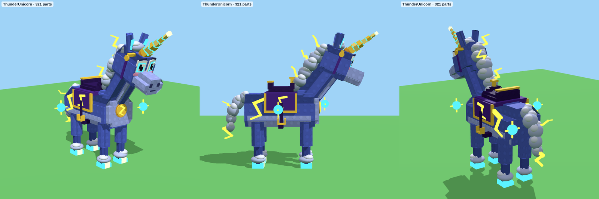

# Thunder Unicorn

Het exclusieve rijdier van de game pass: een storm-blauwe eenhoorn met **manen en staart van onweerswolken vol
bliksem**, een **gouden spiraalhoorn** die knettert van de elektriciteit, **gloeiende donderhoeven**, bliksemstralen
op zijn flanken, een paars-gouden zadel en **drie geladen bollen** die om hem heen draaien, met elektrische bogen
ertussen. Hij is gemaakt in dezelfde blokjesstijl als je andere dieren, van gewone Parts, dus je hoeft niets te
uploaden.



(De deeltjes, lichtsporen, bogen en het licht zie je niet in deze plaatjes, alleen in Roblox.)

## Animaties en effecten

Het script **AnimalFX** (hetzelfde als bij de Dark Woods-dieren) laat hem bewegen. Het kijkt hoe snel het model
beweegt, dus je hoeft niets aan te zetten:

- **Stilstaan:** hij ademt, kijkt rond, zijn hoorn knettert, de wolken in zijn manen en staart rommelen en de bollen
  draaien rond.
- **Lopen:** een rustige stap, met vonkjes en een kleine schokgolf onder elke hoef.
- **Rennen:** hij gaat over in een **galop**. Bij 8x snelheid blijven zijn benen netjes galopperen (niet wazig
  snel), en zijn achterhoeven en staart trekken **bliksemsporen** achter zich aan.
- **Elke paar seconden stilstaan:** hij **steigert**, er slaat een **bliksemschicht** op zijn hoorn met een flits en
  een regen van vonken, en als zijn voorhoeven neerkomen gaat er een grote schokgolf over de grond.

## In je game zetten

1. Klik in de **Explorer** met de rechtermuisknop op **ServerStorage** (of **ReplicatedStorage**) en kies **Insert
   from File...** → `ThunderUnicorn.rbxm`. Je krijgt een map **Mounts** met het model **ThunderUnicorn**.
2. Het model werkt zoals je andere dieren:
   - **RootPart** is de hitbox en de PrimaryPart. Verplaats het hele model met `PivotTo`; de pivot zit op de grond.
   - **RideAttachment** (in RootPart) is de plek op het zadel waar de speler zit. Gebruik die in je rij-script.
   - **OverheadAttachment** is de plek boven zijn hoofd, voor een naamkaartje.
3. Gebruik het in je mount-script net als je paarden: zet je rij-code (Seat, AlignPosition, of wat je paarden
   gebruiken) op dit model in plaats van op een paard. **Stuur me een screenshot van een paard in de Explorer**, dan
   maak ik de eenhoorn precies zoals je paarden zijn opgebouwd.

## Attributen

| Attribuut | Waarde | Wat het doet |
|---|---|---|
| `Mount` | true | voor je scripts: dit is een rijdier |
| `SpeedMultiplier` | 8 | voor je mount-script: 8x snelheid |
| `WalkSpeed` | 16 | de snelheid (studs/s) van een gewone stap. Sneller = galop |
| `OrbitSpeed` | 0.45 | hoe snel de bollen ronddraaien (0 = stil) |
| `State` | "" | "Idle", "Walk" of "Run" om een animatie te forceren |
| `IdleActions` | (aan) | zet op false: geen steigeren met bliksem |
| `FXDistance` | 160 | verder weg dan dit (studs) geen effecten |

## Gemaakt voor telefoons

Ongeveer 320 Parts, 8 bewegende delen, een handvol ParticleEmitters, een paar lampjes zonder schaduw en 3 Trails.
Kleine onderdelen geven geen schaduw en botsen niet. Ver weg (buiten `FXDistance`) stopt hij met effecten, en nog
verder weg ook met animeren. De bliksem bij het steigeren is maar een halve seconde te zien.

## Let op

Ik heb het bestand gemaakt met dezelfde rbxm-writer als je andere modellen, de previews gerenderd en het script
gecontroleerd met de Luau-checker. Roblox Studio zelf kan ik niet openen. Gaat er iets mis, kopieer dan de tekst uit
het Output-venster en stuur die op.

## Opnieuw maken

```
cd tools/animal-models
python3 build_mounts.py --rbxm ../../models/thunder-unicorn/ThunderUnicorn.rbxm
```

Het model staat in `tools/animal-models/thunder_unicorn.py`, de animaties in `AnimalFX.lua` (profiel
`ThunderUnicorn` en de actie `thunder`).
