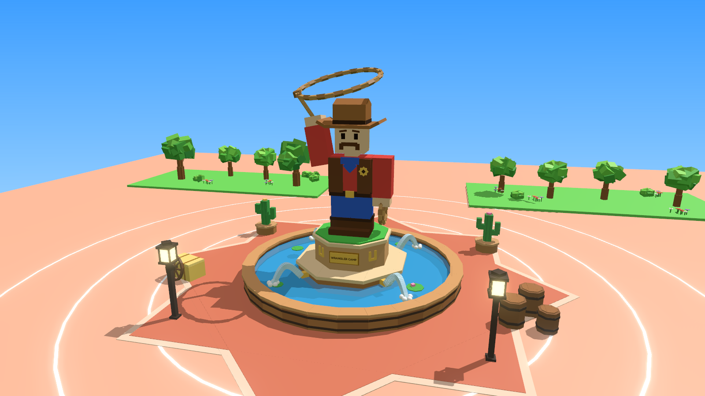
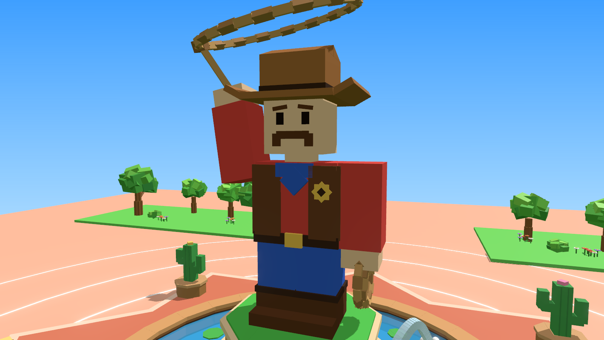
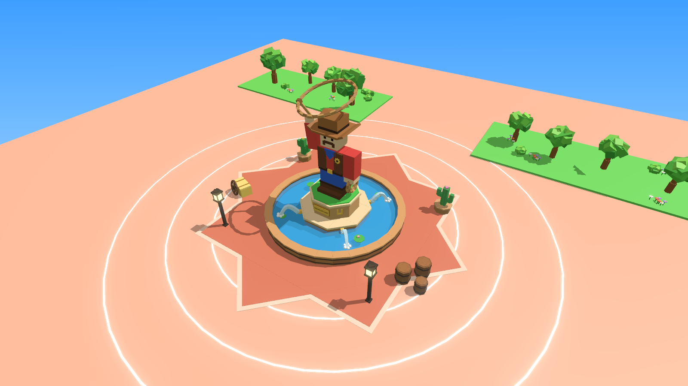

# Wrangler Camp – standbeeld met fontein

`WranglerCampStatue.rbxm` is het nieuwe standbeeld voor het plein, gebouwd zoals in het ontwerp: een blokkige
cowboy die een lasso boven zijn hoofd laat draaien, op een sokkel van zandsteen in een houten fontein, met een
sheriffster in de vloer en Wild West-spullen eromheen. Alles is gemaakt van gewone Parts (470 stuks), dus je
hoeft niets te uploaden.







## In Roblox Studio zetten

1. Klik in de **Explorer** met de rechtermuisknop op **Workspace** en kies **Insert from File...**. Kies
   `WranglerCampStatue.rbxm`.
2. Verwijder je oude standbeeld en zet het nieuwe op dezelfde plek. Het draaipunt van het model ligt op de grond
   in het midden van de fontein. Je kunt het dus zo neerzetten (in de Command Bar):

```lua
workspace.WranglerCampStatue:PivotTo(CFrame.new(0, 0, 0))  -- vul hier het midden van je plein in
```

De cowboy kijkt naar de voorkant van het model (daar zit het gouden bord). Moet hij de andere kant op kijken?
Draai het model dan met het Rotate-gereedschap.

## Wat erin zit

| Onderdeel | Wat je ziet |
|---|---|
| **Cowboy** | Rood shirt, bruin vest met een gouden sheriffster, blauwe bandana, riem met een gouden gesp, spijkerbroek, laarzen met gouden sporen, snor en wenkbrauwen, en een cowboyhoed met een band, omgekrulde randen en een deuk bovenop. Zijn linkerhand houdt een rol touw vast. |
| **LassoLoop** | De lasso boven zijn hoofd, met een knoop (de "honda"). Het touw van zijn hand naar de lasso is een Beam, dus het blijft vastzitten terwijl de lasso draait. |
| **Pedestal** | Twee achthoekige lagen zandsteen met lichte randen, gras bovenop, een gouden bord met **WRANGLER CAMP** en twee gouden hoefijzers. |
| **Fountain** | Een ronde houten kuip met donkere banden en een lichte rand, water, waterlelies en vier gouden spuiten met gebogen waterstralen die in het water spetteren. |
| **StarFloor** | Een grote achtpuntige ster in de vloer met een lichte rand. |
| **Props** | Drie tonnen, een hooibaal met een wagenwiel, twee cactussen in bloembakken en twee lantaarns die echt licht geven. |

Het standbeeld is ongeveer 33 studs hoog (met de lasso), de fontein is 34 studs breed en de ster 68 studs van
punt tot punt. Een speler is ongeveer 5 studs.

Alle Parts staan vast (Anchored). Tegen de cowboy, de sokkel, de rand van de fontein en de spullen kun je niet
doorlopen. Door het water en de vloerster wel, zodat spelers de fontein in kunnen lopen.

## De lasso draait

In het model zit een Script **LassoSpin**, met `RunContext` op **Client**. Het draait op de computer van elke
speler, dus de lasso draait bij iedereen soepel en de server hoeft er niets voor te doen. Sneller of langzamer?
Verander het attribuut **SpinSpeed** van het model (standaard 5, bij 0 staat hij stil). In Studio zie je het
draaien pas als je op **Play** drukt.

## Andere kleur: brons of goud

In het ontwerp kon je kiezen uit geverfd, brons en goud. Dat kan hier ook. Open **View → Command Bar** en voer
één van deze regels uit:

```lua
require(workspace.WranglerCampStatue.StatueStyle).apply("Bronze")   -- oud bronzen standbeeld
require(workspace.WranglerCampStatue.StatueStyle).apply("Gold")     -- glimmend gouden standbeeld
require(workspace.WranglerCampStatue.StatueStyle).apply("Painted")  -- weer terug naar de kleuren
```

Elk onderdeel van de cowboy heeft een attribuut **Paint** (bijvoorbeeld `shirt`, `vest` of `hat`) dat zegt
welke kleur het krijgt. De kleuren staan bovenaan in de ModuleScript **StatueStyle**; die kun je zelf aanpassen.

## Let op

Ik heb het bestand gemaakt met de rbxm-writer uit deze repo, de 3D-previews gerenderd en beide scripts
gecontroleerd met de officiële Luau-checker (geen fouten). Roblox Studio zelf kan ik niet openen. Gaat er iets
mis? Kopieer de tekst uit het Output-venster en stuur die op, dan los ik het op.

## Opnieuw maken

```
python3 tools/statue/build_statue.py --rbxm models/wrangler-camp/WranglerCampStatue.rbxm
```

De vormen en kleuren staan in `tools/statue/build_statue.py`, de scripts in `tools/statue/LassoSpin.lua` en
`tools/statue/StatueStyle.lua`. De preview (`tools/statue/build/world.json`) render je net als bij de bosset met
`tools/viewer` (shots: `front`, `close`, `top`).
