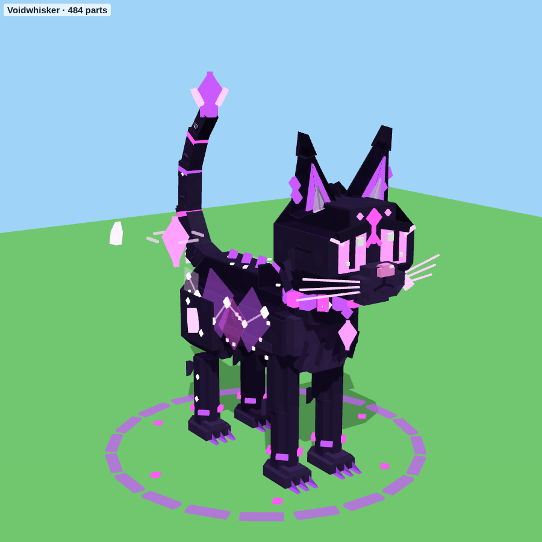
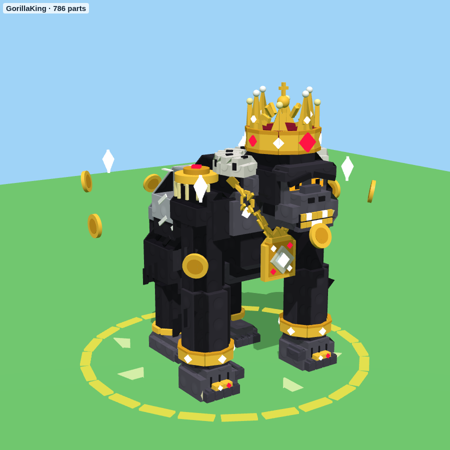
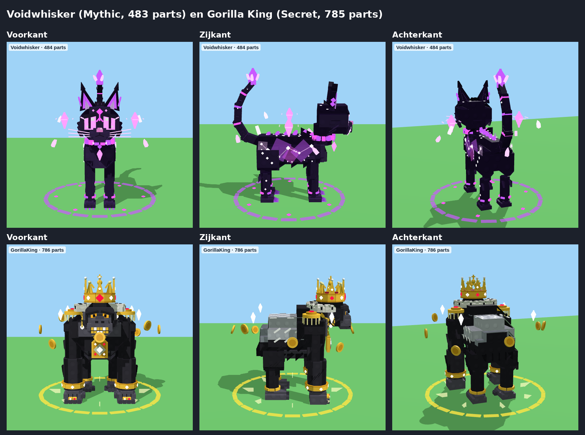
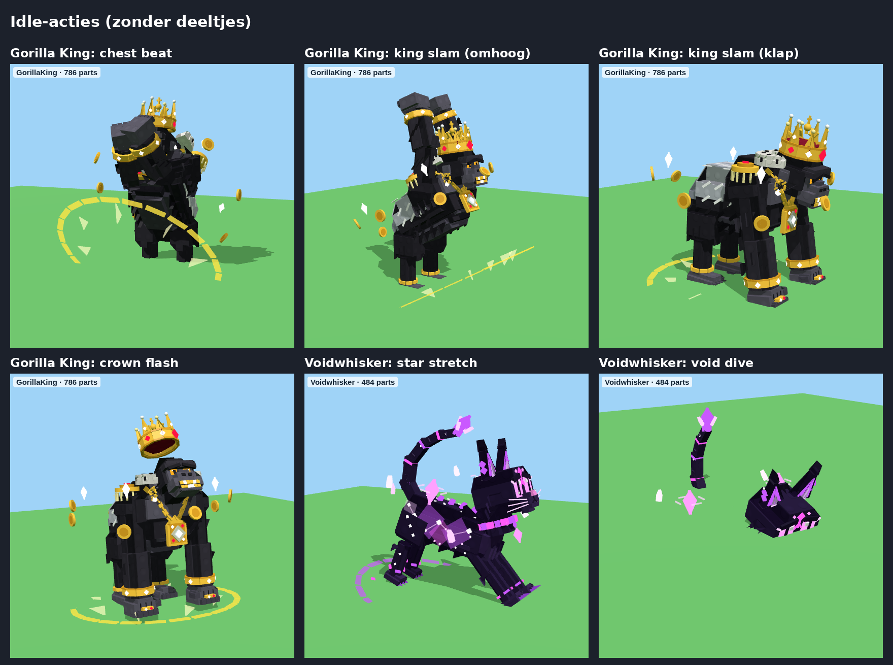

# Zoo-topdieren – Voidwhisker en Gorilla King

`ZooShowpieces.rbxm` bevat de twee topdieren van de zoo, opnieuw gebouwd van gewone Parts in dezelfde stijl als
de andere dieren (zoals de nieuwe Phoenix). Hun `AnimalId` is `Voidwhisker` en `GorillaKing`, dus ze kunnen de
oude stud-modellen uit `models/stud-animals` vervangen.

| Dier | Zeldzaamheid | Parts | Gewrichten | Hoogte |
|---|---|---|---|---|
| Voidwhisker | Mythic | 483 | 9 | ca. 13 studs (met de staart) |
| Gorilla King | Secret | 785 | 10 | ca. 14 studs (met de kroon) |





(De plaatjes laten geen deeltjes zien. In het spel komen daar de gloed, de vonken, de sporen en de lichtstralen
bij.)

## Voidwhisker (Mythic)

Een slanke schaduwkat, bijna zwart-paars, met dezelfde kenmerken als het oude model.

- **Kop:**
  - Grote roze ogen met spleetpupillen en paarse oogranden.
  - Een gloeiende rune op het voorhoofd: een ruit boven een pijl.
  - Lange oren met gloeiend paars van binnen, plukjes en ringetjes.
  - Snorharen van licht en wangpluis.
- **Melkwegvacht:** op de flanken hangen nevels van paars en roze. Er zitten sterren en stipjes in de vacht, en op
  elke flank staat een sterrenbeeld met lijntjes tussen de sterren.
- **Halsband:** een gloeiende halsband in paars en roze, met een roze edelsteen eronder en een kraag van zachte vacht.
- **Rug:** kleine void-kristallen langs de ruggengraat.
- **Staart:** een S-vormige staart die hoog omkrult, met gloeiende ringen, sterren en een paars kristal op de punt.
  De punt van de staart beweegt iets later mee dan de rest.
- **Om haar heen:**
  - Twee roze diamanten zweven naast haar, elk met een ringetje van licht.
  - Zes sterrenscherven draaien rond.
  - Op de grond ligt een void-ring.

**Effecten:**
- Een paarse gloed om het lijf en sterrenstof dat opstijgt. Schaduwslierten drijven van haar af.
- De ogen, de rune, de sterren en de nevels pulseren.
- Gekrulde stralen van roze licht verbinden de edelsteen op de halsband met de twee zwevende diamanten. Ze
  draaien mee als de diamanten rondgaan.
- De diamanten en het staartkristal fonkelen en trekken een spoor van licht. Bij het staartkristal draait ook een
  kleine void-schijf.
- Op de grond draait een void-sigil, met sterren die eruit opstijgen.

**Lopen:** een snelle, lichte draf. Onder elke poot komen void-rook, roze vonkjes en een roze ring.

**Idle-acties:**
- **Void dive:**
  1. Ze duikt in elkaar en onder haar opent een void-portaal.
  2. Ze zakt erdoor weg.
  3. Even later springt ze draaiend terug uit een tweede portaal, in een storm van roze vonken met een schokgolf.
- **Star stretch:** een lange kattenrek met de voorpoten ver naar voren. De sterren uit haar vacht stijgen op en
  er licht een sterrensigil op de grond op.
- **Gem storm:**
  1. De zwevende diamanten draaien steeds sneller rond.
  2. Ze laten roze licht los.
  3. Dan barst de edelsteen op de halsband open met een ring van licht en een schokgolf.

## Gorilla King (Secret)

Een enorme zilverrug die op zijn knokkels loopt, met alle bling van het oude model en meer.

- **Lijf:**
  - Zwarte vacht met een zilveren rug en zilveren strepen.
  - Grijze borstspieren en buikspieren, en ruige vacht langs de schouders, buik en billen.
- **Kop:**
  - Een zware wenkbrauwboog met kleine, felle oranje ogen.
  - Gouden grills met diamanten tanden.
  - Een gouden oorring met een diamantje in het rechteroor en een diamanten knopje in het linker.
- **Kroon** (met een eigen gewricht):
  - Goud, met acht punten met parels en robijnen en diamanten op de band.
  - Een rood fluwelen kap met twee bogen en een rijksappel met kruis.
  - Een grote robijn voorop.
- **Koninklijk:**
  - Een kraag van hermelijn (wit met zwarte stippen) achter de kop.
  - Gouden epauletten met franje en een robijn.
- **Bling:**
  - Een dikke gouden ketting met een groot gouden medaillon met een diamant, robijnen en een kroontje.
  - Gouden armbanden met diamanten om de polsen.
  - Gouden ringen met edelstenen om de vingers.
  - Gouden enkelbanden.
- **Armen:** de armen hebben een elleboog-gewricht (`ForearmR`/`ForearmL`), zodat hij zich op de borst kan slaan.
- **Om hem heen:** acht gouden munten en vier diamanten draaien rond. Op de grond liggen een gouden ring en
  een kroonsigil.

**Effecten:**
- Een warme gouden gloed om het lijf en opstijgend goudstof.
- Boven de kroon staat een draaiende zon van goud, met gloed en vallende sterretjes.
- Elke diamant fonkelt: het medaillon, de grills, de oorring, de armbanden, de kroon en de rondvliegende diamanten.
- Robijnen en het medaillon pulseren.
- De munten en vuisten trekken gouden sporen.
- Op de grond draait een gouden sigil met vonken die opspringen.

**Lopen:** een zware knokkelgang die van links naar rechts rolt. Bij elke stap komen stof, gouden vonken en
een gouden ring.

**Idle-acties:**
- **Chest beat:**
  1. Hij gaat op zijn achterpoten staan en slaat zich vier keer op de borst, links en rechts om en om.
  2. Bij elke klap komt een flits van goud en een ring van licht van zijn medaillon.
  3. Dan brult hij en landt hij weer op zijn vuisten.
- **King slam:**
  1. Hij komt omhoog met beide vuisten hoog boven zijn kop.
  2. Hij slaat ze op de grond: een gouden schokgolf, een fontein van gouden munten en stof, en drie ringen van goud
     die over de grond rollen.
- **Crown flash:**
  1. Hij heft zijn kop en zijn kroon stijgt op en draait een rondje in een gloed van goud.
  2. Een zuil van licht schiet omhoog en er regenen munten rond hem neer.



## Instellingen (attributen op het Model)

| Attribuut | Voidwhisker | Gorilla King | Wat het doet |
|---|---|---|---|
| `WalkSpeed` | 12 | 9 | hoe snel hij loopt |
| `OrbitSpeed` | 0,9 | 0,6 | hoe snel de diamanten/munten rond draaien |
| `TailSway` | 10 | – | hoe ver de staart zwaait |

## Opnieuw bouwen

```
cd tools/animal-models
python3 build_zoo_showpieces.py --rbxm ../../models/zoo-showpieces/ZooShowpieces.rbxm
```

De modellen staan in `tools/animal-models/zoo_showpieces.py`. De animatie staat in `AnimalFX.lua`: de profielen
`Voidwhisker` en `GorillaKing` en de acties `voiddive`, `starstretch`, `gemstorm`, `chestbeat`, `kingslam` en
`crownflash`. Omdat `AnimalFX.lua` in alle dieren zit, zijn de andere `.rbxm`-bestanden ook opnieuw gebouwd
(Dark Woods, paarden, Thunder Unicorn, bergdieren en de Phoenix).
